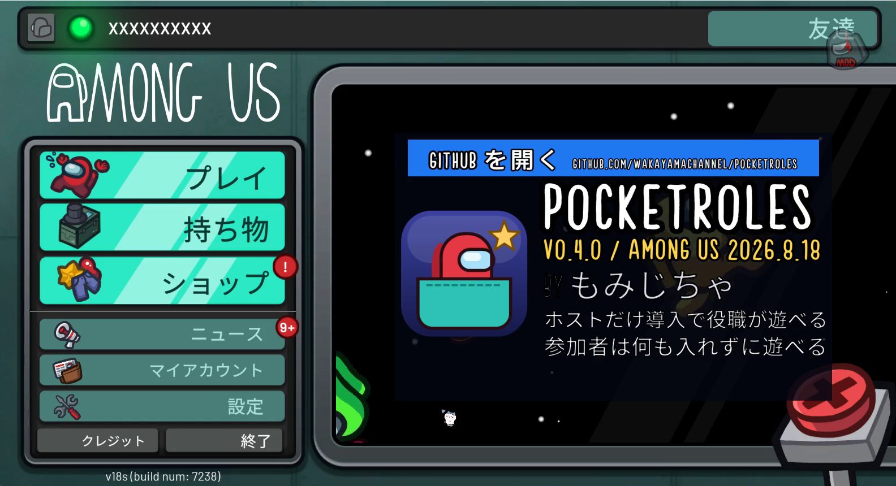
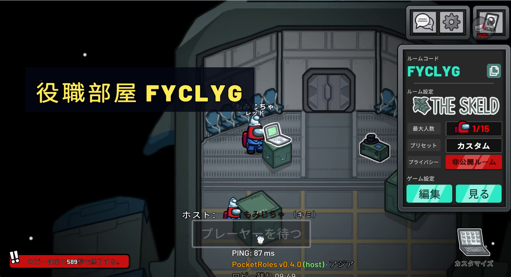
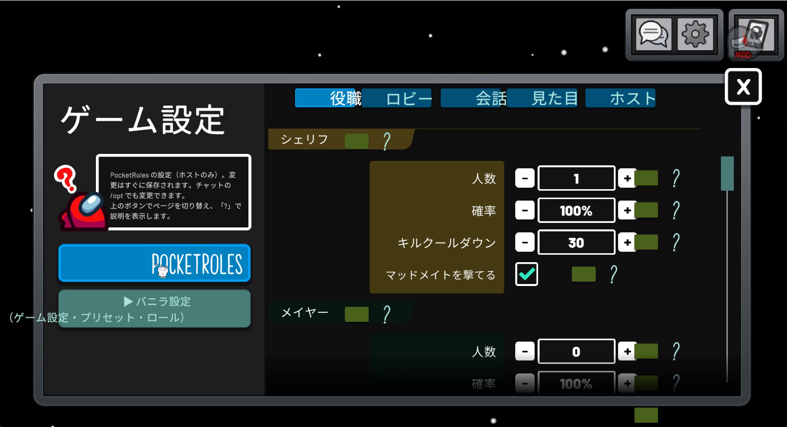
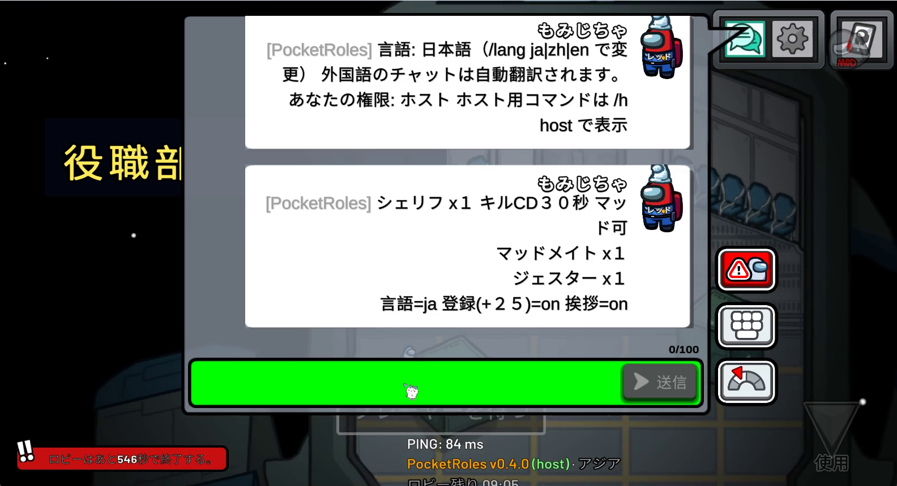
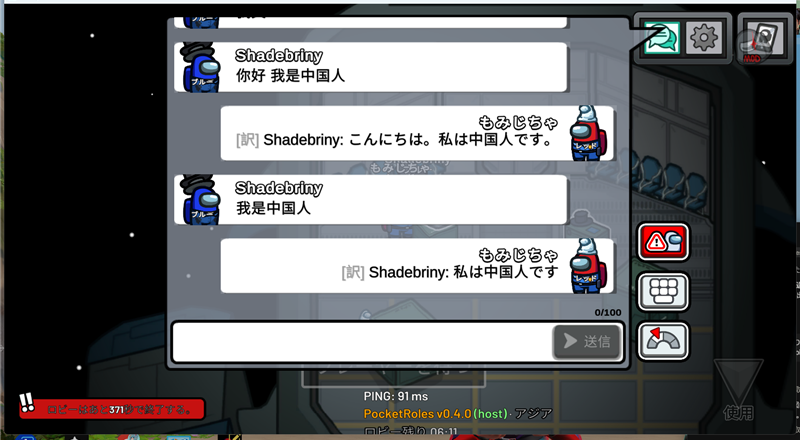

# PocketRoles — Among Us ホスト専用 役職 MOD

[日本語](README.md) | [简体中文](README.zh-CN.md) | [English](README.en.md)

▶ 動画: [導入編（YouTube・1 分半）](https://www.youtube.com/watch?v=Aogbzc_dUTU) / [遊び方編（YouTube・3 分半）](https://www.youtube.com/watch?v=UyvmPzYSrRM)　中文: [安装篇（bilibili）](https://www.bilibili.com/video/BV17obV6CESH) / [玩法篇（bilibili）](https://www.bilibili.com/video/BV1qobV6kERQ)

💬 **公式 Discord「PocketRoles 役職部屋」: <https://discord.gg/ahNvRMVeHP>** — 部屋コードの告知・募集・質問・バグ報告はここで。参加者は MOD なしで遊べます（役職部屋で遊びたい人も、ホストをしたい人も歓迎）。

<p align="center"></p>

**部屋を作る人だけが入れる、Among Us（2026.8.18 / Steam）の役職 MOD です。** 友達は PC でもスマホでも Switch でも、いつもの Among Us のまま部屋コードを打つだけ。シェリフやジャッカル、ジェスターなど 26 の役職が、名前タグとチャットで本人にだけこっそり届きます。設定はロビーのパソコンから、案内は日本語・中文・English の 3 言語、外国語のチャットは自動で翻訳。ロビーの時間切れや会議の長引きもホストの手元で解決できます。無料・非営利、ソースは GitHub で公開しています（**v0.5.0**、旧名 HostRoles）。

- **参加者は何も入れなくて OK** — MOD を入れるのはホストの PC 1 台だけ。参加者はバニラのまま、ふだん通りに遊べます
- **26 役職を 3 言語でこっそり通知** — シェリフ・メイヤー・スニッチ・ジャッカル・ジェスター・ラバーズ…。役職の説明は日本語 / 中文 / English で本人にだけ届き、外国語のチャットは自動翻訳（併用モード）
- **ホストが楽になる道具つき** — ロビー残り時間の常時表示と自動延長、自動開始、廃村（F7）、会議の強制終了（F8）、開始キャンセル（F9）、部屋コードの大表示（`/code` でオン。既定オフ）、友達用インストーラー

|  |  |  |
|---|---|---|
| タイトル画面の PocketRoles パネル | ロビー残り時間の表示 | ロビーのパソコンの設定タブ（役職 / ロビー / 会話 / 見た目 / ホスト） |
|  |  | |
| 参加者に届く役職の通知（本人にだけ） | 中国語のチャットが日本語に翻訳されて全員に届く | |

他の言語: **[简体中文 (README.zh-CN.md)](README.zh-CN.md)** / **[English (README.en.md)](README.en.md)**

> This mod is not affiliated with Among Us or Innersloth LLC, and the content contained therein is not endorsed or otherwise sponsored by Innersloth LLC. Portions of the materials contained herein are property of Innersloth LLC. © Innersloth LLC.

---

## 3 分で導入（Windows + Steam 版）

1. **[GitHub Releases](https://github.com/wakayamachannel/PocketRoles/releases)** から 2 つの zip をダウンロードします: `PocketRoles-Setup-0.5.0.zip`（ランチャー）と `PocketRoles-0.5.0.zip`（MOD 本体）。
2. **2 つとも同じフォルダに展開** します（例: `ドキュメント\PocketRoles`。消さない場所に。ネットにつながっていれば Setup zip だけでも動きます — ランチャーが本体を取りに行きます）。
3. **「PocketRoles Launcher.cmd」をダブルクリック**。青い「Windows によって PC が保護されました」が出たら「詳細情報」→「実行」（署名証明書を付けていないための表示で、ウイルスではありません）。
4. **「インストール」** を押します。Steam 版の Among Us をデスクトップの「Among Us PocketRoles」にコピーして、BepInEx と PocketRoles を自動で入れます（数分。Steam 版そのものは書き換えません）。デスクトップが OneDrive でバックアップされている PC では、代わりに `%LOCALAPPDATA%\PocketRoles\Among Us PocketRoles` にコピーします（クラウドに 1 GB を同期しないため。ランチャーの引数 `-GameDir` で好きなフォルダも選べます）。
5. **Steam を起動してから「起動」**。初回はタイトル画面まで 1〜2 分かかります（途中で黒い窓が出ても閉じないでください）。タイトル画面の右の窓に PocketRoles のパネルが出たら完了です。あとは **オンライン → 部屋を作る** だけで役職が有効になります。

詳しい手順と手動導入は [第 5 章](#5-導入手順steam)、ランチャーの使い方は [第 6 章](#6-ランチャーと更新)、遊び方は [第 7 章](#7-遊び方) にあります。

## 人の集め方

2026 年 7 月からの公式ルールで、MOD を使う部屋はサーバーに登録する必要があります（MOD 部屋登録。PocketRoles が自動で行います）。登録した部屋は **公開一覧に出ない** ので、ホストが部屋コードを伝えて入ってもらいます（[第 3 章](#3-innersloth-の-mod-ポリシーと公開部屋についての注意必読)）。コードの伝え方は自由です。いつも使っている場所に貼るだけで OK:

- **公式 Discord「PocketRoles 役職部屋」** <https://discord.gg/ahNvRMVeHP>: `#部屋コード` にコードを貼ると、遊びたい人がそこから入ってきます（ホストをしたい人も歓迎。募集・質問・バグ報告のチャンネルもあります）
- **自分の Discord サーバー**: 部屋コードを貼るだけ（ホストの画面に出ているコードをコピーして貼ります。チャットに `/announce` と打つとクリップボードにコピーされます）。**v0.4.5 からは自動投稿もできます**: チャンネルの「連携サービス → ウェブフック」で URL を作って設定ファイルの `[Discord] WebhookUrl` に貼ると、部屋を作るたびに「🔑 部屋コード ABCDEF — 3/15人 募集中」が投稿され、人数や「ゲーム中」が自動で書き換わります（[第 12 章](#12-設定ファイル)）
- **LINE などのグループ**
- **X のフォロワー**
- **フレンドに直接**

コミュニティを持っていない・野良で集めたい人は、**サブスマホなどで作る公開バニラ部屋「案内部屋」**（名前を「役職→コード」にする）を使います。公開一覧から人を拾える唯一の入口です:

1. **PC で役職部屋を作ります**（いつも通り。登録はオンのまま）。部屋コードはロビー画面の下（バニラの部屋コード欄）に出ています（`/code on` で左上に「役職部屋 QWERTY」のように **大きく** 出すこともできます。既定はオフ）。チャットに `/announce` と打つとコードがクリップボードにコピーされ、下の手順も表示されます。
2. **サブスマホの Among Us（バニラのまま）で、名前を「役職→QWERTY」にします**（コードの部分は自分の部屋のコード）。
3. **サブスマホで公開部屋を作ります**（MOD なしの普通の部屋）。チャットに「役職ありは QWERTY」と書いておきます。
4. 公開一覧から入ってきた人が、名前のコードを見て **PC の役職部屋に移動** してきます。部屋を作り直してコードが変わったら、スマホの名前を直します（`/announce` でまたコピーできます）。

例: PC の部屋コードが `QWERTY` → サブスマホの名前は `役職→QWERTY`、案内部屋のチャットは「役職ありは QWERTY。コードを入れて来てね」。詳しくは [第 25 章](#25-便利ホスト登録オフと案内部屋)。

> **注意**: 短い時間に何度も部屋を作り直したり、試合の途中で退出したりすると、公式サーバーは「意図的な切断」として **ban points** を加算し、しばらく部屋が作れなくなることがあります。部屋の作り直しは必要な時だけにしてください（[3.4](#34-ban-とキックについて)）。

## 困ったらメール（サポート）

**説明を見ても導入や遊び方がわからない人は pocketroles.report+help@gmail.com へメールしてください（日本語・中文・English）。読んで返事をします。**

- 質問・相談: `pocketroles.report+help@gmail.com`（「インストールが進まない」「参加者に役職が届かない」など、何でも）
- 不具合の報告: `pocketroles.report@gmail.com`（ランチャーの「報告 zip を作る」で作った zip を添付。[第 28 章](#28-不具合の報告方法)）
- 機能・役職の要望: `pocketroles.report+request@gmail.com`
- GitHub の Issue でも受け付けます: <https://github.com/wakayamachannel/PocketRoles/issues>

メールソフトが無くても、ブラウザの Gmail などから送って構いません（zip はデスクトップから添付）。返事には数日かかることがあります。

## よくある質問（かんたん版）

| 質問 | 答え |
|---|---|
| 導入の手順は？ | 上の「3 分で導入」。ランチャーの「インストール」だけです（[第 5 章](#5-導入手順steam)） |
| 「Windows によって PC が保護されました」が出た | 「詳細情報」→「実行」。それでも開かなければファイルを右クリック → プロパティ → 「許可する」にチェック |
| 起動しない / 黒い窓のまま | 初回は 1〜3 分待つ。Steam が起動しているか、Among Us が二重に起動していないか、ウイルス対策が `winhttp.dll` を隔離していないかを確認（[第 28 章](#28-不具合の報告方法) の報告 zip で調べます） |
| 参加者は何をすればいい？ | 何も入れなくて OK。部屋コードで入るだけ。チャットで `/cmd h`（ヘルプ）、`/cmd n`（自分の役職）、`/cmd lang en`（言語）が使えます（[第 26 章](#26-バニラのプレイヤーにはどう見えるか)） |
| 部屋が公開一覧に出ない | 役職 MOD の部屋は公式ルールで公開一覧に出ません（仕様）。Discord などで部屋コードを伝えるか、上の「案内部屋」を使ってください（[第 25 章](#25-便利ホスト登録オフと案内部屋)） |
| 2 人だけの試合で、会議のあと参加者の画面が真っ黒 | 本体の仕様です。2 人しかいない試合では、会議が終わった時点で参加者側の判定が「試合終了」になり画面が止まります（部屋に戻れば直ります）。動作確認は 3 人以上で行ってください |
| 本体の役職（サイエンティスト・エンジニア・ジャッジなど）が出ない | 既定では PocketRoles の役職だけを配り、本体の特殊役職は出しません。併用したいときは設定タブ「役職」の「本体の特殊役職も配る」をオンにするか `/opt roles.vanilla on`（本体のロール設定どおりに出ます） |
| 設定はどこで変える？ | ロビーのパソコンの「PocketRoles」ボタン。チャットの `/set` `/opt` や歯車メニューでも（[第 8 章](#8-設定タブロビーの設定画面)） |
| 言語を変えたい | 参加者は `/cmd lang zh` など。部屋の既定言語は設定タブの「言語」。ランチャーは右上の「言語」（[第 13 章](#13-言語日本語--中文--english)） |
| チャット翻訳と DeepL キー | 既定でオン（設定タブ「チャット翻訳」でオフにできます）。DeepL を使うなら `BepInEx\PocketRoles\deepl-key.txt` にキーを 1 行（[第 13 章](#13-言語日本語--中文--english)） |
| ゲームが更新されて動かない | ランチャーの「更新を確認」。対応版が出るまでは MOD は自動で無効になります（[第 24 章](#24-ゲームのバージョンチェック)） |
| 不具合の報告方法 | ランチャーの「報告 zip を作る」→ `pocketroles.report@gmail.com` に添付（[第 28 章](#28-不具合の報告方法)） |
| 規約違反にならない？ BAN されない？ | Innersloth のポリシーどおり、部屋を作る時に MOD 部屋登録（公式ルール・役職に必須）を自動で行います。登録したままなら利用だけで BAN はされません（[第 3 章](#3-innersloth-の-mod-ポリシーと公開部屋についての注意必読)） |
| Epic 版 / 家庭用機 / スマホでホストできる？ | ホストは Windows + Steam 版のみ。参加者はどの機種でも OK（[第 4 章](#4-必要なもの)） |

---

## できること（一覧）

- 追加役職 26 種: シェリフ、メイヤー、スニッチ、ライター、スピードブースター、ベイト、マッドメイト、マッドメイヤー、マッドスタントマン、マッドホーク、崇拝者、ヴァンパイア、マフィア、魔女、アサシン、イビルホーク、イビル猫又、シリアルキラー、侍、ジェスター、オポチュニスト、テロリスト、ジャッカル、ジャッカルフレンズ、ラバーズ、放火魔
- 役職は各プレイヤーの **名前タグ** と **チャット** で本人にだけ通知されます
- 設定は **ロビーの設定画面の「PocketRoles」タブ**（役職 / ロビー / 会話 / 見た目 / ホスト のページと「?」ヘルプ付き。バニラの 3 ボタンは「▶ バニラ設定（ゲーム設定・プリセット・ロール）」にまとめて折りたたみ）と **歯車メニューの「PocketRoles 設定」パネル** で行います（チャットコマンド `/set` `/opt` と設定ファイルでも可）
- 表示言語: **日本語 / 简体中文 / English**。参加者ごとに `/lang` で切り替え可能（書いた言語から自動判定もします）、文言は `lang\*.json` で編集可能
- **チャットの自動翻訳**（既定でオン、**併用モード**）: 外国語のチャットをホストの言語に訳して全員へ、ホストの言葉を外国語の参加者へその人の言語で個別に（Google、または DeepL の API キー）
- **人集めの支援**: 部屋コードのコピーと案内手順の表示（`/announce`。コピーしたコードは Discord などにそのまま貼れます）、部屋コードの大表示（`/code on`。既定オフ）、便利ホスト部屋から役職部屋への移動案内（`/move`）
- ホスト支援ツール: ロビーの残り時間表示、自動開始、廃村（ロビー更新）、開始のキャンセルボタン、会議の強制終了、ホットキー（F7 / F8 / F9）、ホストページの操作ボタン、ゲームマスター（観戦）モード、逆スケルド（Dleks）、高 PING 時の作り直し確認
- **共同編集（権限）**: アドミン / モデレーター / VIP / BAN を `Admin.txt` などのファイルと `/admin` `/kick` `/ban` で管理。アドミンは設定コマンドを、モデレーターはキックを使えます
- **バニラ設定の範囲拡張**: キルクールダウン、投票・会議時間、緊急会議クールダウン、タスク数をバニラの上限・下限を超えて設定（設定画面の矢印と `/vset`。バニラの参加者にも同じ値が届きます）
- ホストの画面だけの見た目カスタマイズ（帽子・バイザー・ネームプレートの差し替え、ロビー BGM、壁絵、メニュー背景、カーソル）、タイトル画面の PocketRoles パネル
- 自動再ホスト・自動公開、挨拶文とルール行の編集、テストモード（1 人でも開始）、ゲームのバージョンチェック、`/diag` 診断
- **ランチャー**（PocketRoles Launcher）: 友達用インストーラー（Steam 版のコピー → BepInEx → PocketRoles を自動で導入）、更新チェック、起動、不具合報告 zip の作成。日本語 / 中文 / English
- BepInEx 6（IL2CPP）プラグイン、C# / .NET 6、Harmony

---
## 目次

1. [概要（仕組み）](#1-概要仕組み)
2. [新機能（v0.2 / v0.3 / v0.4）](#2-新機能v02--v03--v04)
3. [Innersloth の MOD ポリシーと公開部屋についての注意（必読）](#3-innersloth-の-mod-ポリシーと公開部屋についての注意必読)
4. [必要なもの](#4-必要なもの)
5. [導入手順（Steam）](#5-導入手順steam)
6. [ランチャーと更新](#6-ランチャーと更新)
7. [遊び方](#7-遊び方)
8. [設定タブ（ロビーの設定画面）](#8-設定タブロビーの設定画面)
9. [歯車メニューの「PocketRoles 設定」パネル](#9-歯車メニューのpocketroles-設定パネル)
10. [役職一覧](#10-役職一覧)
11. [コマンド一覧](#11-コマンド一覧)
12. [設定ファイル](#12-設定ファイル)
13. [言語（日本語 / 中文 / English）](#13-言語日本語--中文--english)
14. [参加時の挨拶文とルール行](#14-参加時の挨拶文とルール行)
15. [自動再ホストと自動公開](#15-自動再ホストと自動公開)
16. [ロビーの残り時間・自動開始・廃村](#16-ロビーの残り時間自動開始廃村)
17. [ホットキーとキャンセルボタン](#17-ホットキーとキャンセルボタン)
18. [会議の強制終了](#18-会議の強制終了)
19. [地域の自動選択（最速サーバー）](#19-地域の自動選択最速サーバー)
20. [ゲームマスター（観戦・進行役）](#20-ゲームマスター観戦進行役)
21. [逆スケルド（Dleks）](#21-逆スケルドdleks)
22. [見た目のカスタマイズ（ホストの画面だけ）](#22-見た目のカスタマイズホストの画面だけ)
23. [テストモード（スマホ 1 台での動作確認）](#23-テストモードスマホ-1-台での動作確認)
24. [ゲームのバージョンチェック](#24-ゲームのバージョンチェック)
25. [便利ホスト（登録オフ）と案内部屋](#25-便利ホスト登録オフと案内部屋)
26. [バニラのプレイヤーにはどう見えるか](#26-バニラのプレイヤーにはどう見えるか)
27. [既知の制限・注意](#27-既知の制限注意)
28. [不具合の報告方法](#28-不具合の報告方法)
29. [ビルド方法](#29-ビルド方法)
30. [ライセンス](#30-ライセンス)

---

## 1. 概要（仕組み）

改造されているのはホストの Among Us だけです。バニラのクライアントは「ホストから送られてきた情報」をそのまま表示するので、ホストが各プレイヤーに **別々の内容**（役職、名前タグ、チャット、ゲーム設定）を送ることで役職を実現しています。

- キル判定、ベント、サボタージュ、投票集計、勝敗判定はすべてホスト側で行います。
- シェリフ・ジャッカル・放火魔・崇拝者は、本人のクライアント上では「インポスター」として動作し（キルボタンのため）、他の全員からは「クルー」に見えます。
- 会議後にバニラ側の画面が固まる現象（ブラックアウト）を防ぐ処理を内蔵しています。
- v0.4 のホスト支援ツール（自動開始、廃村、会議終了、ホットキーなど）は **すべてバニラの仕組み（開始カウントダウン、試合終了、投票締め切り）を使う** ので、参加者側にはチャットの案内と通常のゲーム進行しか見えません。
- バニラ設定の範囲拡張（v0.4b）も、バニラの設定同期をそのまま使います。ホストの設定画面で選んだ値（例: キルクールダウン 5 秒）が、参加者のロビー設定一覧にもそのまま表示されます。
- チャット翻訳（v0.4b）はホストの PC から Google / DeepL に文章を送って翻訳します。既定でオンで、**併用モード**（外国語のチャットをホストの言語に訳して全員へ、ホストの言葉を外国語の参加者へ個別に）で動きます。文章を外部に送りたくない場合は設定タブ「会話」の「チャット翻訳」か `/opt translate off` でオフにできます（[第 13 章](#13-言語日本語--中文--english)）。
- 役職を配れるのは **MOD 部屋登録をした部屋だけ** です。登録オフの部屋（便利ホスト）では個別メッセージを送るとホストがサーバーに切断されるため、役職・個別通知は無効になり、バニラの進行にホスト支援ツールだけが付きます（[第 25 章](#25-便利ホスト登録オフと案内部屋)）。
- ホストの画面左上（ping 表示）に `PocketRoles v0.5.0 (host) · アジア` のように接続中の地域名と、オンラインのロビーでは `ロビー残り mm:ss` が表示され（`/code on` にすると大きな部屋コード `役職部屋 ABCDEF` も出ます。既定オフ）、ゲーム内の MOD スタンプも表示されます。タイトル画面では右側の大きな窓に **PocketRoles のパネル**（アイコン、`v0.5.0 / Among Us 2026.8.18`、作者名、クリックで開く GitHub の行、「ホストだけ導入で役職が遊べる」「参加者は何も入れずに遊べる」）が出ます（[第 9 章](#9-歯車メニューのpocketroles-設定パネル)）。
- 対応モードは **クラシック** のみです（Hide n Seek / Seek Fools では MOD は何もしません）。

バニラ側で実際に何がどう見えるかは [第 26 章](#26-バニラのプレイヤーにはどう見えるか) にまとめています。

---

## 2. 新機能（v0.2 / v0.3 / v0.4）

### v0.4e（v0.4.0 の仕上げ: 案内部屋、便利ホスト、翻訳の併用）

- **案内部屋の支援**（[第 25 章](#25-便利ホスト登録オフと案内部屋)）: ロビーの左上に部屋コードを大きく表示（`役職部屋 ABCDEF`。既定オフ、`/code on` でオン、`/code` で切替、設定タブ「部屋コードを大きく表示」）。`/announce`（`/guide`）でコードをクリップボードにコピーして（Discord などにそのまま貼れます）、サブスマホで案内部屋を作る 4 つの手順を表示。`/move [コード]` で便利ホスト部屋から役職部屋への移動案内を 3 言語で全員に送信（`/opt guide.autoreg on` なら 30 秒後に登録部屋として作り直し）。歯車メニューにも案内部屋のヒント。
- **便利ホスト（登録オフ）の整理**: 実機検証で、登録オフの部屋では参加者 1 人宛てのメッセージを送るだけでホストがサーバーに切断される（"DC because Hacking"）ことが分かりました。そのため登録オフの部屋では **役職を配らず、バニラのまま進行** します（ホスト支援ツールと全体向けの案内だけ）。役職ありは登録オン（既定）の部屋で。
- **翻訳の併用が既定**（`BroadcastToAll = true` + `TranslateForPlayers = true`）: 外国語のチャットはホストの言語に訳して全員へ、ホストの言葉は外国語を選んだ人へその人の言語で個別に。同じ人に 2 通届かないように整理しました。翻訳自体（`Enabled`）も既定オンです（チャットの文章は Google、または `BepInEx\PocketRoles\deepl-key.txt` にキーを置いた場合は DeepL に送られます）。設定タブ「チャット翻訳」か `/opt translate off` でオフにできます。
- **高 PING の作り直しは確認式**: 部屋を作った直後の PING が高い時、ホストの画面に「PING が ○ ms と高いです。部屋を作り直しますか？」のダイアログ（はい / いいえ、`/rehost yes|no` でも可）。既定はオフ（`MaxHostPing = 0`）。短時間に何度も作り直すと ban points が付くためです（[3.4](#34-ban-とキックについて)）。
- **設定タブ**: ページボタンは「役職 / ロビー / 会話 / 見た目 / ホスト」の短い表記で横一列。バニラの 3 ボタンは最初は折りたたまれ、「▶ バニラ設定（ゲーム設定・プリセット・ロール）」を押すと展開（「▼ バニラ設定」）。「ホスト」ページの上にボタン列（今すぐ開始 / キャンセル / 廃村 / 会議終了 / テストモード / 設定を表示）。
- **役職の配り方を修正**: 2 人以上で開始した時にイントロが出ず真っ暗になる問題を修正（本体の役職送信をそのまま通し、直後に全員分の見え方をまとめて上書き）。シェリフ・ジャッカルのイントロが「インポスター」になるのは従来どおりです（v0.4.1 から役職通知に「※本体の表示（イントロ・キルボタン）は「インポスター」ですが、あなたの本当の役職は○○です。」の 1 行が付きます）。
- **テストモード**: `/test on` で開始ボタンが即「開始」になり、本体の「4 人でプレイ可能ですが…」ポップアップも自動で OK。
- **言語ファイル**: アップデートで増えたキーを起動時に `lang\*.json` へ追記します（自分で編集した文章はそのまま）。
- **ログ**: 通常は静かに。詳細トレースは常に裏で記録され、異常時（開始が固まる・会議要求が通らない）に自動でログへ書き出されます。`/diag` で状態のスナップショット、`/diag dump` で記録の書き出し。

### v0.4c（v0.4.0 の修正: 実機検証で見つかった問題への対応）

- **高 PING の部屋を作り直す**（`[Lobby] MaxHostPing`、`/opt maxping <ms>`、0 で無効）: 部屋を作った直後の 5 秒間、サーバーへの PING が上限を超えていて、まだ自分しかいない時に同じ設定で部屋を作り直します（連続 3 回まで。チャットに理由と新しい部屋コードが出ます）。公式のアジア地域でも近いサーバー（8〜10 ms）と遠いサーバー（70 ms 台）が混ざるための対策です。地域の自動選択は既定オフのままです。**v0.4e で「必ず確認してから」の形になり、既定もオフ（0）になりました**（[第 15 章](#15-自動再ホストと自動公開)）。
- **`/diag`**（ホスト専用）: 開始ボタン・テストモード・廃村・試合の状態と画面（船、イントロ、HUD）のスナップショットをチャットとログに出力します。画面が真っ暗なまま進まない時の報告に使ってください。開始処理の各段階も `Trace:` としてログに残ります。
- **F9 キャンセルがチャット入力中でも効く**: `/start` を打った直後（入力欄にカーソルが残っている状態）でも、カウントダウン中なら F9 で取り消せます（F7 / F8 は従来どおり入力中は無効）。F7 の 1 回目には「もう一度 F7 を押すと…（3 秒以内）」がチャットにも出ます。画面が出ないまま 10 秒以上経った試合は F7 1 回で終了します。
- **ロビーの残り時間バナー**: バニラの赤い「ロビーはあと○秒で終了する。」は、設定画面（ロビーのパソコン）を開いている間だけ隠れ、閉じると戻ります（それ以外は従来どおり表示。PocketRoles の「ロビー残り mm:ss」とは別）。
- **PING 行に地域名**: 左上の行が `PocketRoles v0.4.0 (host) · アジア` のように、接続中の地域名（ゲームの言語）付きになります。
- そのほか: `/test on` で開始ボタンがすぐ「開始」になる、廃村や「もう一度プレイ」の後に前の試合の状態が残らない（2 回目の `/start` の黒画面対策）、廃村後の終了画面は自動で「もう一度プレイ」に進む、タイトル画面の右窓の上に「GitHub を開く」ボタン。

### v0.4b（v0.4.0 に追加: 翻訳、権限、設定タブの整理、ランチャーの友達用インストーラー）

| 機能 | 説明 | 章 |
|---|---|---|
| ランチャー（友達用インストーラー） | `PocketRoles-Setup-<ver>.zip` を展開して「PocketRoles Launcher.cmd」→「インストール」を押すだけで、Steam 版のコピー・BepInEx・PocketRoles の導入が終わります。「更新を確認」で GitHub の新版に更新、「起動」で MOD 付き起動、「報告 zip を作る」で不具合報告。日本語 / 中文 / English | [5](#5-導入手順steam), [6](#6-ランチャーと更新) |
| タイトル画面のパネル | メインメニューの右側の窓に PocketRoles のアイコン・バージョン・作者・GitHub の行・説明を表示（右下のクレジット行はパネルが作れない時の予備） | [9](#9-歯車メニューのpocketroles-設定パネル) |
| チャット翻訳 | 外国語のチャットをホストの画面に翻訳表示。全員への送信、外国語を選んだ参加者への個別送信も可。Google（キー不要）または DeepL（`BepInEx\PocketRoles\deepl-key.txt` にキーを書く） | [13](#13-言語日本語--中文--english) |
| 言語の自動判定 / 3 言語の案内 | `/lang` を使っていない参加者が中国語・英語で書くと表示言語を自動で切り替えて案内。挨拶（短い 2 行）は既定でその人の言語 → 残り 2 言語の順に 3 言語で届く（`WelcomeAllLanguages`。オフなら 1 言語 + 「English: /cmd lang en ｜ 中文: … ｜ 日本語: …」の 1 行） | [13](#13-言語日本語--中文--english), [14](#14-参加時の挨拶文とルール行) |
| 設定タブの整理 | PocketRoles ボタンが左列の一番上に。バニラの 3 ボタンは「バニラ設定」ボタンにまとめて表示。タブの中は「役職 / ロビー / チャット / 見た目 / ホスト支援」のページボタン。役職見出しと項目の「?」ボタンで左の説明欄にヘルプを表示 | [8](#8-設定タブロビーの設定画面) |
| 権限（共同編集） | `BepInEx\PocketRoles\Admin.txt` / `Moderator.txt` / `VIP.txt` / `Banlist.txt`（1 行に 1 人、フレンドコードか Puid）。`/admin` `/mod` `/vip` の add / remove / list、`/kick`、`/ban`。アドミンは設定コマンド、モデレーターはキック / BAN、VIP は名前に ★ と個別の挨拶 | [11](#11-コマンド一覧) |
| バニラ設定の範囲拡張 | キルクールダウン 0〜120 秒（矢印は既定 2.5 秒刻み。0.5 秒単位の値は `/vset` か `[Vanilla] KillCooldownStep` を下げて）、投票 0〜600 秒、会議 0〜600 秒、緊急会議 CD 0〜120 秒、タスク数 0〜30 などを設定画面の矢印と `/vset` で。移動速度・視界も `/vset` で拡張。バニラの参加者にも同じ値が届きます | [8](#8-設定タブロビーの設定画面), [11](#11-コマンド一覧) |
| `/h` に権限表示 | ヘルプの最後に「あなたの権限: 一般 / VIP / モデレーター / アドミン / ホスト」 | [11](#11-コマンド一覧) |
| 不具合報告の整備 | ランチャーの報告 zip（ログ・設定・環境情報。DeepL キーは含めません）、報告用メール、GitHub Issue テンプレート、サポート宛先 | [28](#28-不具合の報告方法) |

### v0.4（ホスト支援ツール、名前を PocketRoles に変更）

| 機能 | 説明 | 章 |
|---|---|---|
| 名前の変更 | HostRoles → **PocketRoles**。プラグイン ID `jp.pocketroles.mod`、設定ファイル `jp.pocketroles.mod.cfg`（旧 `jp.hostroles.mod.cfg` は初回起動時に自動でコピー）、フォルダ `BepInEx\PocketRoles\`、ランチャー「PocketRoles Launcher」 | [5](#5-導入手順steam) |
| ロビーの残り時間 | 画面左上に `ロビー残り mm:ss`、バニラのタイマー表示を最初から表示、`/time` で誰でも確認、残り 120 秒 / 60 秒でお知らせ | [16](#16-ロビーの残り時間自動開始廃村) |
| 自動開始 | 設定した人数が揃うとカウントダウンして自動で開始。人数が減ると中止。`/autostart <人数>`、`/start`（今すぐ開始） | [16](#16-ロビーの残り時間自動開始廃村) |
| 時間切れ対策（延長 / 廃村） | 残り時間が少なくなると、サーバーの延長を受け入れるか、**廃村**（一度開始してすぐ終了し、同じ部屋・同じコードのまま時間をリセット）を自動で実行。`/haison` で手動実行 | [16](#16-ロビーの残り時間自動開始廃村) |
| キャンセルボタン | 開始カウントダウン中に Start ボタンの位置に「キャンセル」ボタン。F9 / Esc / `/cancel` でも取り消し | [17](#17-ホットキーとキャンセルボタン) |
| ホットキー | F7 ×2 = 廃村（ロビー更新 / 試合の即終了）、F8 ×2 = 会議の投票を締め切る、F9 = 開始キャンセル。キーは変更可 | [17](#17-ホットキーとキャンセルボタン) |
| 会議の強制終了 | `/endmeeting`（F8 ×2）で投票を締め切る、`/results` で結果画面を短縮 | [18](#18-会議の強制終了) |
| 地域の自動選択 | オンラインメニューを開いた時に公式 3 地域の応答時間を計測し、最速の地域に切り替え。`/region` で表を表示 | [19](#19-地域の自動選択最速サーバー) |
| 歯車メニューのパネル | 設定（歯車）メニューの「一般」タブに「PocketRoles 設定」ボタン。タイトル画面でも試合中でも主要設定を切り替え | [9](#9-歯車メニューのpocketroles-設定パネル) |
| ゲームマスター | ホストが役職を持たず、イントロ直後に死亡して観戦・進行役になるモード | [20](#20-ゲームマスター観戦進行役) |
| コマンドの無効化 | 参加者のコマンドを無効（`PlayerCommands`）、全コマンドを無効（`AllCommands`） | [11](#11-コマンド一覧) |
| 挨拶のルール行 | 挨拶文に「ルール」の行が入ります（既定は「ルールなし」）。`/rules <文章>` で自由に設定 | [14](#14-参加時の挨拶文とルール行) |
| 逆スケルド（Dleks） | マップ選択に左右反転スケルド「Dleks」を追加（バニラの参加者もそのまま遊べます） | [21](#21-逆スケルドdleks) |
| 不具合報告 | GitHub Issue とメールでの報告先、`.github` の Issue テンプレート（日 / 中 / 英） | [28](#28-不具合の報告方法) |

### v0.3（ホストの画面だけの見た目カスタマイズ）

| 機能 | 説明 | 章 |
|---|---|---|
| 帽子・バイザー・ネームプレートの差し替え | `BepInEx\PocketRoles\hats\<ProductId>.png` などを置くと、ホストの画面上でその見た目が差し替わります（誰が着けていても）。`/cos ids` で ID を確認 | [22](#22-見た目のカスタマイズホストの画面だけ) |
| ロビー BGM | `music\*.wav` / `*.ogg` をロビーで再生（`custom` / `vanilla` / `mute`、音量設定あり） | [22](#22-見た目のカスタマイズホストの画面だけ) |
| 装飾 | ロビーの壁絵、ドロップシップの飾り、メインメニューの背景、マウスカーソル | [22](#22-見た目のカスタマイズホストの画面だけ) |

これらは **何も送信しません**。参加者にはバニラの見た目のままです。

### v0.2

| 機能 | 説明 | 章 |
|---|---|---|
| 設定タブ | ロビーのノート PC（設定画面）に「PocketRoles」タブ | [8](#8-設定タブロビーの設定画面) |
| 3 言語 | 日本語 / 简体中文 / English。部屋の既定言語と参加者ごとの `/lang`。文言は `BepInEx\PocketRoles\lang\*.json` で編集可能 | [13](#13-言語日本語--中文--english) |
| 挨拶文の編集 | `/welcome` で自由に設定（`{roles}` などの差し込みあり） | [14](#14-参加時の挨拶文とルール行) |
| 自動再ホスト・自動公開 | 切断されたら自動で部屋を作り直す。数秒後に自動で公開。`/public now` | [15](#15-自動再ホストと自動公開) |
| テストモード | `/test on` で 1 人でも開始でき、勝敗判定が止まる。`/assign` で役職を指定、`/end` で終了 | [23](#23-テストモードスマホ-1-台での動作確認) |
| バージョンチェック | ゲームのバージョンが対応版（2026.8.18）と違うと MOD を自動で無効化 | [24](#24-ゲームのバージョンチェック) |
| セーフモード | 登録オフ（`/opt register off`）で部屋を作った時の低負荷モード（v0.4e からは役職なしの「便利ホスト」） | [25](#25-便利ホスト登録オフと案内部屋) |
| ランチャー | デスクトップの「PocketRoles Launcher」から更新・ビルド・起動（v0.4b で友達用インストーラーに拡張） | [6](#6-ランチャーと更新) |
| クレジット行 | タイトル画面右下に作者名と URL を表示（`[Credits]`。v0.4b からはパネルの予備） | [12](#12-設定ファイル) |

シェリフのタスクは **偽タスク** です（本人のクライアントがインポスターとして動くためタスクのコンソールが使えないため）。チャットの 1 通の上限は 100 文字です。

今後の予定（v0.5: MOD を入れた友達にだけ役職の画面表示を出すコンパニオンモードなど）は `ROADMAP.md` を参照してください。

---

## 3. Innersloth の MOD ポリシーと公開部屋についての注意（必読）

### 3.1 部屋作成時の「MOD 部屋登録」が必要です

Innersloth の Among Us Mod Policy（<https://www.innersloth.com/among-us-mod-policy/> 、Last Modified July 30, 2026）には次の項目があります。

> "Any mod that changes the functionality of Among Us on official servers must be registered on lobby creation. A change of functionality includes but is not limited to making modifications to gameplay, custom role behavior, cheating, or modifying any part of a peer's experience."

（公式サーバーで Among Us の機能を変える MOD は、部屋作成時に登録しなければならない。ゲームプレイの変更、独自役職、チート、他のプレイヤーの体験を変えることが含まれる。）

PocketRoles は役職を追加し、他のプレイヤーの体験を変える MOD なので、公式サーバーで使うには **部屋作成時の MOD 部屋登録（いわゆる +25）が必須** です。
ホスト専用 MOD の登録方法は、プロトコルバージョンに 25 を加える「host authority mode」で、Innersloth の公式資料 <https://github.com/Innersloth-LLC/AmongUsModdingInformation> に説明があります。PocketRoles は **既定でこれを行います**（設定 `RegisterAsModdedLobby = true`。部屋を作る時だけ付き、他人の部屋に参加する時は付きません）。

登録すると:

- サーバーは、参加者が送った `/cmd …` で始まるチャットを **ホストにだけ** 届けます。参加者が `/cmd n` のように **非公開で** コマンドを使えるのはこのためです。
- ゲームプレイ系の検証の多くがホストに委ねられるため、MOD の通信でホストが「hacking」としてキックされにくくなります。

### 3.2 登録した部屋は公開部屋一覧に表示されません

Innersloth のヘルプセンター（<https://innersloth.zendesk.com/hc/en-us/articles/6711746215700-Are-there-mods-for-Among-Us>）には "modded games are not able to be found via public lobby search, so if you're hosting a modded game, you'll need to invite friends directly"（MOD 部屋は公開部屋検索では見つからないので、友達を直接招待する必要がある）とあります。
MOD 部屋登録をした PocketRoles の部屋は、バニラの公開部屋一覧に **表示されません**（スマホ版で確認済み）。「公開」にしても同じです。参加者には **ルームコード** を Discord サーバー・LINE などのグループ・X・フレンドに伝えるか、[案内部屋](#25-便利ホスト登録オフと案内部屋)（サブスマホなどのバニラ公開部屋に「役職→コード」と書いておく方法。公開一覧から野良を集めたい時用）で呼んでください。

参考: 日本の MOD（TOH-Y、TOH-K、SuperNewRoles など）は、バニラのプレイヤーが知らずに MOD 部屋へ入ってしまう問題について 2023 年に Innersloth から通知を受け、公式サーバーでの公開部屋を無効にしています。

技術的な補足（2026.8.18 のクライアントを調べた結果）: バニラの「部屋を探す」画面のフィルタには MOD 用の項目（ModFilter）があり、これは全員が同じ MOD を入れる GUID 登録型の MOD が使うものです。バニラのクライアントはこのフィルタを付けないので、MOD 部屋登録をしたホスト専用 MOD の部屋はサーバー側で一覧から除外されます。登録したまま一覧に載せる方法はクライアント側にはありません。

### 3.3 登録をオフにすると「便利ホスト」（役職なし）になります

`RegisterAsModdedLobby = false`（`/opt register off`、設定タブの「MOD部屋登録（公式ルール・役職に必須）」、歯車パネルの「MOD部屋登録」）で作った部屋は公開一覧に載りますが、**役職は配られません**。

- 登録していない部屋では、サーバーが「特定の参加者にだけ送るメッセージ」を不正と見なし、**ホストを切断します**（実機で確認。"DC because Hacking"）。役職の個別通知が成立しないので、PocketRoles は登録オフの部屋では役職・名前タグ・個別メッセージをすべて止め、バニラの進行にホスト支援ツール（残り時間、自動開始、廃村、会議終了、全体向けの翻訳など）だけを付けます。これは AUR のような「ユーティリティ MOD」の使い方で、ゲームプレイを変えないためポリシー上の登録は不要です。
- `/cmd` の非公開チャンネルもないので、参加者のコマンドは全員に見えます。
- 役職ありで遊ぶには **登録オン（既定）** の部屋を作ってください。人を集める方法は [人の集め方](#人の集め方)（Discord などでコードを伝える）と [第 25 章](#25-便利ホスト登録オフと案内部屋)（案内部屋、`/move`）。

`/opt register on` で戻せます（次に作る部屋から）。

### 3.4 BAN とキックについて

Innersloth は、他人の体験を妨げない限り MOD の使用だけで BAN はしないとしています。一方、自動アンチチートによる **キック** はホスト専用 MOD ではよく起こります（特に大人数で通信量が多い時）。PocketRoles は送信を 0.1 秒間隔に分散し、1 パケットを小さく保つことで対策していますが、完全ではありません。切断された時は [自動再ホスト](#15-自動再ホストと自動公開) が使えます。

**ban points（短時間の退出）に注意**: 公式サーバーは、部屋を作ってすぐ抜ける・試合の途中で退出する・短時間に何度も部屋を作り直す、といった行動を「意図的な切断」として数えます（ban points。実機検証では 3.5 点で「意図的に接続を切ったため制限」と表示され、しばらく部屋を作れなくなりました）。MOD の機能とは関係なく、バニラのホストにも同じ仕組みが働きます。部屋の作り直し（自動再ホスト、`/move`、高 PING の作り直し）は必要な時だけにし、廃村（同じ部屋のまま時間をリセット）を優先してください。
### 3.5 以前使っていた AUR との違い

AUR（Among Us Revamped）は役職や個別設定の送信（desync）を含まないホスト用の **ユーティリティ MOD** で、MOD 部屋登録もしていません。PocketRoles は「他のプレイヤーの体験を変える MOD」なので、ポリシー上の扱いが異なります。v0.4 のホスト支援ツール（廃村、キャンセルボタン、ゲームマスターなど）は AUR / EHR / SuperNewRoles と同じバニラの仕組みで動きます。

### 3.6 収益化しないでください

PocketRoles は無償・非営利です。この MOD や MOD 部屋を使った収益化は行わないでください（ポリシーの収益化に関する条項も確認してください）。

### 3.7 免責

> This mod is not affiliated with Among Us or Innersloth LLC, and the content contained therein is not endorsed or otherwise sponsored by Innersloth LLC. Portions of the materials contained herein are property of Innersloth LLC. © Innersloth LLC.

---

## 4. 必要なもの

| 項目 | 内容 |
|---|---|
| ゲーム | Steam 版 Among Us **2026.8.18**（Windows、ゲーム本体は **32 bit**） |
| BepInEx | **6.0.0-be.735**、Unity.IL2CPP、**win-x86** 版<br><https://builds.bepinex.dev/projects/bepinex_be/735/BepInEx-Unity.IL2CPP-win-x86-6.0.0-be.735%2B5fef357.zip>（ランチャーが自動でダウンロードします） |
| MOD 本体 | `PocketRoles.dll`（GitHub Releases の `PocketRoles-<ver>.zip` に入っています。ランチャーが自動で取得します。自分でビルドする場合は .NET 8 SDK） |
| ランチャー | `PocketRoles-Setup-<ver>.zip`（GitHub Releases）。PowerShell 5.1 と .NET Framework（Windows 10 / 11 に標準で入っています）で動きます。管理者権限は不要 |
| その他 | ゲーム起動時に Steam クライアントが起動していること。ダウンロードと更新チェック、チャット翻訳にはインターネット接続 |

参加者側には **何も必要ありません**。

---

## 5. 導入手順（Steam）

どちらの方法でも、Steam のゲームフォルダを **別の場所にコピーして** そこに BepInEx と MOD を入れます。Steam 版はバニラのまま残るので、他人の部屋に普通に参加でき、Steam の自動アップデートで MOD 環境が壊れることもありません。

### 5.1 おすすめ: ランチャーで入れる（PocketRoles-Setup zip）

1. GitHub Releases（<https://github.com/wakayamachannel/PocketRoles/releases>）から **`PocketRoles-Setup-<バージョン>.zip`** をダウンロードします。
2. 消さないフォルダ（例: `ドキュメント\PocketRoles`）に展開します。**`PocketRoles-<バージョン>.zip`（MOD 本体）も同じフォルダに置いて（または展開して）おく** と、ネットにつながっていなくても導入できます。このフォルダをデスクトップのショートカットが指すので、後で移動・削除しないでください。
3. **「PocketRoles Launcher.cmd」をダブルクリック** します。初回に「Windows によって PC が保護されました」（SmartScreen）が出たら **「詳細情報」→「実行」** を押してください。署名証明書を使っていないための表示で、ウイルスではありません。
4. ランチャーの **「インストール」** を押します。次を自動で行います（数分。進行状況は下の欄に出ます）。
   1. Steam 版の Among Us を探して（見つからない時はフォルダ選択）、`デスクトップ\Among Us PocketRoles` にコピー（1 GB 前後）。デスクトップが OneDrive でバックアップされている場合は代わりに `%LOCALAPPDATA%\PocketRoles\Among Us PocketRoles` にコピーします（引数 `-GameDir` で好きなフォルダも選べます）
   2. BepInEx 6.0.0-be.735（win-x86）を builds.bepinex.dev からダウンロードして展開
   3. GitHub の最新リリースから `PocketRoles-<ver>.zip` を取得して配置（ランチャーと同じフォルダに `PocketRoles-<ver>.zip` を置いておけばオフラインでも可）。旧 `HostRoles.dll` があれば削除
   4. デスクトップに「PocketRoles Launcher」ショートカットを作成
5. **Steam を起動してから「起動」** を押します。初回は BepInEx が interop を生成するため、タイトル画面まで **1〜2 分** かかります（途中で黒いコンソール画面が出る場合がありますが、閉じないでください）。
6. タイトル画面の右側に PocketRoles のパネル、左上に `PocketRoles v0.5.0` が出れば導入完了です。

途中の手順が失敗した場合は、原因（ネット接続、Steam の場所など）を直してからもう一度「インストール」を押すと、終わっている手順は飛ばして続きから再開します。ランチャーの右上の「言語」で日本語 / 中文 / English を切り替えられます。同梱の `はじめに.txt` にも同じ手順が 3 言語で書いてあります。

### 5.2 手動で入れる

1. `C:\Program Files (x86)\Steam\steamapps\common\Among Us` を丸ごと別フォルダにコピーします（例: `デスクトップ\Among Us PocketRoles`）。
2. 上の BepInEx の zip をそのコピー先に展開します（`Among Us.exe` と同じ階層に `winhttp.dll`、`doorstop_config.ini`、`BepInEx\` フォルダが並ぶ状態）。
3. **Steam を起動した状態で**、コピー先の `Among Us.exe` を **1 回起動** します。初回は BepInEx が `BepInEx\interop` を生成するため、タイトル画面が出るまで **1〜3 分** かかります。タイトルまで出たら閉じて構いません。
4. GitHub Releases の `PocketRoles-<ver>.zip` をコピー先に展開します（`BepInEx\plugins\PocketRoles.dll` と `BepInEx\PocketRoles\lang\*.json`、README、LICENSE、NOTICE が入っています）。**旧版の `HostRoles.dll` が残っている場合は削除してください**（同じパッチが二重に当たります）。
5. コピー先の `Among Us.exe` を起動します（Steam ライブラリからではなく、コピー先の exe を直接。Steam は起動しておく）。画面左上に `PocketRoles v0.5.0`、タイトル画面の右側の窓に PocketRoles のパネルが出れば MOD が読み込まれています。`BepInEx\LogOutput.log` に `PocketRoles v0.5.0 loaded` と出ていることでも確認できます。

初回起動時に `BepInEx\config\jp.pocketroles.mod.cfg`（設定）、`BepInEx\PocketRoles\lang\`（言語ファイル）、`BepInEx\PocketRoles\{hats,visors,nameplates,music,images}\` と `README.txt`（見た目カスタマイズ用）が生成されます。権限ファイル `Admin.txt` / `Moderator.txt` / `VIP.txt` / `Banlist.txt` は最初に部屋を作った時に `BepInEx\PocketRoles\` に作られます。DeepL を使う場合の `deepl-key.txt` は自分で作ります（[13 章](#13-言語日本語--中文--english)）。旧 HostRoles の設定 `jp.hostroles.mod.cfg` が同じフォルダにあり、新しい設定ファイルがまだ無い場合は、内容が自動でコピーされます（設定はそのまま引き継がれます）。

### 開発者の PC での構成（参考）

- MOD 用コピー: `デスクトップ\Among Us PocketRoles`
- ソース: `デスクトップ\PocketRoles`（ソース一式の中でランチャーを起動すると開発モードになります）
- ランチャー: デスクトップの **「PocketRoles Launcher」ショートカット**（実体は `PocketRoles\PocketRoles Launcher.cmd`）
- `build.cmd` を実行するとビルドした `PocketRoles.dll` が自動で `..\Among Us PocketRoles\BepInEx\plugins` にコピーされます。
- 設定ファイル: `Among Us PocketRoles\BepInEx\config\jp.pocketroles.mod.cfg`（初回起動時に生成）
- 言語ファイル: `Among Us PocketRoles\BepInEx\PocketRoles\lang\ja.json` / `zh-CN.json` / `en.json`
- 見た目カスタマイズ用フォルダ: `Among Us PocketRoles\BepInEx\PocketRoles\`（`hats` `visors` `nameplates` `music` `images`）
- ログ: `Among Us PocketRoles\BepInEx\LogOutput.log`

---

## 6. ランチャーと更新

### 6.1 PocketRoles Launcher の 2 つのモード

デスクトップの **「PocketRoles Launcher」** ショートカット（実体は `PocketRoles Launcher.cmd` → `PocketRolesLauncher.ps1`）で起動する小さな GUI です（PowerShell 5.1 / WinForms、管理者権限不要、ランチャー v0.4.0）。起動時に自動で 2 つのモードのどちらかになります。

| モード | いつ | できること |
|---|---|---|
| **友達モード（インストーラー）** | ランチャーの隣に `PocketRoles.csproj` が **無い** 時（`PocketRoles-Setup-<ver>.zip` を展開した場合） | インストール / 更新を確認 / 起動 / 報告 zip を作る / 設定ファイルを開く / ログを開く / 説明書 (README) / mod フォルダを開く |
| **開発モード** | ソース一式の中で起動した時（`PocketRoles.csproj` が隣にある） | mod 付きで起動 / 更新チェック / 更新（コピー → interop → 再ビルド）/ 再ビルドのみ / GitHub の更新を確認 / バニラ (Steam 版) を起動 / 設定ファイルを開く / ログを開く / 説明書 (README) / mod フォルダを開く / 報告 zip を作る |

共通: 右上の **「言語」** で 日本語 / 中文 (简体) / English を切り替えられます（初回は Windows の表示言語から自動判定、選択は `launcher-state.json` に保存）。上部に状態、中央にボタン、下部に進行状況のログが出ます。処理中はボタンが無効になります。MOD 用コピーの場所は `デスクトップ\Among Us PocketRoles`（開発モードではソースの隣の `..\Among Us PocketRoles` を優先）で、環境変数 `POCKETROLES_GAMEDIR` / `POCKETROLES_STEAMDIR` か引数 `-GameDir` / `-SteamDir` で変えられます。

状態表示:

| 表示 | 意味 |
|---|---|
| Steam 版 Among Us / mod 用コピー | 両方のゲームフォルダから読み取ったバージョン。違っていれば **Steam 版が更新されています**（橙 / 赤字） |
| BepInEx | 導入済みのバージョン（be.735 なら OK、違えば要更新）。開発モードでは「BepInEx / interop」の有無 |
| PocketRoles.dll | 導入済みのバージョンと日時（開発モードではビルド時のゲームバージョンも。合っていなければ **再ビルドが必要**） |
| interop (初回起動で生成) | 初回起動で生成される `BepInEx\interop` の有無 |
| .NET SDK (再ビルド用) | 開発モードのみ。`%USERPROFILE%\.dotnet\dotnet.exe` の有無 |
| Steam クライアント | 起動中かどうか（ゲームを遊ぶ時も interop 生成の時も Steam が必要） |

緑字で「準備 OK」（開発モードでは「最新です」）と出ていれば、そのまま遊べます。

### 6.2 友達モードのボタン

| ボタン | 動作 |
|---|---|
| **インストール** | [5.1](#51-おすすめ-ランチャーで入れるpocketroles-setup-zip) の手順を実行します。失敗した手順があっても、原因を直してもう一度押せば続きから再開します（終わっている手順はスキップ）。ゲームが起動中は実行できません |
| **更新を確認** | GitHub の最新リリースと導入済みの `PocketRoles.dll` のバージョンを比べ、新しければ「今すぐ更新しますか？」→ ダウンロードして配置します（`BepInEx\config\` は上書きしないので設定は残ります。見た目ファイルもそのまま）。続けて Steam 版が更新されていれば「mod 用コピーを更新しますか？」と確認します（下の「Among Us のアップデート後」） |
| **起動** | MOD 用コピーの `Among Us.exe` を起動します。未インストール / Among Us 起動中 / Steam 未起動の時は案内だけ出します。Steam 版が更新されていれば先にコピーの更新を勧めます（更新しないとオンラインに入れません） |
| **報告 zip を作る** | デスクトップに `PocketRoles-report-YYYYMMDD-HHMM.zip` を作り、送り先とメールを開くボタンのダイアログを出します（[第 28 章](#28-不具合の報告方法)） |
| **設定ファイルを開く** | `BepInEx\config\jp.pocketroles.mod.cfg` をメモ帳で開きます |
| **ログを開く** | `BepInEx\LogOutput.log` をメモ帳で開きます |
| **説明書 (README)** | 選んでいる言語の README（MOD 用コピーに展開されたもの）を開きます |
| **mod フォルダを開く** | MOD 用コピーのフォルダをエクスプローラーで開きます |

**Among Us のアップデート後（友達モード）**: Steam 版が新しくなると「起動」や「更新を確認」で「mod 用コピーを更新しますか？」と聞かれます。「はい」で Steam 版のゲームファイルをコピーし直し、古い `BepInEx\interop` と `BepInEx\cache` を削除します（`BepInEx`、`dotnet`、`winhttp.dll`、`doorstop_config.ini`、`steam_appid.txt` は上書きしないので、設定・plugins・言語ファイル・見た目ファイルは残ります）。次の起動で interop が再生成されます（1〜2 分）。PocketRoles が新しいゲームバージョンに対応していない場合は、起動しても [バージョンチェック](#24-ゲームのバージョンチェック) で MOD が無効のままになるので、対応版が出たら「更新を確認」で更新してください。

自動起動: ショートカットのリンク先に ` -AutoLaunch` を付けると、ランチャーを開いた直後に「起動」を自動で実行します（両モード）。テスト・自動化用に `-Action Install|Check|Report|Status` の画面なし実行、`-Language ja|zh-CN|en`、`-Friend`（友達モードを強制）もあります。

### 6.3 開発モードのボタンと更新の流れ

| ボタン | 動作 |
|---|---|
| **mod 付きで起動** | MOD 用コピーの `Among Us.exe` を起動します。Steam が起動していないと警告。アップデートを検知している時は「先に更新しますか？」と確認（更新しないとオンラインに入れません）、再ビルドが必要な時は「今ビルドしますか？」と確認します |
| **更新チェック / 更新** | バージョンを比較し、違いがあれば下の「更新の流れ」を自動で実行。違いがなければ、必要に応じて再ビルドだけ行います |
| **再ビルドのみ** | `dotnet build -c Release` を実行して `PocketRoles.dll` を `BepInEx\plugins` に配置します（1〜2 分） |
| **GitHub の更新を確認** | GitHub の最新リリースを確認し、新しければダウンロードして配置します（ローカルでビルドした DLL は上書きされます） |
| **バニラ (Steam 版) を起動** | Steam 版（MOD なし）を起動します。他人の部屋に参加する時はこちら |
| **設定ファイルを開く** / **ログを開く** / **説明書 (README)** / **mod フォルダを開く** / **報告 zip を作る** | 友達モードと同じ |

**更新の流れ（Among Us のアップデート後、開発モード）**: ランチャーの「更新チェック / 更新」（またはコマンド版の `update-game.cmd`）は次を行います。**ゲームを閉じ、Steam を起動した状態で** 実行してください。

1. Steam 版のゲームファイルを MOD 用コピーへコピー（`BepInEx`、`dotnet`、`winhttp.dll`、`doorstop_config.ini`、`steam_appid.txt` は上書きしないので、設定・plugins・言語ファイル・見た目カスタマイズのファイルはそのまま残ります）
2. 古い `BepInEx\interop` と `BepInEx\cache` を削除
3. ゲームを起動して interop を再生成（1〜3 分。ランチャーはログに `Chainloader startup complete` が出ると自動でゲームを閉じます。`update-game.cmd` の場合はタイトル画面が出たら手動で閉じてください）
4. `PocketRoles` を再ビルド（`build.cmd` 相当）

ゲーム側の API が変わっているとビルドに失敗します。その場合はランチャーにエラーの先頭数行が表示されるので、その内容を添えて「PocketRoles をアップデート対応して」と依頼してください。修正されるまでは MOD 付きでオンラインに入れません（バニラの Steam 版はそのまま遊べます）。

MOD が読み込まれた後、ゲームのバージョンが対応版と違う場合は [バージョンチェック](#24-ゲームのバージョンチェック) により MOD は自動で無効になります。

---

## 7. 遊び方

1. ランチャーの「起動」（開発モードでは「mod 付きで起動」。または MOD 用コピーの `Among Us.exe`）で起動します（Steam 起動中）。
2. **オンライン → 部屋を作る**（ゲームモードは **クラシック**、登録はオンのまま）。地域は普段どおり選びます（日本からはアジア）。
3. ロビーのノート PC（設定画面）を開き、左側の **「PocketRoles」** ボタンで役職の人数などを設定します（[第 8 章](#8-設定タブロビーの設定画面)）。チャットの `/set sheriff 1` や `/opt sheriff.cooldown 25` でも同じことができ、どちらも即座に設定ファイルへ保存されます。初期設定はシェリフ 1、ジェスター 1、マッドメイト 1 です。
4. 人を集めます。ロビー画面の下に出ている **部屋コード** を Discord サーバー・LINE などのグループ・X・フレンドに伝えます（`/announce` でコピーしてそのまま貼れます。`/code on` で左上に大きく出すこともできます）。コミュニティがなく野良で集めたい時は、サブスマホの **案内部屋** に書き写します（[第 25 章](#25-便利ホスト登録オフと案内部屋)）。参加した人には数秒後に、役職 MOD 部屋であること（何も入れなくてよい、役職は自分の名前の上に出る）と役職の説明の見方（`/cmd r 役職名`）の短い案内が 3 言語で **その人にだけ** チャットで届きます（[第 14 章](#14-参加時の挨拶文とルール行)）。
5. 設定タブ「会話」の **チャット翻訳** は既定でオンです（外国語のチャットが日本語に訳されて全員に届き、外国語の人にはあなたの日本語がその人の言語で届きます。チャットの文章が Google / DeepL に送られるので、不要なら `/opt translate off` でオフに。[第 13 章](#13-言語日本語--中文--english)）。
6. 待っている間、画面左上に `ロビー残り mm:ss` が出ます。人数が揃ったら Start を押すか、自動開始（`/autostart <人数>`）に任せます。残り時間が少なくなると MOD が自動で延長 / 廃村を行うので、部屋が閉じる心配はありません（[第 16 章](#16-ロビーの残り時間自動開始廃村)）。
7. 開始します。開始から数秒後、各プレイヤーに役職名と説明がチャットで届き、自分の名前の上に役職名が表示されます（会議中は名前の横に小さく表示）。通常の役職の人には「この試合には特殊役職がいます」という案内だけが届きます。
   - 参加者は `/cmd n` で自分の役職、`/cmd r <役職名>` で役職の説明、`/cmd h` でヘルプ、`/cmd time` でロビーの残り時間、`/cmd lang en` で自分の言語を変更できます（登録済みの部屋では `/cmd …` はホストにしか届きません）。
   - 会議が始まるたびに役職の説明が再送されます（`RoleInfoAtMeeting`）。
8. 試合が終わってロビーに戻ると、全員の役職と勝者の一覧がチャットに流れます。`/cmd l` でもう一度見られます。

ヒント:

- Start を押した直後に「プレイヤーの同期待ちです」と出た場合は、数秒待ってからもう一度押してください（同期前に開始するとサーバーにキックされるための保護です）。
- 開始カウントダウン中に取り消したい時は「キャンセル」ボタン、F9、Esc、`/cancel` のどれでも（[第 17 章](#17-ホットキーとキャンセルボタン)）。
- 会議が長引いたら F8 を 2 回（または `/endmeeting`）で投票を締め切れます（[第 18 章](#18-会議の強制終了)）。
- 試合をすぐ終わらせて同じ部屋に戻りたい時は F7 を 2 回（または `/haison`）。
- 設定タブの「ホスト」ページの上にも **今すぐ開始 / キャンセル / 廃村 / 会議終了 / テストモード / 設定を表示** のボタンがあります（マウスだけで操作できます）。
- 一時的にバニラで遊びたい時は `/mod off`（次の試合から）。`/mod on` で戻ります。
- 本番の前に、スマホなど別の端末を使って [テストモード](#23-テストモードスマホ-1-台での動作確認) で動作を確認しておくことをおすすめします。
- サーバーから切断された時に自動で部屋を作り直したい場合は `/rehost on`（[第 15 章](#15-自動再ホストと自動公開)）。作り直すとコードが変わるので、伝え直してください（案内部屋を使っている時はその名前も直します）。
- 一緒に運営する友達がいれば `/admin add <名前>` でアドミンにすると、その人も `/set` や `/kick` などが使えます（[第 11 章](#11-コマンド一覧)）。
- キルクールダウンを 10 秒未満にしたい、会議時間を 2 分より長くしたい時は、設定画面の矢印がそのまま範囲外まで動きます（`/vset killcd 5` でも可。[第 8 章](#8-設定タブロビーの設定画面)）。
- 画面が真っ暗なまま進まない時は `/diag` を打つと状態がチャットとログに出ます。報告 zip と一緒に送ってください（[第 28 章](#28-不具合の報告方法)）。

---
## 8. 設定タブ（ロビーの設定画面）

ホストがロビーでノート PC（設定画面）を開くと、左側の列の **一番上に青い「PocketRoles」ボタン** があります（ホストにだけ表示されます）。バニラの「プリセット」「ゲーム設定」「ロール設定」の 3 ボタンはその下の **「▶ バニラ設定（ゲーム設定・プリセット・ロール）」ボタン 1 つに折りたたまれていて**、押すと「▼ バニラ設定」の下に 3 つが展開され、ゲーム設定が開きます（もう一度押すと折りたたみ。初回は折りたたまれた状態です）。「PocketRoles」を押すと右側に PocketRoles の設定が並びます。

### ページと「?」ヘルプ（v0.4b）

- パネルの上部に **ページボタンが横一列** に並びます: **役職 / ロビー / 会話 / 見た目 / ホスト**（会話 = チャット、ホスト = ホスト支援）。選んだページはメニューを閉じても覚えています。
- 役職の見出しの横と、説明のある項目の右端に小さな **「?」ボタン** があります。マウスを乗せると左の説明欄に説明が出て、クリックすると固定されます（もう一度クリックで元の説明に戻ります）。役職の「?」には役職の説明・陣営と「キル / ベント / サボタージュ / タスク」の ○×、項目の「?」にはその設定の意味が出ます。
- 見出し・項目名・説明は部屋の既定言語で表示されます（`lang\*.json` の `opt.section.*` / `opt.name.*` / `opt.tip.*` / `ui.page.*` で変更できます）。

### ページの内容

- **役職**（役職色の見出し）: 人数（0〜15）、確率（0〜100%、5 刻み）、その役職の固有設定（シェリフ: キルクールダウン・マッド系を撃てる、ジャッカル: キルクールダウン・ベント使用、ヴァンパイア: 噛みつき遅延、メイヤー: 票数、スニッチ: 残りタスクで警告、ライター: 視界倍率、スピードブースター: 速度倍率、マッドメイト: インポスターに公開、マッドメイヤー: 票数・インポスターに公開、マッドスタントマン: 耐えられるキル回数・本人に通知、マッドホーク: 視界倍率・速度倍率、崇拝者: 崇拝回数・崇拝のクールダウン、ジャッカルフレンズ: ジャッカルに公開・シェリフに撃たれる、イビルホーク: 視界倍率、イビル猫又: 道連れは投票者から・インポスター陣営を除外・全員に通知、シリアルキラー: キルクールダウン・自殺までの時間・会議でタイマーをリセット、侍: 斬撃のクールダウン・範囲・倒れる間隔・味方も斬る、ラバーズ: インポスターも恋人になる・残り3人で勝利、放火魔: 油のクールダウン・ベント使用、魔女: 呪いのクールダウン・呪われた本人に印、アサシン: 会議ごとの推理回数・初回会議でも推理可）
- **ロビー**: 自動再ホスト、自動公開、自動公開までの秒数（0〜60）、再ホスト最大回数（1〜10）、高PINGなら部屋を作り直す(ms)（0〜300、0 = しない。確認ダイアログ付き）、自動開始、自動開始の人数（4〜15）、開始カウントダウン(秒)（1〜30）、ロビー残り時間の動作（extend / haison / notify）、残り時間の警告(秒)（30〜300、10 刻み）、警告から延長までの秒数（0〜60）、自動で最速の地域を選ぶ、逆スケルド(Dleks)を出す
- **会話（チャット）**: 挨拶に設定を含める、挨拶のルール行（none / custom）、挨拶を3言語で送る、プレイヤーのコマンド、全コマンド、**チャット翻訳**、翻訳サービス（auto / google / deepl）、翻訳先の言語（ja / zh / en）、翻訳をホスト画面に表示、翻訳を全員に送る、外国語の人へ翻訳、言語の自動判定、翻訳の最小文字数（1〜50）、翻訳の1分あたり上限（1〜120、5 刻み）
- **見た目（ホストのみ）**: 見た目のカスタマイズ、ロビー音楽（custom / vanilla / mute）、ロビー音楽の音量（0〜1）、ロビーの壁絵、ドロップシップ装飾、メニュー背景、マウスカーソル
- **ホスト（ホスト支援）**: 上に **操作ボタンの列**（今すぐ開始 / キャンセル / 廃村 / 会議終了 / テストモード / 設定を表示。ロビーや試合の状態に応じて押せるものだけ有効）。見出し「全般」= MOD部屋登録（公式ルール・役職に必須）、言語（ja / zh / en）、参加時の挨拶、会議で役職説明、不正RPCでキック、バージョン不一致を無視、クレジット表示。見出し「ホスト支援」= ゲームマスター、ホットキー有効、廃村キー(2回押し)、会議終了キー(2回押し)、開始キャンセルキー（それぞれ F1〜F12 から選択）、**部屋コードを大きく表示、/move 後に登録部屋へ作り直す**（案内部屋、[第 25 章](#25-便利ホスト登録オフと案内部屋)）、**アドミンにも設定変更を許可、モデレーターのキック/BAN、VIP の名前に★**（権限）、**バニラ設定の範囲拡張、キルCD最小(秒)、キルCD最大(秒)、キルCDの刻み(秒)、投票時間最小(秒)、投票時間最大(秒)、議論時間最大(秒)、緊急会議CD最大(秒)、タスク数最大**（下の「バニラ設定の範囲拡張」）
- 数値は `−` / `+` ボタン、オン/オフはチェックボックス、選択肢は `<` / `>` で切り替えます。
- 変更は **その場で設定ファイルに保存** され、ホストのチャットに「設定変更: シェリフ 人数 = 1」のように表示されます。
- チャットの `/opt` や歯車パネルで変えた値も、次にタブを開いた時に反映されています。
- チャット欄を開いている間はタブのスクロールが止まります（誤操作防止）。
- 試合中に変えた内容は次の試合から適用されます。

設定タブに **無い** もの: 挨拶文の本文（`/welcome`）、ルール行の本文（`/rules`）、クレジットの作者名と URL（`/opt credits.author` など、または設定ファイル）、ロビー音楽のファイル名（`/opt cos.musicfile`）、MOD 自体のオン/オフ（`/mod on|off`）、DeepL の API キー（ファイル `deepl-key.txt`）、権限リストの中身（`/admin add` などか、ファイルを直接編集）。

タブの作成に失敗した場合（ゲームの UI が変わった時など）はログにエラーが出ますが、ゲームは通常どおり動き、チャットコマンドで設定できます。

### バニラ設定の範囲拡張（v0.4b、`[Vanilla]`）

バニラの「ゲーム設定」タブの数値には上限・下限があります（キルクールダウン 10〜60 秒、投票時間 15〜300 秒、会議時間 0〜120 秒、緊急会議クールダウン 0〜60 秒、タスク数 コモン 0〜2 / ショート 0〜5 / ロング 0〜3）。`ExtendedRanges = true`（既定でオン。設定タブ「バニラ設定の範囲拡張」、`/opt vanilla.ranges on|off`）にすると、ホストの設定画面で **その行の矢印がバニラの範囲を超えて動く** ようになります。

| 項目 | バニラの範囲 | 拡張後の既定 | 設定キー（設定タブの項目） |
|---|---|---|---|
| キルクールダウン | 10〜60 秒、2.5 刻み | **0〜120 秒**、矢印の刻みは既定 2.5（`KillCooldownStep` を 0.5 に下げるか `/vset` で 0.5 秒単位の値も可） | `KillCooldownMin`（0〜60）/ `KillCooldownMax`（10〜600）/ `KillCooldownStep`（0.5〜10、既定 2.5） |
| 投票時間 | 15〜300 秒 | **0〜600 秒**（0 = 投票フェーズなし） | `VotingTimeMin`（0〜300）/ `VotingTimeMax`（15〜3600） |
| 会議（議論）時間 | 0〜120 秒 | **0〜600 秒** | `DiscussionTimeMax`（0〜3600） |
| 緊急会議クールダウン | 0〜60 秒 | **0〜120 秒** | `EmergencyCooldownMax`（0〜600） |
| コモン / ショート / ロングタスク数 | 0〜2 / 0〜5 / 0〜3 | **0〜30**（3 つ共通） | `TaskCountMax`（1〜60） |

- 範囲は **広げるだけ** で狭めません。値はバニラと同じ経路（設定変更 → 設定同期）で送られるので、**バニラの参加者のロビー設定一覧にも同じ数字が表示され、試合でもその値で動きます**。参加者側に特別なものは何も要りません。
- チャットからは `/vset <項目> <値>` で直接設定できます（ロビーでのみ）。項目: `killcd`（`kill` `cooldown`）、`vote`、`discuss`、`emergency`、`common` / `short` / `long`（タスク数）、`speed`（移動速度 0.25〜5 倍）、`vision`（クルー視界 0.1〜10 倍）、`impvision`（インポスター視界 0.1〜10 倍）。`/vset show` で現在値。速度・視界の拡張は固定範囲で、`/vset` だけで設定できます（設定画面の行は広げません）。
- 設定画面が開いていれば `/vset` の値は即座に行に反映され、矢印もそこから続きます。プリセットは「カスタム」になります。
- 注意: 極端な値（投票 0 秒、キルクールダウン 0 秒、タスク 30 個など）はバニラが想定していない動作になることがあります。本番前にスマホで試してください。ゲーム設定タブの「投票時間 0」は投票フェーズをスキップします。

---

## 9. 歯車メニューの「PocketRoles 設定」パネル

ゲームの設定（歯車）メニューを開くと、**「一般」タブの下部に青い「PocketRoles 設定」ボタン** があります（「ゲームを退出」「ゲームに戻る」ボタンは左右に寄ります）。タイトル画面でも、ロビーや試合中でも使えます。押すと切り替えボタンが 3 列に並んだパネルが開き、「戻る」で閉じます。

| ボタン | 内容 | 設定キー |
|---|---|---|
| ゲームマスター | ホストが観戦・進行役になるモード（オンにすると説明のポップアップが出ます） | `[General] GameMaster` |
| プレイヤーのコマンド無効 | 参加者のチャットコマンドを無視 | `[Chat] PlayerCommands`（反転） |
| 全コマンド無効 | ホストも含めて `/mod` 以外のコマンドを無効 | `[Chat] AllCommands`（反転） |
| 自動地域 | 最速の公式地域を自動選択 | `[Lobby] AutoRegion` |
| 自動再ホスト | 切断後に部屋を作り直す | `[Lobby] AutoRehost` |
| 自動公開 | 部屋作成の数秒後に公開 | `[Lobby] AutoPublic` |
| 自動開始 | 人数が揃ったら自動で開始 | `[Lobby] AutoStart` |
| ロビー音楽: カスタム / バニラ / ミュート | 押すたびに切り替え | `[Cosmetics] LobbyMusic` |
| 装飾(v0.3) | 見た目カスタマイズ全体のオン/オフ | `[Cosmetics] Enabled` |
| MOD部屋登録 | MOD 部屋登録（いわゆる +25。公式ルールで必須、役職に必要。オフはポリシー違反。次に作る部屋から） | `[General] RegisterAsModdedLobby` |
| 言語: 日本語 / 中国語 / 英語 | 部屋の既定言語（押すたびに切り替え。パネルの表示も変わります） | `[General] Language` |
| ロビー残り時間の動作: 延長 / 廃村 / 通知のみ | 時間切れ間近の動作 | `[Lobby] TimerMode` |
| ホットキー有効 | F7 / F8 / F9 の有効化 | `[Hotkeys] Enabled` |

パネルの下には案内部屋のヒント（「案内部屋：サブ端末でバニラの公開部屋を立て、その名前とチャットにこの部屋のコードを出して案内できます（/announce でコードをコピー）」）が出ます。

青 = オン、灰色 = オフ、緑 = 選択式。変更は即座に設定ファイルへ保存されます。人数や秒数などの細かい値、翻訳・権限・バニラ範囲拡張・案内部屋の設定は [設定タブ](#8-設定タブロビーの設定画面) か `/opt` で変更してください（歯車パネルにはありません）。パネルはホストのクライアントだけの UI で、何も送信しません。

### タイトル画面の PocketRoles パネル（v0.4b）

メインメニューの右側の大きな窓（バニラでは Among Us のロゴが出る場所）に、PocketRoles の案内パネルが出ます（SuperNewRoles と同じ考え方。バニラのロゴはパネルの表示中だけ隠れます）。

| 行 | 内容 |
|---|---|
| アイコンと「PocketRoles」 | MOD に埋め込まれた `PocketRoles-256.png` |
| `v0.5.0 / Among Us 2026.8.18` | MOD のバージョンと対応するゲームバージョン |
| `by もみじちゃ` | `[Credits] Author`（空なら出ません） |
| `GitHub: github.com/wakayamachannel/PocketRoles（クリックで開く）` | `[Credits] RepoUrl`。クリックでブラウザが開きます（空なら出ません） |
| 「ホストだけ導入で役職が遊べる」「参加者は何も入れずに遊べる」 | 部屋の既定言語で表示 |

- オンライン / アカウント / コード入力 / ゲームモード / 部屋作成 / クレジットの各サブメニューを開いている間は隠れ、メイン画面に戻ると再表示されます。
- `[Credits] ShowInMenu = false`（設定タブ「クレジット表示」、`/opt credits.show off`）でパネルもクレジット行も消えます。
- ゲームの UI が変わってパネルが作れなかった時は、v0.2 の右下のクレジット行（`PocketRoles v0.5.0  © 2026 もみじちゃ` と URL）が代わりに出ます（バニラのバージョン表示と重ならないように上へ寄せます）。
- 何も送信しません（ホストの画面だけ）。

---

## 10. 役職一覧

役職は、バニラの役職決定の後で「通常のクルー」「通常のインポスター」になったプレイヤーの中から抽選されます（バニラの特殊役職になった人には付きません。ゲームマスター中のホストと廃村の使い捨て試合は対象外です）。

バニラの役職との関係: サイエンティスト、エンジニア、守護天使、トラッカー、ノイズメーカー、シェイプシフター、ファントム、そして 2026 年版で本体に加わった **ジャッジ（Judge）** などはバニラの役職で、PocketRoles の役職ではありません（ログの `Judge` は本体のものです）。バニラの「ロール設定」で人数を 0 にしておくと、PocketRoles の役職が付く人が増えます。登録オフ（便利ホスト）の部屋では PocketRoles の役職は配られません（[第 25 章](#25-便利ホスト登録オフと案内部屋)）。

| 役職 | 陣営 | 説明 | 主な設定（既定値） |
|---|---|---|---|
| シェリフ (Sheriff / 警长) | クルー | キルボタンでインポスター（ヴァンパイア・マフィア・魔女・アサシン・イビルホーク・イビル猫又・シリアルキラー・侍含む）とジャッカル、放火魔を撃てます。マッド系役職（マッドメイト・マッドメイヤー・マッドスタントマン・マッドホーク・崇拝者）とジャッカルフレンズは設定次第（既定: 撃てる）。撃てない相手（クルー、その他の第三陣営）を撃つと自分が死にます。ベント・サボタージュは不可。**タスクは偽物**（進行に数えません）。 | キルCD 30 秒、マッド系を撃てる: on |
| メイヤー (Mayor / 市长) | クルー | 会議での投票が複数票として数えられます（投票アイコンも票数分表示）。 | 票数 2 |
| スニッチ (Snitch / 告密者) | クルー | 残りタスクが一定数以下になるとキラー側（インポスター・ジャッカル）の画面であなたの名前に ★ が付きます。タスクを全部終えるとインポスターの名前が赤、ジャッカルが青に見えます。 | 残りタスク 1 で警告 |
| ライター (Lighter / 点灯人) | クルー | 視界が通常より広くなります。 | 視界 ×2.0 |
| スピードブースター (Speed Booster / 增速者) | クルー | 移動速度が通常より速くなります。 | 速度 ×1.5 |
| ベイト (Bait / 诱饵) | クルー | あなたをキルした人は強制的に死体を通報します（ヴァンパイアの噛みつきなら噛んだ本人）。 | — |
| マッドメイト (Madmate / 内鬼狂粉) | インポスター | インポスター陣営のクルー。インポスターの名前が赤く見えますがキルはできません。インポスターが勝つとあなたも勝ちです。タスクは進行に数えられず、インポスター勝利の人数判定でもクルーに数えられません。 | インポスターに公開（マッドスタントマン・マッドホーク・崇拝者にも適用。崇拝者は Ⓦ）: off |
| マッドメイヤー (Mad Mayor / 狂粉市长) | インポスター | インポスター陣営のクルー。会議での投票が複数票として数えられます（投票アイコンも票数分表示されるので、他の人からはメイヤーに見えます）。インポスターの名前が赤く見えますがキルはできません。インポスターが勝つとあなたも勝ちです。タスクは進行に数えられず、インポスター勝利の人数判定でもクルーに数えられません。 | 票数 2、インポスターに公開: off |
| マッドスタントマン (Mad Stuntman / 疯狂特技演员) | インポスター | マッドメイトの仲間。インポスターの名前が赤く見えますがキルはできません。キルされても設定回数（既定 1 回）までは死なず、相手のクールダウンだけが戻ります。インポスター側のキラーには「マッドスタントマンがキルを耐えた（残り N 回）」、シェリフ・ジャッカルには「キルを耐えた」とだけチャットが届きます。本人への通知は設定（既定オフ。役職チャットにはいつも残り回数が出ます）。投票による追放・アサシンの推理は防げません。侍の斬撃に巻き込まれても回数を消費せずに無事です。シェリフはマッドメイトと同じ設定で撃てます。インポスターが勝つとあなたも勝ちです。タスクは進行に数えられず、人数判定でもクルーに数えられません。 | 耐えられる回数 1、本人に通知: off |
| マッドホーク (Mad Hawk / 鹰眼狂粉) | インポスター | 視界の広いマッドメイト。視界が通常の 3 倍（設定）になります。停電中も倍率はかかります（狭くなった視界の 3 倍）。インポスターの名前が赤く見えますがキルはできません。インポスターが勝つとあなたも勝ちです。タスクは進行に数えられず、人数判定でもクルーに数えられません。シェリフの「マッド系を撃てる」とインポスターへの公開（Ⓜ、`[Madmate] KnownToImpostors`）はマッドホークにもそのまま適用されます。 | 視界倍率 3、速度倍率 1 |
| 崇拝者 (Worshipper / 崇拜者) | インポスター | インポスター陣営のクルー。キルボタンが「崇拝」になり相手は死にません: 相手がクルー（通常役職のほか、メイヤー・スニッチ・ライター・スピードブースター・ベイト、ジェスター・オポチュニスト・テロリスト・ジャッカルフレンズも）ならその場で **マッドメイト** になります（本人にチャットで通知。回数制限）。相手がインポスター側のキラー（ヴァンパイア・マフィア・魔女・アサシン・イビルホーク・イビル猫又・シリアルキラー・侍・インポスター側のラバーズ含む）だと崇拝者が自爆します。マッド系役職・他の崇拝者・シェリフ・ジャッカル・放火魔・クルー側のラバーズには効きません（キル失敗の演出、回数は減りません）。回数を使い切った後はどの相手でもキル失敗の演出だけです（自爆もしません）。マッドメイトと違いインポスターが誰かは分かりません。本人のクライアントはインポスターとして動作（イントロ・偽タスク・インポスター視界）。ベント・サボタージュ不可。崇拝でクルーの人数と残りタスクが減るため、崇拝した瞬間にインポスター勝利（相手が最後の残りタスクを持っていた場合はクルー勝利）で終わることがあります。インポスター勝利で勝ち、人数判定ではクルーに数えません。シェリフは `CanKillMadmate` オンなら撃てます。`KnownToImpostors` オンならインポスターには名前の前に赤い **Ⓦ**（アサシンは `worshipper` で当てます）。 | 崇拝 1 回、崇拝CD 30 秒 |
| ヴァンパイア (Vampire / 吸血鬼) | インポスター | インポスター枠。キルが「噛みつき」になり、相手は数秒後に死にます（会議が始まると即死）。ベント・サボタージュ可。 | 噛みつきから死亡まで 10 秒 |
| マフィア (Mafia / 黑手党) | インポスター | インポスター枠。他のインポスターが全員死ぬまでキルできません。ベント・サボタージュ可。 | — |
| 魔女 (Witch / 女巫) | インポスター | インポスター枠。キルが「呪い」になり相手は死にません（相手には何も起きません）。次の会議が終わった直後（追放画面の約 2 秒後）に呪った相手が全員同時に死にます。魔女が追放・死亡すると呪いは消えます。ベント・サボタージュ可。 | 呪いCD 0（= キルCD）、本人に印: off |
| アサシン (Assassin / 刺客) | インポスター | インポスター枠。通常どおりキルできるほか、会議中に `/cmd guess <名前> <役職>` で役職を推理。正解なら相手がその場で死亡、外れると自分が死亡（`/guess` と打つと全員に見えます。参加者コマンドが無効の部屋では配られません）。ヴァンパイア・マフィア・魔女・イビルホーク・イビル猫又・シリアルキラー・侍などインポスター枠の役職は `impostor` ではなく役職名で、マッド系役職・崇拝者・ジャッカルフレンズも役職名で当てる必要があります（`madmate` は崇拝者に外れ。インポスターには崇拝者が Ⓦ で見えます）。 | 会議ごとの推理 1 回、初回会議: on |
| イビルホーク (Evil Hawk / 邪恶鹰眼) | インポスター | インポスター枠。視界が通常のインポスターよりずっと広くなります（インポスターの視界 × 倍率、常時。停電の影響は通常のインポスターと同じく受けません）。キル・ベント・サボタージュは通常どおり。SNR の「ホークアイ」ボタンはバニラ参加者に作れないため常時効果です。 | 視界 ×2.0 |
| イビル猫又 (Evil Nekomata / 邪恶猫又) | インポスター | インポスター枠。通常どおりキル・ベント・サボタージュができます。会議で追放されると、自分に投票した人の中からランダムで 1 人を道連れにします（追放画面の約 2.5 秒後にその場で倒れます）。投票者がいない（全員インポスター陣営・死亡・切断）時は誰も死にません。追放で試合が終わる時は道連れは起きません（本人への通知もありません）。 | 道連れは投票者から: on、インポスター陣営を除外: on、全員に通知: on |
| シリアルキラー (Serial Killer / 连环杀手) | インポスター | インポスター枠（SuperNewRoles 準拠）。キルクールダウンが短い代わりに、前のキルから設定秒数キルしないとその場で自滅します（自分で自分をキルする演出、死体あり）。タイマーはキルのたびにリセット、会議中は停止、既定では会議後にリセット。残り時間は自分の名前タグに 5 秒刻みで表示、残り 10 秒（制限が 20 秒未満なら半分）で本人にだけ警告チャット。ベント・サボタージュ可。 | キルCD 10 秒、自殺まで 30 秒、会議でリセット: on |
| 侍 (Samurai / 武士) | インポスター | インポスター枠。キルが「斬撃」になり、キルした相手に続いて、その瞬間に侍の周囲（設定の半径）にいた人も約 0.3 秒間隔で次々にその場で倒れます（既定では仲間のインポスター・マッド系役職は巻き込みません。ベントの中・はしご・動く床の上・守護天使に守られている人・回数の残っているマッドスタントマンも無事）。巻き込まれた人は自分で自分をキルする演出で倒れ、侍は動きません。クールダウンは長め。ベント・サボタージュ可。 | 斬撃CD 45 秒（0 = キルCD）、範囲 2.0、間隔 0.3 秒、味方も斬る: off |
| ジェスター (Jester / 小丑) | 第三陣営 | 会議で追放されると単独勝利。タスクは偽物。 | — |
| オポチュニスト (Opportunist / 投机者) | 第三陣営 | 試合終了時に生きていれば勝者に加わります。タスクは偽物。 | — |
| テロリスト (Terrorist / 恐怖分子) | 第三陣営 | タスクを全部終えた後にキルまたは追放されると単独勝利。タスクは本物ですがクルーの進行には数えられません。 | — |
| ジャッカル (Jackal / 豺狼) | 第三陣営 | 誰でもキルできる第三のキラー。サボタージュ不可。タスクは偽物。インポスターを全滅させ、残りのクルーの数が自分（たち）以下になると勝利。 | キルCD 30 秒、ベント: on |
| ジャッカルフレンズ (Jackal Friends / 豺狼之友) | 第三陣営 | ジャッカル陣営のクルー（マッドメイトのジャッカル版）。ジャッカルの名前が青く見えますがキルはできません。ジャッカルが勝つとあなたも勝ちです（死んでいても）。ジャッカルが配られた試合にだけ配られます。タスクは進行に数えられず、人数判定でもクルーに数えられません。ジャッカルからは分かりません（設定でジャッカルにも青く見せられます）。崇拝者に崇拝されるとマッドメイトになります。 | ジャッカルに公開: off、シェリフに撃たれる: on |
| ラバーズ (Lovers / 恋人) | 第三陣営 | 2 人 1 組。お互いの名前に ♥ が見えます。片方が死ぬ（キル・追放・切断）ともう片方も後を追って死にます。2 人とも生きている状態で他の終了条件が成立した時、または（設定オン時）生存者が 3 人以下になった時に 2 人だけの勝利。2 人目はインポスターから選ばれることもあります（キルは可能、勝利はラバーズとしてのみ）。タスクは偽物。 | 組数 0/1、インポスター可: on、残り 3 人で勝利: on |
| 放火魔 (Arsonist / 纵火犯) | 第三陣営 | キルボタンが「油をかける」になり相手は死にません（相手には何も起きません）。生きている他の全員に油をかけた瞬間に単独勝利。放火魔が死ぬと油は消えます。サボタージュ不可、ベントは設定。タスクは偽物。シェリフに撃たれます。 | 油CD 10 秒、ベント: off |

チャットの `/cmd r` で一覧、`/cmd r <役職名>` で説明と現在の設定が見られます。役職名は英語名、日本語名、中国語名、短縮形（`sh`、`my`、`sn`、`lt`、`sb`、`bt`、`mad`、`mmy`、`stunt`、`mh`、`ws`、`vamp`、`mf`、`wt`、`as`、`eh`、`neko`、`sk`、`sam`、`js`、`opp`、`tr`、`jk`、`jf`、`lv`、`ars` など）のどれでも指定できます。日本語名・中国語名は先頭の数文字だけでも通ります（`シェリ`、`警`）。同じ文字で始まる役職は役職表で先にある方が優先です: `マッド`・`マッドメイ` はマッドメイト（マッドメイヤーは `マッドメイヤ`、マッドスタントマンは `マッドス`、マッドホークは `マッドホ`）、`ジャ`〜`ジャッカル` はジャッカル（ジャッカルフレンズは `ジャッカルフ`）、`イビ`・`イビル`・`邪`・`邪恶` はイビルホーク（イビル猫又は `イビル猫` / `邪恶猫`。確実なのは `イビルホ` / `邪恶鹰`）、`豺` はジャッカル（豺狼之友は `豺狼之`）。「侍」は 1 文字なので `侍` そのもの（または `武` / `武士`）で指定してください。アサシンの `/cmd guess` も同じ解釈です。

### 勝利条件（ホストが判定）

| 条件 | 結果 |
|---|---|
| リアクター等の緊急サボタージュのタイマー切れ | インポスター勝利 |
| クルーのタスク完了（クルー陣営でタスクが本物の役職のみ集計） | クルー勝利 |
| インポスター側のキラー（インポスター、ヴァンパイア、マフィア、魔女、アサシン、イビルホーク、イビル猫又、シリアルキラー、侍、インポスターの恋人）とジャッカルが全滅 | クルー勝利 |
| ジャッカルがいない状態で、インポスター側キラーの数 ≥ それ以外の生存者数（マッド系役職・ジャッカルフレンズを除く） | インポスター勝利（マッド系役職と崇拝された人も勝ち） |
| インポスター側キラーがいない状態で、ジャッカルの数 ≥ それ以外の生存者数（マッド系役職・ジャッカルフレンズを除く） | ジャッカル勝利（ジャッカルフレンズも勝ち） |
| ジェスターが追放された | ジェスター単独勝利 |
| タスクを終えたテロリストがキルまたは追放された | テロリスト単独勝利 |
| 放火魔が生きている他の全員に油をかけた | 放火魔単独勝利 |
| ラバーズが 2 人とも生きた状態で上記のどれか（ジェスター・テロリスト以外）が成立、または `WinAsLastThree` がオンで生存者 3 人以下 | ラバーズ勝利（2 人） |
| 上記のどれかで終了した時に生きているオポチュニスト | 勝者に追加 |

インポスターとジャッカルの両方が生きている間は、人数が少なくても試合は続きます。テストモード中は緊急サボタージュのタイマー切れと `/end` 以外では終了しません。ホストが F7 ×2 / `/haison` で終了した試合は勝敗なし（結果一覧も出ません）。崇拝者の崇拝は相手をマッドメイトにするので、崇拝した瞬間にこの表の判定（人数、またはタスク完了）で終わることがあります。

---

## 11. コマンド一覧

チャットに入力します。書き方は `/cmd <コマンド> …` または `/<コマンド> …`。設定の変更は [設定タブ](#8-設定タブロビーの設定画面) や [歯車パネル](#9-歯車メニューのpocketroles-設定パネル) でもできます。

- **`/cmd …` は登録済みの部屋ではホストにだけ届きます**（参加者が自分の役職を聞く時はこちら）。
- `/n` のように `/cmd` を付けずに書くと、普通のチャットとして **全員に見えます**（返答はその人にだけ届きます）。参加者が `/cmd` なしで知らないコマンドを打った場合は普通のチャットとして扱われます。
- ホストが自分で打ったコマンドはどちらの書き方でも送信されず、返答はホストの画面にだけ出ます。
- 参加者のコマンドは 1 人につき 2 秒に 1 回まで。返答は 1 コマンドにつき最大 3 通（`/cmd s` の設定一覧は 4 通、挨拶文のプレビューは 4〜5 通）で、**その人の言語** で届きます。
- `Admin.txt` に載せた参加者（アドミン）はホスト専用コマンドの一部を、`Moderator.txt` のモデレーターは `/kick` `/ban` を使えます（v0.4b、下の「権限」）。それ以外の人がホスト専用コマンドを打つと「ホスト専用です。」と返ります。

### コマンドの無効化（v0.4）

| 設定 | 効果 |
|---|---|
| `[Chat] PlayerCommands = false`（設定タブ「プレイヤーのコマンド」オフ、歯車パネル「プレイヤーのコマンド無効」） | 参加者のコマンド（`/cmd …` と既知の `/…`）は無視され、その部屋で 1 人 1 回だけ「この部屋ではチャットコマンドは使えません（ホストが無効にしています）。」と返します。知らない `/…` は普通のチャットのままです。ホストのコマンドは使えます |
| `[Chat] AllCommands = false`（「全コマンド」オフ、「全コマンド無効」） | ホストも `/mod on|off` 以外は使えません（「コマンドは無効です（設定「全コマンド」がオフ）。/mod on|off だけ使えます。…」と返します）。参加者のコマンドは上と同じく無視されます。設定タブか歯車パネルで戻せます |

### 全員が使えるコマンド

| コマンド | 内容 |
|---|---|
| `h`, `help`, `?`, `ヘルプ` | ヘルプ（一般コマンド、言語、翻訳がオンならその案内、最後に「あなたの権限: 一般 / VIP / モデレーター / アドミン / ホスト」）。ホストとアドミンは `/h host` でホスト用コマンドの一覧（8 通） |
| `n`, `now`, `me`, `役職` | 自分の役職と説明（試合中のみ） |
| `r`, `role`, `roles` | 役職一覧（陣営別）と、この部屋で有効な役職 |
| `r <役職名>` | その役職の説明と現在の設定 |
| `s`, `settings`, `設定` | この部屋の役職設定の一覧（ホストの `/show` と同じ内容。v0.4.1 から挨拶には載らないので、知りたい人はこれ。最大 4 通） |
| `guess <名前> <役職>`, `g` | アサシン専用（会議の投票中）。必ず `/cmd guess …` で（`/guess` は全員に見えます）。役職名のほか `crew` / `impostor` も指定可。正解なら相手、外れなら自分がその場で死亡。回数は `assassin.guesses`（既定 1 回 / 会議）。役職名の解釈は /cmd r と同じ（日本語名の先頭一致は役職表で先にある役職が優先。役職名は最後の 1 語だけが読まれるので `mad stuntman` と分けて書くと相手の名前と解釈されます） |
| `l`, `last` | 前回の試合の結果（役職と勝者の一覧） |
| `lang`, `language`, `言語` | 自分の言語を表示 |
| `lang ja` / `lang zh` / `lang en` | 自分宛てのメッセージの言語を変更（ホストがゲームを閉じるまで記憶） |
| `lang reset` | 部屋の既定言語に戻す |
| `time`, `timer`, `時間` | ロビーの残り時間（`ロビーの残り時間: 9:57（時間切れになると部屋が閉じます）`）。ホストには時間切れ時の動作と自動開始の状態も表示。ローカルの部屋では「時間制限がありません」 |

### ホスト専用コマンド

| コマンド | 内容 |
|---|---|
| `set <役職> <人数> [確率%]` | 役職の人数（0〜15）と出現率（0〜100）を設定。例: `/set sheriff 1 50` |
| `opt <キー> <値>` | 個別設定を変更（キーは下の表）。例: `/opt mayor.votes 3`。`/opt` だけでキー一覧（8 通） |
| `show` | 現在の設定を表示 |
| `reset` | 役職の人数・確率を初期値（シェリフ 1、ジェスター 1、マッドメイト 1、他 0、確率 100%）に戻す |
| `reload` | 設定ファイルを読み直す（ロビーでのみ） |
| `mod on` / `mod off` | MOD の有効 / 無効（ロビーでのみ。試合中は切り替え不可） |
| `lang default ja|zh|en` | 部屋の既定言語を変更（`/opt lang` と同じ） |
| `lang reload` | 言語ファイル `lang\*.json` を読み直す |
| `welcome` | 挨拶文の状態と使い方を表示 |
| `welcome <文章>` | 挨拶文を設定（最大 320 文字。`\n` で改行、`{rules}` `{roles}` `{settings}` `{help}` `{version}` を差し込み） |
| `welcome show` | 挨拶文をホストの画面にプレビュー |
| `welcome reset` | 挨拶文を標準に戻す |
| `welcome settings on|off` | 挨拶に現在の設定を付けるかどうか（既定 off。参加者は `/cmd s` で見られます） |
| `rules` / `rules show` | 挨拶のルール行の状態を表示 |
| `rules <文章>` | ルール行を設定（最大 200 文字、`\n` で改行。`RulesMode` が `custom` になります） |
| `rules none` | ルール行を標準（「ルールなし」）に戻す |
| `test` / `test on|off` | テストモードの表示 / 切り替え（ロビーでのみ） |
| `assign <名前|ID> <役職>` | 次の試合でそのプレイヤーに役職を強制。例: `/assign Taro sheriff`、`/assign 2 jackal`。`/assign <名前> none` で個別解除 |
| `assign show` / `assign clear` | 役職指定の一覧 / 全解除 |
| `end` | 試合を強制終了（クルー勝利扱い。テストモードの終了に使う） |
| `rehost` / `rehost on|off` | 自動再ホストの表示 / 切り替え |
| `rehost yes` / `rehost no` | 高 PING の「部屋を作り直しますか？」の確認に答える（ダイアログのボタンと同じ。[第 15 章](#15-自動再ホストと自動公開)） |
| `public` / `public on|off` | 自動公開の表示 / 切り替え |
| `public now` | 今すぐ部屋を公開にする（オンラインのロビーでのみ） |
| `start` | 人数に関係なく今すぐ開始カウントダウン（`AutoStartCountdown` 秒、既定 5 秒）。「5秒後に開始します。/cancel で取り消せます。」 |
| `cancel` | 開始カウントダウンを取り消す（バニラの Start でも自動開始でも）。すでに開始処理に入った後は不可 |
| `autostart` | 自動開始の状態を表示 |
| `autostart on|off` | 自動開始のオン / オフ |
| `autostart <人数>` | 自動開始の人数（4〜15）を設定してオンにする。例: `/autostart 10` |
| `haison`, `廃村` | ロビーでは廃村（一度開始してすぐ終了し、同じ部屋・同じコードで残り時間をリセット）。試合中はその試合を即終了して同じ部屋に戻る（勝敗なし）。オンラインの部屋のみ |
| `endmeeting`, `em` | 会議の投票を今すぐ締め切る（「ホストが会議を終了しました」と全員に通知） |
| `results` | 投票結果の画面を短縮して追放画面へ進む（結果表示中のみ） |
| `region` | 現在の地域と、最後に計測した応答時間の表、自動選択の状態を表示（4 通、ホスト画面のみ） |
| `cos ids` | 参加者全員の帽子・バイザー・ネームプレート・スキン・ペットの ProductId をホストの画面とログに表示 |
| `cos reload` | 見た目の画像・音楽を読み直して再適用 |
| `cos music custom|vanilla|mute` | ロビー音楽の切り替え（引数なしで現在の状態） |
| `vset <項目> <値>` | バニラの設定をメニューの範囲外の値に設定（`/vset killcd 5`、`/vset vote 0`、`/vset short 12`、`/vset speed 4`）。ロビーでのみ。`/vset show` で現在値。項目と範囲は [第 8 章](#8-設定タブロビーの設定画面) |
| `code` / `code on|off` | ロビー左上の **部屋コードの大表示** を切り替え（`[Guide] ShowCodeOverlay`、既定オフ）。現在のコードもチャットに表示 |
| `announce`, `guide`, `案内` | 部屋コードを **クリップボードにコピー**（Discord などにそのまま貼れます）し、案内部屋（サブスマホ）の作り方 4 手順を表示（[第 25 章](#25-便利ホスト登録オフと案内部屋)）。登録オフの部屋では `/move <コード>` で設定した役職部屋のコードをコピー |
| `move` / `migrate` / `move <コード>` / `move cancel` | 便利ホスト（登録オフ）の部屋で、全員に「役職ありの部屋は ○○ です」の案内を 3 言語で送る。`/move <コード>` でコードを指定（`[Guide] RoleRoomCode`）、コード無しなら「案内部屋のホストの名前を見てね」。`[Guide] AutoRecreateRegistered = true` なら 30 秒後にこの部屋を登録オンで作り直す（`/move cancel` で中止）。登録済みの部屋で打つと `/announce` の案内 |
| `diag` / `diag on|off` / `diag dump` | 開始ボタン・テストモード・廃村・試合の状態と画面のスナップショットをチャットとログに出す（真っ暗な時の報告用）。`on` で開始処理の詳細トレースをログに出し、`off` で止める 詳細トレースは常に裏で記録され（直近 400 行）、開始が固まった時や会議要求が通らなかった時に自動でログへ書き出されます。`diag dump` で任意の時点の記録を書き出せます |
| `who`, `生存` | 死亡後に全員の役職一覧（生存 / 死亡）を自分の画面だけに表示（v0.4.6）。死ぬと 1.5 秒後に自動で出て、会議のたびに再表示、以後の死亡は「【死亡】名前: 役職（生存 N 人）」を 1 行ずつ。生存中は使えません。`/opt ghostlist off` で止める。便利ホスト（登録オフ）の部屋でも本体の役職名で動きます |
| `admin` / `admin list` | アドミン一覧と使い方（`Admin.txt`） |
| `admin add <名前|番号|フレンドコード>` | その人をアドミンにする（`Admin.txt` に書き込み。部屋にいない人はフレンドコード `name#1234` か Puid で） |
| `admin remove <名前|コード>` / `admin reload` | 削除 / ファイルを読み直す |
| `mod add|remove|list <…>`, `moderator …` | モデレーター（`Moderator.txt`）の追加・削除・一覧。`/mod on|off` は従来どおり MOD の切り替え |
| `vip add|remove|list <…>` / `vip <名前>` | VIP（`VIP.txt`）の追加・削除・一覧。`/vip <名前>` だけで追加 |
| `kick <名前|番号>` | その人をキックします（部屋にいる時だけ。ホストと、自分と同等以上の権限の人はキックできません） |
| `ban <名前|番号>` | キックして `Banlist.txt` に登録（次に参加した時も自動でキック）。サーバー側の一時 BAN も送ります |
| `ban list` / `ban remove <名前|コード>` / `unban <…>` / `ban reload` | BAN 一覧 / 解除 / 読み直し |

試合中に `/set` や `/opt` で変えた内容は次の試合から適用されます。

### 権限（共同編集）: アドミン / モデレーター / VIP / BAN（v0.4b）

友達と一緒に部屋を運営するための仕組みです。`BepInEx\PocketRoles\` の 4 つのテキストファイルで管理します（最初に部屋を作った時に見出し付きで作られます）。

| ファイル | 権限 | できること |
|---|---|---|
| `Admin.txt` | アドミン | `[Permissions] AdminsCanChangeSettings = true`（既定）の間、ホスト専用コマンドのうち **`/set` `/opt` `/show` `/start` `/cancel` `/autostart` `/welcome` `/rules` `/kick` `/ban` `/unban` `/vset` `/vip …` `/mod add|remove|list`** が使えます（`/mod on|off`、`/test`、`/assign`、`/end`、`/rehost`、`/public`、`/haison`、`/endmeeting`、`/results`、`/region`、`/cos`、`/reload`、`/reset`、`/admin` はホストだけ）。返答はその人にだけ届き、ログに誰が実行したか残ります |
| `Moderator.txt` | モデレーター | `[Permissions] ModeratorsCanKick = true`（既定）の間、`/kick <名前>` と `/ban <名前>` が使えます（`/ban list` / `remove` はアドミン以上） |
| `VIP.txt` | VIP | `[Permissions] VipMarker = true`（既定）の間、試合中の名前タグの先頭に **★** が付き（全員の画面）、参加時に「★ VIP ○○ さん、ようこそ！いつもありがとうございます。」の 1 行が挨拶に加わります |
| `Banlist.txt` | BAN | 参加した瞬間（約 0.5 秒後）にキックされます（MOD が有効な部屋で） |

- 書式: **1 行に 1 人**、フレンドコード（`name#1234`）か Puid。`//` 以降はメモ（`/admin add` で追加すると `<識別子> // <名前> <日付>` の形で書き込まれます）。`//`、`;`、`#` で始まる行はコメント。大文字小文字は区別しません。
- ファイルは **更新日時が変わると自動で読み直される** ので、ゲームを起動したまま編集して構いません（`/admin reload` などで強制的に読み直せます）。
- 順位は ホスト > アドミン > モデレーター > VIP > 一般。キック / BAN は **自分より下の権限の人にだけ** できます（モデレーターはアドミンをキックできません。ホストは誰にもキックされません）。
- 名前の指定は、番号（`#3` / `3`）、フレンドコード / Puid、正確な名前、一意に絞れる部分文字列のどれでも通ります（`/assign` と同じ）。
- 識別はフレンドコード / Puid で行うので、**ローカル（LAN）の部屋では使えません**（識別情報が無いため）。
- `/h` の最後にその人の権限が出ます（「あなたの権限: モデレーター（モデレーターは /kick と /ban が使えます）」など）。ホスト専用コマンドを権限の無い人が打つと「ホスト専用です。」に理由が付きます。
- 設定タブ「ホスト支援」ページの「アドミンにも設定変更を許可」「モデレーターのキック/BAN」「VIP の名前に★」、または `/opt perm.adminsettings|perm.modkick|perm.vipmarker on|off` で機能ごとに止められます（ファイルはそのまま）。

### `/opt` のキー

| キー | 値 | 対応する設定 |
|---|---|---|
| `<役職>.count` | 0〜15 | `[Roles] <役職>.Count` |
| `<役職>.chance` | 0〜100 | `[Roles] <役職>.Chance` |
| `sheriff.cooldown` | 2.5〜180 | `[Sheriff] KillCooldown` |
| `sheriff.killmadmate` | on / off | `[Sheriff] CanKillMadmate` |
| `jackal.cooldown` | 2.5〜180 | `[Jackal] KillCooldown` |
| `jackal.vent` | on / off | `[Jackal] CanVent` |
| `vampire.delay` | 1〜60 | `[Vampire] KillDelay` |
| `mayor.votes` | 1〜5 | `[Mayor] Votes` |
| `snitch.tasks` | 0〜10 | `[Snitch] TasksLeftToWarn` |
| `lighter.vision` | 1〜5 | `[Lighter] VisionMultiplier` |
| `speedbooster.speed` | 1〜3 | `[SpeedBooster] SpeedMultiplier` |
| `madmate.known` | on / off | `[Madmate] KnownToImpostors` |
| `lovers.impostor` | on / off | `[Lovers] AllowImpostor` |
| `lovers.lastthree` | on / off | `[Lovers] WinAsLastThree` |
| `arsonist.cooldown` | 2.5〜180 | `[Arsonist] DouseCooldown` |
| `arsonist.vent` | on / off | `[Arsonist] CanVent` |
| `witch.cooldown` | 0〜180（0 = キルCD） | `[Witch] SpellCooldown` |
| `witch.mark` | on / off | `[Witch] SpelledSeeMark` |
| `assassin.guesses` | 1〜5 | `[Assassin] GuessesPerMeeting` |
| `assassin.firstmeeting` | on / off | `[Assassin] CanGuessFirstMeeting` |
| `madmayor.votes` | 1〜5 | `[MadMayor] Votes` |
| `madmayor.known` | on / off | `[MadMayor] KnownToImpostors` |
| `madstuntman.lives` | 1〜10 | `[MadStuntman] Lives` |
| `madstuntman.notify` | on / off | `[MadStuntman] NotifyStuntman` |
| `madhawk.vision` | 1〜5 | `[MadHawk] VisionMultiplier` |
| `madhawk.speed` | 0.5〜1.5 | `[MadHawk] SpeedMultiplier` |
| `worshipper.uses` | 1〜5 | `[Worshipper] Uses` |
| `worshipper.cooldown` | 2.5〜180 | `[Worshipper] Cooldown` |
| `jackalfriends.known` | on / off | `[JackalFriends] KnownToJackal` |
| `jackalfriends.sheriff` | on / off | `[JackalFriends] SheriffCanKill` |
| `evilhawk.vision` | 1〜5 | `[EvilHawk] VisionMultiplier` |
| `evilnekomata.voters` | on / off | `[EvilNekomata] VotersOnly` |
| `evilnekomata.excludeimp` | on / off | `[EvilNekomata] ExcludeImpostors` |
| `evilnekomata.announce` | on / off | `[EvilNekomata] Announce` |
| `serialkiller.cooldown` | 1〜60 | `[SerialKiller] KillCooldown` |
| `serialkiller.time` | 10〜300 | `[SerialKiller] SuicideTime` |
| `serialkiller.meetingreset` | on / off | `[SerialKiller] ResetAtMeeting` |
| `samurai.cooldown` | 0〜180（0 = キルCD） | `[Samurai] KillCooldown` |
| `samurai.range` | 0.5〜5 | `[Samurai] Range` |
| `samurai.stagger` | 0.1〜1 | `[Samurai] Stagger` |
| `samurai.teammates` | on / off | `[Samurai] HitTeammates` |
| `lang` | ja / zh / en | `[General] Language`（部屋の既定言語） |
| `enabled` | on / off | `[General] Enabled`（ロビーでのみ） |
| `register` | on / off | `[General] RegisterAsModdedLobby`（次に作る部屋から。off はポリシー違反） |
| `general.ignoreversion` | on / off | `[General] IgnoreVersionMismatch` |
| `gm` | on / off | `[General] GameMaster` |
| `welcome` | on / off | `[Chat] WelcomeMessage` |
| `roleinfo` | on / off | `[Chat] RoleInfoAtMeeting` |
| `chat.welcometext` | 文章 | `[Chat] WelcomeText`（`/welcome <文章>` と同じ） |
| `chat.welcomesettings` | on / off | `[Chat] WelcomeIncludeSettings`（既定 off。設定は `/cmd s` で） |
| `chat.rulesmode` | none / custom | `[Chat] RulesMode` |
| `chat.rulestext` | 文章 | `[Chat] RulesText`（`/rules <文章>` はこれと `rulesmode custom` を同時に設定） |
| `chat.playercommands` | on / off | `[Chat] PlayerCommands` |
| `chat.allcommands` | on / off | `[Chat] AllCommands` |
| `chat.welcomeall` | on / off | `[Chat] WelcomeAllLanguages`（挨拶をその人の言語 → 残り 2 言語の順に 3 言語で送る。既定 on） |
| `chat.compatwelcome`（`compatwelcome`） | 文章（86 文字まで） | `[Chat] CompatWelcomeText`（登録オフの部屋だけ。入室者全員に送る公開の挨拶 1 行。空で内蔵の文。v0.4.4） |
| `chat.compatwelcomeinterval`（`compatwelcomeinterval`） | 0〜600（0 = 入室ごと） | `[Chat] CompatWelcomeInterval`（登録オフの部屋の挨拶を何秒に 1 回までにするか。既定 60。v0.4.4） |
| `translate.enabled`（`translate`, `tr`） | on / off | `[Translate] Enabled`（チャット翻訳） |
| `translate.provider` | auto / google / deepl | `[Translate] Provider` |
| `translate.target` | ja / zh / en | `[Translate] TargetLang`（ホストが読む言語） |
| `translate.showhost` | on / off | `[Translate] ShowOnHost` |
| `translate.broadcast` | on / off | `[Translate] BroadcastToAll` |
| `translate.players` | on / off | `[Translate] TranslateForPlayers` |
| `translate.autodetect` | on / off | `[Translate] AutoDetectLang` |
| `translate.minchars` | 1〜50 | `[Translate] MinChars` |
| `translate.maxperminute` | 1〜120 | `[Translate] MaxPerMinute` |
| `perm.adminsettings` | on / off | `[Permissions] AdminsCanChangeSettings` |
| `perm.adminlobby`（`adminlobby`） | on / off | `[Permissions] AdminLobbyControl`（アドミンにも `/start`・`/cancel`・`/autostart`・`/vset` とロビー系の `/opt` を許可。既定 off。v0.4.4） |
| `perm.modkick` | on / off | `[Permissions] ModeratorsCanKick` |
| `perm.vipmarker` | on / off | `[Permissions] VipMarker` |
| `vanilla.ranges` | on / off | `[Vanilla] ExtendedRanges` |
| `vanilla.clampunreg`（`clampunreg`） | on / off | `[Vanilla] ClampInUnregistered`（登録オフの部屋を作るときバニラ範囲に丸める。既定 on） |
| `vanilla.killmin` / `vanilla.killmax` / `vanilla.killstep` | 0〜60 / 10〜600 / 0.5〜10 | `[Vanilla] KillCooldownMin` / `KillCooldownMax` / `KillCooldownStep` |
| `vanilla.votemin` / `vanilla.votemax` | 0〜300 / 15〜3600 | `[Vanilla] VotingTimeMin` / `VotingTimeMax` |
| `vanilla.discussmax` | 0〜3600 | `[Vanilla] DiscussionTimeMax` |
| `vanilla.emergencymax` | 0〜600 | `[Vanilla] EmergencyCooldownMax` |
| `vanilla.taskmax` | 1〜60 | `[Vanilla] TaskCountMax` |
| `kick` | on / off | `[AntiCheat] KickOnForgedRpc` |
| `lobby.autorehost` | on / off | `[Lobby] AutoRehost` |
| `lobby.autopublic` | on / off | `[Lobby] AutoPublic` |
| `lobby.autopublicdelay` | 0〜60 | `[Lobby] AutoPublicDelay` |
| `lobby.rehostmax` | 1〜10 | `[Lobby] RehostMaxAttempts` |
| `lobby.maxping`（`maxping`） | 0〜300（0 = 無効） | `[Lobby] MaxHostPing`（高 PING の時に作り直しを **確認** する上限） |
| `guide.overlay` | on / off | `[Guide] ShowCodeOverlay`（部屋コードの大表示。既定オフ。`/code` と同じ） |
| `guide.code` | 部屋コード（英字 4 / 6 文字） | `[Guide] RoleRoomCode`（`/move <コード>` と同じ。空で解除） |
| `guide.autoreg` | on / off | `[Guide] AutoRecreateRegistered`（`/move` の 30 秒後に登録部屋として作り直す） |
| `lobby.autostart` | on / off | `[Lobby] AutoStart` |
| `lobby.autostartplayers` | 4〜15 | `[Lobby] AutoStartPlayers` |
| `lobby.afkkick`（`afkkick`） | 0〜30（0 = しない） | `[Lobby] AfkKickMinutes`（ロビーでその分数だけ動きも発言もない人を 30 秒前に警告してから退出。VIP・モデレーター・アドミンは対象外。v0.4.6） |
| `roles.ghostlist`（`ghostlist`） | on / off | `[Roles] HostGhostRoleList`（死亡後の役職一覧をホストの画面だけに出す。既定 on。v0.4.6） |
| `roles.reveal`（`reveal`） | on / off | `[Roles] RevealRoleOnDeath`（キル・追放された人の役職を全員に知らせる。役職なしの部屋では本体の役職名。既定 off。v0.4.4） |
| `roles.vanilla`（`vanillaroles`） | on / off | `[Roles] VanillaRoles`（本体の特殊役職も本体の設定どおりに配る。既定 off） |
| `compat.risky`（`risky`） | on / off | `[Compat] AllowRiskyRoles`（登録オフの部屋でもシェリフ・ジャッカルを配る。サーバーにキルを拒否されることあり。既定 off） |
| `lobby.autostartcountdown` | 1〜30 | `[Lobby] AutoStartCountdown` |
| `lobby.timermode` | extend / haison / notify | `[Lobby] TimerMode` |
| `lobby.timerwarnat` | 30〜300 | `[Lobby] TimerWarnAt` |
| `lobby.extenddelay` | 0〜60 | `[Lobby] ExtendNoticeDelay` |
| `lobby.autoregion` | on / off | `[Lobby] AutoRegion` |
| `lobby.dleks` | on / off | `[Lobby] EnableDleks` |
| `hotkeys` | on / off | `[Hotkeys] Enabled` |
| `hotkeys.haison` | キー名（`F7`、`F5`、`Escape` など UnityEngine.KeyCode の名前） | `[Hotkeys] Haison` |
| `hotkeys.endmeeting` | キー名 | `[Hotkeys] EndMeeting` |
| `hotkeys.cancelstart` | キー名 | `[Hotkeys] CancelStart` |
| `cos.enabled` | on / off | `[Cosmetics] Enabled` |
| `cos.music` | custom / vanilla / mute | `[Cosmetics] LobbyMusic` |
| `cos.musicfile` | ファイル名 | `[Cosmetics] LobbyMusicFile` |
| `cos.musicvolume` | 0〜1 | `[Cosmetics] LobbyMusicVolume` |
| `cos.lobbypaint` / `cos.dropship` / `cos.menubg` / `cos.cursor` | on / off | `[Cosmetics] LobbyPaint` / `Dropship` / `MenuBackground` / `Cursor` |
| `credits.author` | 文字列 | `[Credits] Author` |
| `credits.url` | URL | `[Credits] RepoUrl` |
| `credits.show` | on / off | `[Credits] ShowInMenu` |

範囲外の値は範囲内に丸められます。on / off は `1`/`0`、`true`/`false`、`yes`/`no`、`オン`/`オフ` でも指定できます。DeepL の API キーは `/opt` では設定できません（ファイル `BepInEx\PocketRoles\deepl-key.txt`、[第 13 章](#13-言語日本語--中文--english)）。

---

## 12. 設定ファイル

`BepInEx\config\jp.pocketroles.mod.cfg`（初回起動時に自動生成。設定タブ・歯車パネル・`/set` `/opt` で変えた値は即座にここへ保存されます。ゲームを閉じた状態でテキストエディタで編集するか、編集後にロビーで `/reload`）。実際のファイルではセクションがアルファベット順に並びます。

```ini
[General]
Enabled = true                  # MOD の有効 / 無効（/mod on|off）
Language = ja                   # 部屋の既定言語: ja | zh | en（参加者は /lang で個別に変更可）
RegisterAsModdedLobby = true    # MOD 部屋登録（いわゆる +25）。公式ルールで必須、役職に必要。off はポリシー違反
IgnoreVersionMismatch = false   # ゲームのバージョンが対応版（2026.8.18）と違っても MOD を動かす（自己責任）
GameMaster = false              # ゲームマスター: ホストは役職を持たず、イントロ直後に死亡して観戦・進行役になる

[Chat]
WelcomeMessage = true           # 参加者へ MOD 部屋の案内を送る
RoleInfoAtMeeting = true        # 会議開始時に役職説明を再送する
WelcomeText =                   # 挨拶文（空 = 標準）。\n で改行、{rules} {roles} {settings} {help} {version} を差し込み
WelcomeIncludeSettings = false  # 挨拶に現在の役職設定を付ける（既定オフ。設定は /cmd s でいつでも見られる）
PlayerCommands = true           # 参加者のチャットコマンドを許可（false = 無視して 1 回だけ案内）
AllCommands = true              # チャットコマンド全体を許可（false = ホストも /mod だけ）
RulesMode = none                # 挨拶のルール行: none（標準の「ルールなし」）| custom（RulesText）
RulesText =                     # custom の時のルール文（\n で改行、/rules <文章>）
WelcomeAllLanguages = true      # 短い挨拶（2 行）をその人の言語 → 残り 2 言語の順に送る（false = その人の言語だけ + 3 言語の /lang 案内 1 行）

[Discord]                       # Discord に部屋コードを自動投稿（v0.4.5）。Bot 不要
WebhookUrl =                    # チャンネル設定「連携サービス → ウェブフック → URL をコピー」の URL。空 = 投稿しない。他人に見せないこと（このファイルからだけ変更可）
Announce = true                 # 部屋を作ると「🔑 部屋コード ABCDEF — 3/15人 募集中（役職あり）」を投稿し、入退室・開始・終了で同じ投稿を書き換える（5 秒に 1 回まで）
Text =                          # 文面（空 = 標準）。{code} {count} {max} {state} {kind}、\n で改行、**太字** や @here も可

[Translate]                     # チャット翻訳（v0.4b）。文章は Google / DeepL に送られます。DeepL のキーはこのファイルには書きません
Enabled = true                  # 外国語のチャットを翻訳する（既定オン。文章は Google / DeepL に送られます。設定タブ「チャット翻訳」か /opt translate off でオフ）
Provider = auto                 # auto（BepInEx\PocketRoles\deepl-key.txt にキーがあれば DeepL、なければ Google）| google | deepl
TargetLang =                    # ホストが読む言語 ja | zh | en（空 = [General] Language）
ShowOnHost = true               # 翻訳をホストの画面に表示（送信なし）
BroadcastToAll = true           # 外国語のチャットをホストの言語に訳して全員に送る（個別訳が届く人には送らない）
TranslateForPlayers = true      # /lang で外国語を選んだ参加者に、チャットをその言語に訳して個別に送る（両方 true = 併用、既定）
AutoDetectLang = true           # /lang 未設定の人が中国語・英語で書いたら表示言語を自動で切り替える（1 回だけ）
MinChars = 3                    # この文字数未満は翻訳しない（1〜50）
MaxPerMinute = 20               # 1 分あたりの翻訳回数の上限（1〜120。超えた分は翻訳しない）

[Permissions]                   # 権限（v0.4b）。名簿は BepInEx\PocketRoles\Admin.txt / Moderator.txt / VIP.txt / Banlist.txt
AdminsCanChangeSettings = true  # Admin.txt の人がホスト用コマンド（/set /opt /show /start /cancel /autostart /welcome /rules /kick /ban /vset …）を使える
ModeratorsCanKick = true        # Moderator.txt の人が /kick と /ban を使える
VipMarker = true                # VIP.txt の人の名前に★を付け、参加時に個別の挨拶を送る

[Vanilla]                       # バニラ設定の範囲拡張（v0.4b）。設定画面の矢印と /vset。値はバニラの参加者にも同期されます
ExtendedRanges = true           # バニラの数値設定をバニラの上限・下限を超えて設定できるようにする
KillCooldownMin = 0             # 設定画面で選べるキルクールダウンの最小（秒、0〜60。バニラ 10）
KillCooldownMax = 120           # 最大（秒、10〜600。バニラ 60）
KillCooldownStep = 2.5          # 矢印 1 回の刻み（秒、0.5〜10。バニラと同じ 2.5。0.5 にすると 0.5 秒単位、/vset なら刻みに関係なく指定可）
VotingTimeMin = 0               # 投票時間の最小（秒、0〜300。バニラ 15。0 = 投票なし）
VotingTimeMax = 600             # 投票時間の最大（秒、15〜3600。バニラ 300）
DiscussionTimeMax = 600         # 会議時間の最大（秒、0〜3600。バニラ 120）
EmergencyCooldownMax = 120      # 緊急会議クールダウンの最大（秒、0〜600。バニラ 60）
TaskCountMax = 30               # コモン / ショート / ロングタスク数の最大（1〜60。バニラ 2 / 5 / 3）

[AntiCheat]
KickOnForgedRpc = false         # 偽装 RPC を 3 回検出したプレイヤーをキックする（false = 無視してログに記録するだけ）

[Lobby]
AutoRehost = false              # サーバーから切断されたら自動で部屋を作り直す
AutoPublic = false              # 部屋を作った（作り直した）数秒後に自動で公開にする
AutoPublicDelay = 3             # 公開までの秒数（0〜60）
RehostMaxAttempts = 3           # 連続で再ホストを試みる回数（1〜10）
MaxHostPing = 0                 # 部屋を作った直後 5 秒間 PING がこの値(ms)を超え、自分しかいなければ「作り直しますか？」と確認する（0〜300、0 = 確認しない、連続 3 回まで）
AutoStart = false               # AutoStartPlayers 人が揃ったら自動で開始（/autostart on|off|<人数>）
AutoStartPlayers = 10           # 自動開始の人数（4〜15）
AfkKickMinutes = 0              # ロビーでこの分数だけ動きも発言もない人を 30 秒前に警告してから退出させる（0〜30、0 = しない。ホスト・VIP・モデレーター・アドミンは対象外。登録オフの部屋でも動く）
AutoStartCountdown = 5          # 自動開始 / /start のカウントダウン秒数（1〜30）
TimerWarnAt = 60                # ロビーの残りがこの秒数になったら動作する（30〜300）
ExtendNoticeDelay = 5           # 「残り時間が少ない」の案内から延長 / 廃村までの秒数（0〜60）
TimerMode = extend              # 時間切れ間近の動作: extend（サーバーの延長、無理なら廃村）| haison（廃村）| notify（案内のみ）
AutoRegion = false              # ホストする前に公式 3 地域の応答時間を計測して最速を選ぶ（/region で表を表示）
EnableDleks = true              # マップ選択に逆スケルド（Dleks）を出す

[Guide]                         # 案内部屋の支援（v0.4e）
ShowCodeOverlay = false         # 既定オフ。/code on でロビー中、ホストの画面左上に部屋コードを大きく表示
RoleRoomCode =                  # 便利ホスト部屋から /move で案内する役職部屋のコード（空 = 案内部屋のホスト名を見てもらう）
AutoRecreateRegistered = false  # /move の 30 秒後にこの部屋を MOD 登録ありの役職部屋として作り直す

[Hotkeys]
Enabled = true                  # ホットキーを使う（チャット入力中は無効）
Haison = F7                     # 廃村 / 試合の即終了（3 秒以内に 2 回押し）。UnityEngine.KeyCode の名前
EndMeeting = F8                 # 会議の投票を締め切る（2 回押し）
CancelStart = F9                # 開始カウントダウンの取り消し（Esc でも可）

[Credits]
Author = もみじちゃ               # タイトル画面のパネル（と予備のクレジット行）に出す名前（空 = 出さない）
RepoUrl = https://github.com/wakayamachannel/PocketRoles   # リポジトリ / ホームページの URL（パネルの GitHub 行。クリックで開く。空 = 出さない）
ShowInMenu = true               # タイトル画面のパネル / クレジット行を表示する

[Cosmetics]                     # ホストの画面だけ。何も送信しません
Enabled = true                  # 見た目カスタマイズ全体のオン/オフ
LobbyMusic = custom             # custom（music フォルダのファイル。無ければバニラ）| vanilla | mute
LobbyMusicFile =                # music フォルダ内のファイル名（WAV / OGG。空 = 最初に見つかったファイル）
LobbyMusicVolume = 0.07         # カスタム曲の音量（0〜1。バニラのテーマは約 0.07）
LobbyPaint = true               # images\lobbypaint.png をロビーの壁に表示
Dropship = true                 # images\dropship.png をドロップシップの飾りとして表示
MenuBackground = true           # images\menu.png をメインメニューの背景にする
Cursor = true                   # images\cursor.png をマウスカーソルにする

[Roles]                         # 役職ごとに Count（人数 0〜15）と Chance（出現率 0〜100）
Sheriff.Count = 1
Sheriff.Chance = 100
Mayor.Count = 0
Mayor.Chance = 100
Snitch.Count = 0
Snitch.Chance = 100
Lighter.Count = 0
Lighter.Chance = 100
SpeedBooster.Count = 0
SpeedBooster.Chance = 100
Bait.Count = 0
Bait.Chance = 100
Madmate.Count = 1
Madmate.Chance = 100
MadMayor.Count = 0
MadMayor.Chance = 100
MadStuntman.Count = 0
MadStuntman.Chance = 100
MadHawk.Count = 0
MadHawk.Chance = 100
Worshipper.Count = 0
Worshipper.Chance = 100
Vampire.Count = 0
Vampire.Chance = 100
Mafia.Count = 0
Mafia.Chance = 100
Jester.Count = 1
Jester.Chance = 100
Opportunist.Count = 0
Opportunist.Chance = 100
Terrorist.Count = 0
Terrorist.Chance = 100
Jackal.Count = 0
Jackal.Chance = 100
JackalFriends.Count = 0
JackalFriends.Chance = 100
Lovers.Count = 0                # 組数（0 か 1。1 組 = 2 人）
Lovers.Chance = 100
Arsonist.Count = 0
Arsonist.Chance = 100
Witch.Count = 0
Witch.Chance = 100
Assassin.Count = 0
Assassin.Chance = 100
EvilHawk.Count = 0
EvilHawk.Chance = 100
EvilNekomata.Count = 0
EvilNekomata.Chance = 100
SerialKiller.Count = 0
SerialKiller.Chance = 100
Samurai.Count = 0
Samurai.Chance = 100

[Sheriff]
KillCooldown = 30               # 秒（2.5〜180）
CanKillMadmate = true           # マッド系役職（マッドメイト・マッドメイヤー・マッドスタントマン・マッドホーク・崇拝者）を撃っても死なない

[Jackal]
KillCooldown = 30               # 秒（2.5〜180）
CanVent = true

[Vampire]
KillDelay = 10                  # 噛みつきから死亡までの秒数（1〜60）

[Mayor]
Votes = 2                       # 票数（1〜5）

[Snitch]
TasksLeftToWarn = 1             # 残りタスクがこの数以下でキラーに位置が知られる（0〜10）

[Lighter]
VisionMultiplier = 2            # 1〜5

[SpeedBooster]
SpeedMultiplier = 1.5           # 1〜3

[Madmate]
KnownToImpostors = false        # インポスターがマッド系役職を見分けられる（Ⓜ。崇拝者は Ⓦ。マッドメイヤーは別設定）

[MadMayor]
Votes = 2                       # 票数（1〜5）
KnownToImpostors = false        # インポスターがマッドメイヤーを見分けられる

[MadStuntman]
Lives = 1                       # キルを耐えられる回数（1〜10。投票による追放は防げません）
NotifyStuntman = false          # 耐えたことと残り回数を本人にチャットで知らせる（既定オフ。キルした側にはいつも知らせる）

[MadHawk]
VisionMultiplier = 3            # 視界の倍率（1〜5。停電中も倍率がかかる）
SpeedMultiplier = 1             # 移動速度の倍率（0.5〜1.5。1 = 通常。結果は 0.5〜3 に収める）

[Worshipper]
Uses = 1                        # 1 試合に崇拝できる回数（1〜5。成功した分だけ数える）
Cooldown = 30                   # 崇拝の間隔の秒数（2.5〜180）

[Lovers]
AllowImpostor = true            # 2 人目の恋人がインポスターから選ばれることがある（キルは可能、勝利はラバーズとしてのみ）
WinAsLastThree = true           # 2 人とも生きていて生存者が 3 人以下になった時点でラバーズの勝利

[Arsonist]
DouseCooldown = 10              # 油をかける間隔の秒数（2.5〜180）
CanVent = false

[Witch]
SpellCooldown = 0               # 呪いの間隔の秒数（0〜180。0 = ロビーのキルクールダウン）
SpelledSeeMark = false          # 呪われた本人にも印 † を見せる（魔女にはいつも見える）

[Assassin]
GuessesPerMeeting = 1           # 1 回の会議で /cmd guess を使える回数（1〜5）
CanGuessFirstMeeting = true     # 試合の最初の会議でも推理できる

[EvilHawk]
VisionMultiplier = 2            # インポスターの視界に掛ける倍率（1〜5。常時有効）

[EvilNekomata]
VotersOnly = true               # 道連れは自分に投票した人から選ぶ（false = 生存者全員から）
ExcludeImpostors = true         # インポスター陣営（マッド系役職含む）は道連れにしない
Announce = true                 # 道連れを全員にチャットで知らせる（false = 本人だけ）

[SerialKiller]
KillCooldown = 10               # シリアルキラーのキルクールダウン（秒、1〜60）
SuicideTime = 30                # 前のキルからこの秒数キルしないと自滅（10〜300。会議中は停止、キルCD+5 秒未満には下がらない）
ResetAtMeeting = true           # 会議が終わるたびにタイマーを最初から（false = 残り時間を引き継ぐ）

[Samurai]
KillCooldown = 45               # 斬撃の間隔の秒数（0〜180。0 = ロビーのキルクールダウン。2.5 以上推奨）
Range = 2                       # 斬撃の半径（0.5〜5。バニラのキル距離はおよそ 短1 / 中1.8 / 長2.5）
Stagger = 0.3                   # 巻き込んだ人が倒れる間隔の秒数（0.1〜1。0.3 = 公式サーバーの送信間隔）
HitTeammates = false            # 範囲内の仲間（インポスター・マッド系役職）も斬る

[JackalFriends]
KnownToJackal = false           # ジャッカルがジャッカルフレンズを見分けられる（青い名前）
SheriffCanKill = true           # シェリフはジャッカルフレンズを撃っても死なない
```

テストモードと `/assign` の内容、逆スケルドの選択状態は設定ファイルには保存されません（部屋ごとに解除されます）。DeepL の API キー（`BepInEx\PocketRoles\deepl-key.txt`）と権限の名簿（`Admin.txt` など）は設定ファイルとは別のファイルです。

---

## 13. 言語（日本語 / 中文 / English）

PocketRoles がプレイヤーに送る文章（挨拶、役職名と説明、コマンドの返答、キルなどの通知、ロビーの残り時間や廃村の案内、試合結果）は **日本語（ja）・简体中文（zh）・English（en）** の 3 言語に対応しています。

### 部屋の既定言語

`[General] Language`（既定 `ja`）。設定タブの「言語」、歯車パネルの「言語」、`/opt lang zh`、`/lang default zh` のどれでも変更できます。ホストが自分で `/lang zh` と打った場合も既定言語が変わります（ホスト宛ての表示、設定タブ、歯車パネル、ホットキーの確認表示はすべて既定言語です）。

### 参加者ごとの言語

参加者は `/cmd lang en`（登録済みの部屋なら非公開）または `/lang en` で **自分宛てのメッセージだけ** を別の言語にできます。挨拶は既定で 3 言語（その人の言語 → 残り 2 言語）で届き、1 言語だけの設定（`WelcomeAllLanguages = false`）では 3 言語で書いた 1 行 `English: /cmd lang en ｜ 中文: /cmd lang zh ｜ 日本語: /cmd lang ja`（v0.4b）が付くので、日本語が読めない人もすぐに切り替えられます。

- 対象: 挨拶、役職通知（開始時・会議時）、コマンドの返答、キル・ベント・サボタージュの通知、自動開始・延長・廃村・会議終了の全員向け案内、テストモードの案内、試合結果の一覧、翻訳の配信など、その人に送るものすべて（全員向けの案内も 1 人ずつその人の言語で組み立てて送ります）。
- 選択はフレンドコード / Puid 単位で **ホストがゲームを閉じるまで** 記憶されます（同じ起動中なら、部屋を作り直してもその人が入り直しても引き継がれます。フレンドコードも Puid も分からなかった人の選択だけは部屋ごとに消えます）。`/lang reset` で既定に戻ります。
- 言語の指定は `en` / `english` / `英語`、`zh` / `zh-CN` / `cn` / `中文` / `简体中文` / `中国語`、`ja` / `jp` / `日本語` などが通ります。
- 日本語・中国語のヘルプには短い英語の行（`EN: …`）が付きます。
- **言語の自動判定**（v0.4b、`[Translate] AutoDetectLang = true`、設定タブ「言語の自動判定」）: `/lang` を使っていない参加者が 6 文字以上の中国語か英語のチャットを書くと（翻訳サービスの判定を使います）、その人の表示言語を **1 回だけ自動で** その言語に切り替え、その言語で「表示言語を中国語にしました。/cmd lang ja で戻せます。」と本人にだけ案内します。ホストと、すでに `/lang` で選んだ人は対象外です。チャット翻訳がオフの時は判定しません。
- **挨拶を 3 言語で送る**（`[Chat] WelcomeAllLanguages = true`、設定タブ「挨拶を3言語で送る」、`/opt chat.welcomeall on`。v0.4.1 から既定オン）: 短い挨拶（2 行）を、その人の言語 → 残りの 2 言語の順に送ります（2 行 × 3 言語 = 6 通 + 翻訳の案内 1 通、順番に届きます）。この時は 3 言語の案内行は付きません。オフにすると、その人の言語の 2 行 + 3 言語の案内行 1 行になります。

### 文言ファイル（編集可能）

文章は `BepInEx\PocketRoles\lang\` の `ja.json` / `zh-CN.json` / `en.json` から読み込まれます（初回起動時に MOD 内蔵の既定内容が書き出されます）。

```json
{
  "role.sheriff.name": "シェリフ",
  "role.sheriff.desc": "キルボタンでインポスターやジャッカルを撃てます。…",
  "welcome.1": "役職MOD部屋です。何も入れなくてOK。役職は試合が始まると自分の名前の上に出ます。",
  "haison.notice": "ロビーの時間切れを防ぐため、一度ゲームを開始してすぐ終了します。…",
  "cmd.lang.set": "言語を {0} に設定しました。"
}
```

- 「キー」→「文章」の平坦な JSON です（UTF-8、コメント不可）。キーの意味は 3 つのファイルを見比べれば分かります。
- `{0}` `{1}` のような差し込みは **そのまま残して** ください（数や名前が入ります）。
- 役職名は `role.<役職キー>.name`、説明は `role.<役職キー>.desc` で変更できます（役職キー: `sheriff`、`mayor`、`snitch`、`lighter`、`speedbooster`、`bait`、`madmate`、`vampire`、`mafia`、`jester`、`opportunist`、`terrorist`、`jackal`）。設定タブの見出し・項目名は `opt.section.*` / `opt.name.*`、歯車パネルは `ui.gear.*`。
- キーが無い場合は MOD 内蔵の文章が使われます。JSON が壊れている場合はそのファイルを無視して内蔵の文章に戻り、ログにエラーが出ます。
- 編集後は `/lang reload`（ホスト）かゲームの再起動で反映されます。
- アップデートで新しいキーが増えた場合、起動時に **不足しているキーだけ** が内蔵の文章で追記されます（自分で編集した文章はそのまま残ります）。新しい既定ファイルを得たい時はファイルを削除して起動してください。

役職名の指定（`/set`、`/assign`、`/cmd r`）は言語に関係なく、英語名・日本語名・中国語名・短縮形のどれでも通ります。

### チャット翻訳（v0.4b、`[Translate]`）

外国語で書かれたチャットを自動で翻訳する機能です。**既定でオン** で、**併用モード**（下記）で動きます。翻訳はホストの PC から翻訳サービス（Google、または `deepl-key.txt` にキーがあれば DeepL）に文章を送って行うため、外部に送りたくない場合は設定タブ「会話」の「チャット翻訳」か `/opt translate off` でオフにしてください。

**プライバシーについて（必ず読んでください）**: この機能がオンの間、ホストの画面に届いた **チャットの文章（他の参加者のものと自分のもの）が Google（`translate.googleapis.com`）または DeepL（`api.deepl.com` / `api-free.deepl.com`）に送信されます**。送るのは文章だけで、名前やルームコードは送りません。参加者に知らせるため、オンの間は挨拶に「翻訳あり: 外国語で書いても自動で翻訳されます / Auto-translation is on / 自动翻译已开启」の 1 行が入り、`/h` にも案内が出ます。文章を外部に送りたくない場合は設定タブ「チャット翻訳」か `/opt translate off` でオフにしてください（`/` で始まるコマンドは翻訳しません）。

| 設定 | 既定 | 内容 |
|---|---|---|
| `Enabled`（設定タブ「チャット翻訳」、`/opt translate on|off`） | true | 翻訳のオン / オフ |
| `Provider`（「翻訳サービス」、`/opt translate.provider`） | auto | `auto` = `deepl-key.txt` にキーがあれば DeepL、なければ Google。`google` = キー不要の公開エンドポイント（ベストエフォート。混雑時は失敗することがあります）。`deepl` = DeepL API（キーが無ければ Google に切り替えてログに警告） |
| `TargetLang`（「翻訳先の言語」） | 空 = 部屋の既定言語 | ホストが読む翻訳の言語（ja / zh / en） |
| `ShowOnHost`（「翻訳をホスト画面に表示」） | true | ホストの画面に `[訳] 名前: 翻訳文` を出す（送信なし） |
| `BroadcastToAll`（「翻訳を全員に送る」） | true | 外国語のチャットをホストの言語に訳して **全員に** 送る（送信者名「訳」。自分の言語で個別訳が届く人には送りません） |
| `TranslateForPlayers`（「外国語の人へ翻訳」） | true | `/lang` で部屋の既定言語と違う言語を選んだ参加者に、他の人のチャットをその言語に訳して **個別に** 送る（ホストの日本語も外国語の人に届きます） |
| `AutoDetectLang`（「言語の自動判定」） | true | 上の「言語の自動判定」 |
| `MinChars`（「翻訳の最小文字数」） | 3 | これより短い文章は翻訳しない（1〜50） |
| `MaxPerMinute`（「翻訳の1分あたり上限」） | 20 | 1 分あたりの翻訳回数の上限（1〜120）。超えた分は翻訳せず、ホストの画面に 1 分に 1 回「翻訳の回数制限に達したため、しばらく翻訳を省略します。」と出ます |

**DeepL を使う場合（キーの設定）**

1. DeepL API のアカウント（無料の DeepL API Free でも可）を作り、API キー（`xxxxxxxx-xxxx-…:fx` の形。Free のキーは末尾が `:fx`）を取得します。
2. メモ帳で **`BepInEx\PocketRoles\deepl-key.txt`** を作り、**キーだけを 1 行目に** 書いて保存します（UTF-8。空行と `#` で始まる行は無視されます）。
3. `Provider` は `auto` のままで構いません（キーがあれば自動で DeepL になります）。ゲーム起動中に作った場合も 1 分以内に読み込まれます。

キーは **設定ファイル（`jp.pocketroles.mod.cfg`）には絶対に書かないでください**（`/opt` にもキーの項目はありません）。キーはこのファイルから読んで DeepL にだけ送り、ログには出さず、ランチャーの報告 zip にも含めません（万一ログなどに紛れ込んでも、報告 zip を作る時に `<api-key-masked>` に置き換えます）。DeepL が失敗した時（キー無効・上限超過など）は Google で代用し、ログに 1 回だけ警告を出します。

**併用モード（既定: `BroadcastToAll = true` + `TranslateForPlayers = true`）の動き**（ホストが日本語の例）

- 中国語の人が中国語で書く → **日本語訳が全員に**（送信者名「訳」。書いた本人にも届くので「翻訳された」と分かります）。中国語訳は元の言語と同じなので送りません。
- ホストが日本語で書く → **中国語を選んだ人にだけ中国語訳** が個別に届きます（全体流しは対象が日本語の時だけ）。
- 英語の人が英語で書き、中国語の人もいる → 中国語の人には **中国語訳 1 通だけ**（日本語訳の全体流しからは除外）、それ以外の人には日本語訳。同じ人に 2 通届くことはありません。
- 3 文字未満（`MinChars`）や絵文字・数字だけの文章は翻訳しません。登録オフ（便利ホスト）の部屋では個別訳は送らず、全体流しだけです。

**動き方**

- ホストの画面に届いたチャットのうち、コマンド（`/`）でない、3 文字以上（`MinChars`）、文字を 2 つ以上含む（絵文字・数字だけは除外）、300 文字までの文章を、バックグラウンドで翻訳します。チャットの表示は待たされません。
- 翻訳先は「ホストの言語」（自分の発言は除く）と、`TranslateForPlayers` がオンなら「外国語を選んだ参加者それぞれの言語」。元の文章がすでにその言語だと判定された場合は何も出しません。
- 同じ文章は 10 分間キャッシュします。翻訳サービスに接続できない時は、その部屋で 1 回だけホストの画面に「翻訳サービスに接続できません（…）」と出します。
- 参加者が受け取る翻訳（`TranslateForPlayers` / `BroadcastToAll`）は他の MOD メッセージと同じ扱い（送信者名「訳」、1 通 100 文字、順番に配信）です。

---

## 14. 参加時の挨拶文とルール行

参加者がロビーに入った 3 秒後、その人にだけ挨拶文が届きます（`WelcomeMessage = true` の時。複数人が同時に入っても順番に送ります）。v0.4.1 から挨拶は初めての人向けの **短い 2 行** で、既定ではその人の言語 → 残り 2 言語の順に 3 言語で届きます（`WelcomeAllLanguages = true`）。1 通 100 文字以内で、1 言語あたり最大 4 通（設定行を付ける時は 5 通。翻訳の案内行と 3 言語の案内行があればそれぞれ +1 通、VIP の行があれば +1 通）です。

**標準の挨拶文**（既定の設定。日本語の人の場合。この後に中国語版・英語版の同じ 2 行が続きます）:

```
役職MOD部屋です。何も入れなくてOK。役職は試合が始まると自分の名前の上に出ます。
役職の説明: 会議のチャットで /cmd r 役職名（例: /cmd r シェリフ）。役職一覧は /cmd r、困ったら /cmd h
（中国語版の 2 行）
（英語版の 2 行）
翻訳あり: 外国語で書いても自動で翻訳されます / Auto-translation is on / 自动翻译已开启
```

- 1 行目は MOD 部屋の案内（何も入れなくてよい、役職は自分の名前の上に出る）、2 行目は役職の説明の見方です。どちらも 1 行 100 文字以内なので、それぞれ 1 通で届きます。
- **ルール行** は `/rules <文章>` で自分のルールを設定した時だけ 3 行目に入ります（v0.4.1。標準の「ルールなし」の文は挨拶に出しません）。
- 最後の行は **翻訳の案内**（チャット翻訳がオンの時だけ。[第 13 章](#13-言語日本語--中文--english)）。3 言語で送る時も 1 回だけ付きます。
- 有効な役職の一覧と設定の羅列（`シェリフ x1 キルCD30秒 マッド可 / … / 言語=ja MOD登録=on 挨拶=on`）は挨拶に載せません（v0.4.1）。参加者は `/cmd s`（この部屋の設定）と `/cmd r`（役職一覧）で見られます。`WelcomeIncludeSettings = true`（`/welcome settings on`、設定タブ「挨拶に設定を含める」。既定オフ）にすると従来どおり設定行（`/show` と同じ内容。自動再ホスト / 自動公開、自動開始 / ゲームマスターがオンの時はその行も）が末尾に付きます。
- `VIP.txt` に載っている人には最後に「★ VIP ○○ さん、ようこそ！いつもありがとうございます。」が付きます（[第 11 章](#11-コマンド一覧)）。
- `WelcomeAllLanguages = false` にすると、その人の言語の 2 行だけ + **3 言語の言語切り替え案内** `English: /cmd lang en ｜ 中文: /cmd lang zh ｜ 日本語: /cmd lang ja`（参加者がコマンドを使える時だけ。登録オフの部屋では `/lang en` の形）になります（v0.4b）。
- 参加者のコマンドを無効にしている時（`PlayerCommands = false`）は 2 行目が「この部屋ではチャットコマンドは使えません（ホストの設定）。」になり、3 言語の案内行は付きません。

### ルール行（`/rules`）

| コマンド | 内容 |
|---|---|
| `/rules` / `/rules show` | 現在のルール行と使い方 |
| `/rules <文章>` | ルールを設定（最大 200 文字。`\n` で改行）。`[Chat] RulesMode = custom`、`RulesText` に保存 |
| `/rules none` | 標準（「この部屋に特別なルールはありません…」）に戻す（`RulesMode = none`） |

例: `/rules 初心者歓迎！\n暴言・晒しは禁止です。` → 挨拶文の 3 行目に入ります（`/welcome show` でプレビュー）。標準のルール文は言語ごとに翻訳されますが、自分で書いた文はそのままです。

### 自分の文章にする（`/welcome`）

`/welcome <文章>` で本文（2 行目以降）を置き換えられます（最大 320 文字）。1 行目の「役職MOD部屋です。何も入れなくてOK。…」は MOD 部屋の案内（MOD ポリシー上の通知）なので **必ず付き、外せません**。

- `\n`（バックスラッシュと n の 2 文字）で改行。
- 差し込み: `{rules}` = ルール行、`{roles}` = 有効な役職の一覧、`{settings}` = 現在の設定（`/show` と同じ内容）、`{help}` = ヘルプと言語変更の 1 行、`{version}` = MOD のバージョン。
- `{settings}` を書かなくても「挨拶に設定を含める」がオン（既定オフ）なら設定は末尾に付きます。`{rules}` を書かなくても、`/rules` でルールを設定していればルール行は末尾に付きます（標準の「ルールなし」文は `{rules}` を書いた場所にだけ入ります）。

例:

```
/welcome ようこそ！初心者歓迎です。\n今日の役職: {roles}\n{rules}\n{help}
```

`/welcome show` でホストの画面にプレビュー、`/welcome reset` で標準に戻ります。`/welcome` だけで現在の状態と使い方が出ます。設定ファイルでは `[Chat] WelcomeText` に同じ文章（`\n` 付き）が保存されます。

挨拶は受け取る人の言語で組み立てられます（標準の文章と差し込み部分は翻訳されますが、自分で書いた本文はそのままです）。

---

## 15. 自動再ホストと自動公開

### 自動再ホスト（`/rehost on`、`[Lobby] AutoRehost`、歯車パネル「自動再ホスト」）

ホスト中にサーバーから **意図せず切断された** 場合（サーバーエラー、タイムアウト、アンチチートによるキックなど）、自動で新しい部屋を作り直します。

- 自分で部屋を出た時、BAN・制裁・二重接続などの理由で切断された時は作り直しません。
- 切断の 5 秒後（連続失敗時は 10 秒、20 秒、最大 30 秒と延ばします。サーバー混雑系の理由では 30 秒）に、クライアントがタイトル画面に戻ってから同じゲームモードで部屋を作ります。切断ダイアログは自動で閉じます。
- 連続で `RehostMaxAttempts`（既定 3）回失敗すると諦めます。部屋が 60 秒以上続けば回数はリセットされます。
- 待機中に自分で部屋を作ったり参加したりすると、再ホストは取り消されます。
- 元の部屋が公開だった場合、新しい部屋も公開に戻します。
- 新しい部屋ができるとホストのチャットに「切断後に自動で再ホストしました。新しい部屋コード: XXXXXX」と出ます。**部屋コードは変わる** ので、参加者に伝え直してください（`/announce` でコピーして Discord などに貼り直します。案内部屋を使っている時はその名前も直します。[第 25 章](#25-便利ホスト登録オフと案内部屋)）。ロビーの時間切れ対策には廃村（[第 16 章](#16-ロビーの残り時間自動開始廃村)）を使うと、コードを変えずに済みます。
- ログイン状態（EOS）が切れていた場合は再ホストせず、ゲームのログイン画面に任せます。

### 高 PING の時に作り直しを確認する（`[Lobby] MaxHostPing`、`/opt maxping <ms>`）

公式のアジア地域でも、割り当てられるサーバーによって PING が 8〜10 ms（東京）だったり 70 ms 台（遠いサーバー）だったりします。`MaxHostPing` を 0 より大きくすると（例: `/opt maxping 40`）、部屋を作った直後の 5 秒間 PING がその値を超えていて、まだ自分しかいない時に、ホストの画面に **「PING が ○ ms と高いです。部屋を作り直しますか？（誰も入っていない間だけ）」** のダイアログ（はい / いいえ）が出ます。チャットの `/rehost yes` / `/rehost no` でも答えられます。

- 「はい」で同じ設定のまま部屋を作り直します（コードは変わります。連続 3 回まで）。「いいえ」ならその部屋では二度と聞きません。誰かが入ってきたら聞かずにそのままにします。
- **既定はオフ（0）** です。短時間に何度も部屋を作り直すと「意図的な切断」として ban points が付き、部屋作成が一時制限されるためです（[3.4](#34-ban-とキックについて)）。必要な時だけ使い、1 回の確認につき 1 回だけ作り直します。

### 自動公開（`/public on`、`[Lobby] AutoPublic`、歯車パネル「自動公開」）

部屋を作った（作り直した）`AutoPublicDelay` 秒後（既定 3 秒、0〜60）に自動で「公開」に切り替えます。ホストのチャットに「部屋を公開にしました。」と出ます。

- `/public now` で今すぐ公開にもできます（オンラインのロビーでのみ）。
- ゲームのバージョン不一致（[第 24 章](#24-ゲームのバージョンチェック)）の間は自動公開しません。
- MOD 部屋登録をした部屋は公開にしても一覧に **表示されません**（[3.2](#32-登録した部屋は公開部屋一覧に表示されません)）。一覧に出したい時は登録オフの「便利ホスト」部屋（役職なし）と案内部屋を使ってください（[第 25 章](#25-便利ホスト登録オフと案内部屋)）。

`/rehost`、`/public` だけで現在の状態が出ます。設定タブの「ロビー」でも変更できます。

---

## 16. ロビーの残り時間・自動開始・廃村

公式サーバーのロビーには寿命（約 10 分）があり、時間切れになると部屋が閉じてしまいます。v0.4 では残り時間を常に表示し、自動開始と時間切れ対策を行います。**これらはオンラインの部屋でのみ** 動きます（ローカルの部屋に時間制限はありません）。

### 16.1 残り時間の表示

- ゲームはロビーの残り時間を持っていないので、MOD は **ロビーに入った時点で 597 秒** と見積もり、サーバーから残り時間の通知（延長の打診）が来た時点で本当の値に置き換えます。延長が確定すると延長分（通常 5 分）を足します。表示は「約」の値です。
- ホストの画面左上（ping 表示の下）に `ロビー残り mm:ss` が出ます（残り 120 秒以下で黄色、60 秒以下で赤）。ロビー開始 1 秒後にバニラのタイマー表示も出します。
- 誰でも `/time`（`/cmd time`）で残り時間を確認できます。ホストには「時間切れ時の動作: extend  自動開始: オン（10人で5秒後）  /start 今すぐ開始, /haison 廃村で時間をリセット」も表示されます。
- 残り 120 秒になると全員に「ロビーの残り時間は約120秒です。」と案内します（`TimerWarnAt` が 120 未満の時。60 秒の案内は `TimerWarnAt` が 60 未満の時だけで、既定では代わりに 16.3 の警告が出ます）。

### 16.2 自動開始（`[Lobby] AutoStart`、`/autostart`）

| 設定 | 既定 | 内容 |
|---|---|---|
| `AutoStart` | false | 自動開始のオン/オフ（`/autostart on|off`、設定タブ「自動開始」、歯車パネル「自動開始」） |
| `AutoStartPlayers` | 10（4〜15） | この人数が揃うと開始（`/autostart <人数>` で設定してオンにする） |
| `AutoStartCountdown` | 5（1〜30） | カウントダウンの秒数（`/start` にも使われます） |

ルール 1（人数が揃った時）:

1. ロビーで自動開始がオン、何も始まっていない状態で人数が `AutoStartPlayers` 以上になると、全員に「10人揃いました。5秒後に開始します。」と案内して開始カウントダウンに入ります（バニラの「Game starting in 5」と同じ表示。ホストの Start ボタンは「キャンセル」ボタンに変わります）。
2. カウントダウン中に人数が減って `AutoStartPlayers` 未満になると自動で取り消し、「人数が10人未満になったので自動開始を中止しました。」と案内します。人数が戻れば再びカウントダウンします。
3. ホストがキャンセルボタン / F9 / `/cancel` で取り消した場合は、人数が一度 `AutoStartPlayers` 未満に減ってまた揃うまで再開しません（すぐ再開しないため）。

ルール 2（残り時間が少ない時、16.3）で人数が揃っていれば 5 秒で開始します。

`/start` は自動開始に関係なく **今すぐ**（`AutoStartCountdown` 秒後）開始します。人数が 1 人でも開始できます（テストにも便利）。自動開始・`/start`・廃村・テストモードのいずれかが有効な間は、開始に必要な最低人数が 1 になります。

### 16.3 時間切れ対策（`[Lobby] TimerMode`、`TimerWarnAt`、`ExtendNoticeDelay`）

残り時間が `TimerWarnAt`（既定 60 秒）以下になり、開始処理が動いていなければ、1 回だけ次のように動きます。

| 状況 | 動作 |
|---|---|
| 自動開始がオンで人数が揃っている | 「ロビーの残り時間が少ないので5秒後に開始します。」→ 5 秒後に開始 |
| `TimerMode = extend`（既定） | 「ロビーの残り時間が少ないので5秒後に延長します（部屋はそのままです）。」→ `ExtendNoticeDelay` 秒後に、サーバーから延長の打診が来ていれば **延長を受け入れ**（「ロビーの時間を延長します（部屋はそのままです）」→ 確定後「ロビーの時間を延長しました（部屋はそのままです）。残り約mm:ss」）、打診が無い / 8 秒以内に確定しない場合は **廃村** |
| `TimerMode = haison` | 「ロビーの残り時間が少ないので5秒後にロビーを更新します（一度開始してすぐ終了）。部屋はそのままです。」→ `ExtendNoticeDelay` 秒後に廃村 |
| `TimerMode = notify` | 「ロビーの残り時間は約60秒です。まもなく部屋が閉じます。」だけ（何もしません） |

- 延長 / 廃村は **人数が減っても取り消されません**。案内から実行までの間にホストが Start を押した場合はそのまま開始します。
- 延長できる回数はサーバー側が決めます（打診はロビーの終わり近くにホストへ届きます。MOD はバニラの延長ポップアップを自動で「はい」にしたのと同じことをします）。延長後、残り時間がまた `TimerWarnAt` 以下になれば再び動きます。
- `TimerMode` は設定タブ「ロビー残り時間の動作」、歯車パネル「ロビー残り時間の動作: 延長 / 廃村 / 通知のみ」、`/opt lobby.timermode` で変更できます。

### 16.4 廃村（`/haison`、`/廃村`、F7 ×2）

「廃村」は、ロビーの時間切れを防ぐために **一度ゲームを開始してすぐ終了し、全員を同じ部屋（同じルームコード）に戻す** 操作です（SuperNewRoles などと同じ考え方）。ロビーに戻るとロビーの寿命は新しくなります。

ロビーで実行した時の流れ:

1. 全員に「ロビーの時間切れを防ぐため、一度ゲームを開始してすぐ終了します。部屋はそのまま続き、コードも同じです。退出せずにお待ちください。」と案内（各自の言語）。
2. 1 秒後に 5 秒のカウントダウン → 試合開始。この使い捨て試合では **役職は配られません**（バニラの役職のみ）。カウントダウン中にキャンセルボタン / F9 / `/cancel` で取り消すと廃村も中止されます。
3. イントロが終わった直後（イントロが出ない場合は開始 12 秒後）に試合を終了します（バニラの「インポスターが切断した」時と同じ終了扱い。勝敗・結果一覧はありません）。
4. 全員がロビーに戻り、「ロビーを更新しました。そのまま遊べます。」と案内します。

- すでに通常のカウントダウンが動いている時は何もしません（その試合の後でロビーの時間は新しくなります）。40 秒たっても試合が始まらなければ諦めます。
- **試合中** に `/haison` や F7 ×2 を実行すると、全員に「ホストが試合を終了しました（廃村）」と案内してその試合を即終了し、同じ部屋に戻ります（勝敗なし、結果一覧なし）。テストモードの `/end`（クルー勝利扱い）とは違います。
- 終了画面の途中では実行できません（「今は実行できません（終了画面の後にどうぞ）。」）。オンラインの部屋のみです。

---

## 17. ホットキーとキャンセルボタン

### キャンセルボタン

ホストの画面では、開始カウントダウン中に Start ボタンの位置に **「キャンセル」ボタン** が出ます（バニラの Start でも、自動開始・`/start`・廃村のカウントダウンでも）。押すとバニラの取り消し処理が走り、全員の「Game starting in …」表示が消えます。すでに開始処理に入った後（カウントが 0 になった後）は取り消せません。

### ホットキー（`[Hotkeys]`）

ホストだけ、チャット欄を開いている / 入力中でない時だけ有効です。`[Hotkeys] Enabled = false`（設定タブ「ホットキー有効」、歯車パネル「ホットキー有効」）で全部無効にできます。

| キー（既定） | 動作 | 押し方 |
|---|---|---|
| **F7** | ロビーでは廃村（ロビー更新）、試合中はその試合を即終了して同じ部屋に戻る（[16.4](#164-廃村haison廃村f7-2)） | **3 秒以内に 2 回**。1 回目で「もう一度 F7 を押すと廃村（ロビーを更新）（3 秒以内）」と出ます（画面上部のトーストとホストのチャットにも出ます） |
| **F8** | 会議の投票を締め切る（[第 18 章](#18-会議の強制終了)） | **3 秒以内に 2 回**。投票中（議論・投票）以外では何も起きません |
| **F9** または **Esc** | 開始カウントダウンを取り消す | 1 回。カウントダウン中のみ（Esc はカウントダウン中だけ反応します）。F9 はチャット入力中でも効きます（v0.4c） |

- キーは `[Hotkeys] Haison / EndMeeting / CancelStart` で変更できます（設定タブでは F1〜F12 から選択、`/opt hotkeys.haison F5` のように UnityEngine.KeyCode の名前なら何でも可）。文字キーはチャットや部屋コード入力と衝突しやすいので F キーを推奨します。
- MOD がオフ（`/mod off`、バージョン不一致など）の時は F7 / F8 は動きません。F9 / Esc の取り消しは MOD のオン/オフに関係なく動きます。

---

## 18. 会議の強制終了

会議が長引いた時、ホストは投票を締め切って先に進めることができます。

| 操作 | 動作 |
|---|---|
| `/endmeeting`（`/em`）、F8 ×2 | 全員に「ホストが会議を終了しました」と案内し、投票を締め切ります。**投票時間が切れた時と同じ処理** です: まだ投票していない人は「投票なし」（票に数えない）として集計し、通常どおり結果 → 追放画面へ進みます。メイヤーの複数票も反映されます。議論中・投票中のみ（結果表示中は「投票はすでに終了しています。」） |
| `/results` | 投票結果の画面（5 秒）を短縮して、すぐ追放画面へ進みます。結果表示中のみ（投票中は「まだ投票中です。/endmeeting で投票を終了できます。」） |

参加者側には、バニラで投票時間が切れた時と同じ流れが見えます（チャットの案内以外は通常どおり）。会議の残り時間の表示自体は各クライアントが持っているため短縮できません（締め切りで上書きされます）。

---

## 19. 地域の自動選択（最速サーバー）

`[Lobby] AutoRegion = true`（設定タブ「自動で最速の地域を選ぶ」、歯車パネル「自動地域」、`/opt lobby.autoregion on`）にすると、**オンラインメニューを開いた時**（まだサーバーに接続していない時）に公式の 3 地域（North America / Europe / Asia）の応答時間を計測し、最速の地域に自動で切り替えます。

- 計測方法: 各地域のマッチメーカー（`https://matchmaker[-eu|-as].among.us`）に HTTPS の HEAD リクエストを 3 回送り（+ ウォームアップ 1 回、タイムアウト 3 秒）、中央値で比較します（SuperNewRoles と同じ方式）。結果は 10 分間キャッシュされます。
- 現在の地域と最速が違えば `SetRegion` で切り替えます（ゲームの地域設定に保存されるので、手動で選んだ地域は上書きされます）。接続中は切り替えず、次にホストする前に切り替わります。
- 結果は次にホストしたロビーのチャット（ホストのみ）に 1 回表示されます:

  ```
  地域の自動選択:
  North America: 180 ms
  Europe: 250 ms
  Asia: 45 ms
  地域を Asia に切り替えました（North America → Asia）
  ```

- `/region`（ホスト）でいつでも「現在の地域」「応答時間（中央値）」の表、「自動で最速の地域を選ぶ: オン/オフ」を確認できます。自動選択がオフの間は計測しないので、表は「応答時間はまだ計測していません（オンラインメニューを開いた時に計測します）。」になります。
- 注意: 計測しているのはマッチメーカー（CDN 経由）への HTTPS 応答時間で、実際のゲームサーバーの ping とは異なることがあります。日本からは通常 Asia が最速です。

---

## 20. ゲームマスター（観戦・進行役）

`[General] GameMaster = true`（設定タブ「ゲームマスター」、歯車パネル「ゲームマスター」、`/opt gm on`）にすると、次の試合からホストは **プレイヤーとして参加せず**、観戦・進行役になります（AUR / EHR の GM モードと同じ考え方）。

- 役職の抽選（追加役職もバニラのインポスター枠も）からホストが外れます。`/assign` でホストに役職を付けても無視されます。
- ホストのイントロには「ゲームマスター」「観戦・進行役（ゲームには参加しません）」と表示されます（ホストの画面のみ）。
- イントロ直後にホストは **死亡扱い**（追放と同じ処理を全員に送り、幽霊クルーになります）になり、タスクも消えます。全員に「ホストはゲームマスター（観戦・進行役）です。ゲームには参加しません。」と案内します。
- ホストの画面ではチャットとマップボタンがそのまま使えます。守護天使にはなりません。
- 勝敗判定はホストを数えません（死亡者として扱われます）。
- 参加者が 2 人未満の試合（ホスト 1 人）と廃村の使い捨て試合では適用されません。

注意: 死亡中のホストが打つ **通常のチャット** は、バニラの仕様どおり生存者には見えません（死者にだけ見えます）。MOD のお知らせ（役職通知、コマンドの返答、`/endmeeting` などの案内）はホストを通信上一瞬「生存」扱いにして送るので、これまでどおり全員に届きます（登録オフの便利ホスト部屋では個別メッセージ自体を送りません）。進行役として全員に話しかけたい時はコマンドの案内（例: `/haison`、`/endmeeting`）や会議を使ってください。

---

## 21. 逆スケルド（Dleks）

Among Us には左右反転したスケルド「Dleks（dlekS ehT）」がエイプリルフール用として全クライアントに入っています。`[Lobby] EnableDleks = true`（既定、設定タブ「逆スケルド(Dleks)を出す」、`/opt lobby.dleks on|off`）の間、ホストのマップ選択（部屋作成画面とロビーのマップ選択）に **左右反転したスケルドのアイコン** が 4 番目（Polus と Airship の間）に追加されます。設定一覧のマップ名では 2 つ目の「The Skeld」として並びます。

- 選ぶと、ロビーの設定上は **The Skeld のまま** 送られます（バニラのクライアントはロビーでは「The Skeld」と表示します）。開始カウントダウンに入った時点でマップが Dleks に切り替わり、ホストが逆スケルドの船を読み込んで全員に配ります。バニラの参加者も **そのまま逆スケルドで遊べます**（マップのデータは全員が持っています）。
- カウントダウンを取り消すとロビーの設定は元に戻ります。試合後にロビーへ戻っても選択は維持されます（部屋を作り直すと解除）。
- 公開部屋のフィルタ一覧には出しません。左右反転した Airship などは存在しないので出せません。
- EHR / AUR の DleksPatch と同じ方式です。

---

## 22. 見た目のカスタマイズ（ホストの画面だけ）

v0.3 の機能です。`BepInEx\PocketRoles\` に画像や音楽を置くと、**ホスト（あなた）の画面だけ** 見た目が変わります。**参加者には何も送信されず、参加者側はバニラのままです**（帽子を差し替えても、他の人にはその人が着けている元の帽子が見えています）。同じフォルダに MOD が書き出す `README.txt`（日本語）にも同じ説明があります。

### フォルダ構成（初回起動時に自動作成）

```
<ゲーム>\BepInEx\PocketRoles\
  hats\<ProductId>.png            帽子のメイン画像。省略可: <ProductId>_back.png / _left.png / _left_back.png / _climb.png / _floor.png
  visors\<ProductId>.png          バイザー。省略可: _left.png / _climb.png / _floor.png
  nameplates\<ProductId>.png      会議画面のネームプレート
  music\*.wav | *.ogg             ロビー BGM（最初に見つかったファイル、または LobbyMusicFile で指定したもの）
  images\lobbypaint.png           ロビーの壁の絵（省略可）
  images\dropship.png             ドロップシップの飾り（省略可）
  images\menu.png                 メインメニューの背景（省略可）
  images\cursor.png               マウスカーソル（省略可、64×64 以下推奨）
  README.txt                      MOD が書き出す説明（編集しても次回上書きされます）
```

### ID（ファイル名）の調べ方

ロビーでホストがチャットに `/cos ids` と打つと、参加者全員の帽子・バイザー・ネームプレート・スキン・ペットの ProductId がホストの画面（とログ）に出ます。

```
Taro: hat=hat_pk05_Cheese visor=visor_Cat plate=nameplate_Bavarian skin=- pet=-
```

例: `hat_pk05_Cheese` → `hats\hat_pk05_Cheese.png`、`visor_Cat` → `visors\visor_Cat.png`、`nameplate_Bavarian` → `nameplates\nameplate_Bavarian.png`。

- 差し替えは **誰が着けていても** ホストの画面上のその ID の帽子・バイザー・プレートに適用されます（ロビー、ゲーム中、会議画面、ショップのプレビューを含む）。
- スキンとペットはアニメーションのため差し替え対象外です（ID の確認だけできます）。

### 画像のコツ

- 元の画像と **同じピクセルサイズ** で描くと、位置・大きさがそのまま一致します。サイズが違う場合は帽子・バイザーは既定の基準点（SNR / TOR と同じ）で表示されます。
- プレイヤー色に合わせて色が変わる帽子（adaptive）は、画像の **純粋な赤 (255,0,0) が本体色、緑 (0,255,0) が影、青 (0,0,255) がバイザー色** に置き換わります（他 MOD の慣例から推定した仕様なので、まず 1 つ試してください）。色が変わらない帽子は通常の色で描いてください。
- 透過 PNG を推奨します。
- `images\lobbypaint.png` は 290 px/unit、`dropship.png` は 60 px/unit、`menu.png` は 150 px/unit（1920×1080 程度）で表示されます。カーソルは左上が指す位置です。

### ロビー BGM

- 形式: **WAV**（8 / 16 / 24 bit PCM、32 bit float、モノラル / ステレオ）または **OGG Vorbis**。**MP3 は使えません**。
- `[Cosmetics] LobbyMusic`: `custom`（既定。`music` フォルダにファイルがあれば再生、無ければバニラ）| `vanilla`（ゲームのテーマ）| `mute`（ロビー音楽なし）。`/cos music custom|vanilla|mute`、設定タブ「ロビー音楽」、歯車パネル「ロビー音楽」で切り替え。
- `LobbyMusicFile` でファイル名を指定（空 = 最初に見つかったファイル）。`LobbyMusicVolume`（0〜1、既定 0.07）はカスタム曲の音量で、バニラのテーマが約 0.07 なので、普通に音量正規化された曲は小さい値にしてください。ゲームの音楽スライダーも効きます。
- 参加者にはそれぞれのバニラのテーマが聞こえています。

### その他

- `[Cosmetics] Enabled = false`（設定タブ「見た目のカスタマイズ」、歯車パネル「装飾(v0.3)」）で全部オフ。`LobbyPaint` `Dropship` `MenuBackground` `Cursor` で個別にオフ。
- ファイルを入れ替えたら `/cos reload`（画像・音楽のキャッシュを捨てて再適用）。
- 画面上のオブジェクト名（壁、ドロップシップ、メニュー背景）はゲームの更新で変わることがあります。見つからない場合はログに 1 回だけ警告が出て、その装飾だけスキップされます。

---

## 23. テストモード（スマホ 1 台での動作確認）

本番の前に、バニラのプレイヤーにどう見えるかを **PC（ホスト）＋スマホ（バニラ）の 2 台** で確認できます。テストモードでは:

- **1 人でも開始ボタンが押せます**（`MinPlayers` を 1 にします）。
- **勝敗判定が止まります**。人数が減っても、タスクが終わっても試合は終わりません。終わるのは `/end`（クルー勝利扱い）、F7 ×2 / `/haison`（勝敗なし）、リアクターなど緊急サボタージュのタイマー切れだけです。
- `/assign` で次の試合の役職を指定できます。
- 状態は **その部屋の間だけ** で、設定ファイルには保存されません。部屋を作り直すと（他の部屋に入っても）自動でオフになり、役職指定も消えます。
- オン/オフの切り替えとその通知は全員に見えます（「テストモード ON：１人でも開始でき、試合は自動終了しません（/end で終了）。」）。

### 手順

1. PC で MOD 付きで起動し、オンラインで部屋を作ります（クラシック）。地域の自動選択をオンにしていれば、ロビーのチャットに計測結果が出ます。
2. スマホ（バニラの Among Us）でルームコードを入力して参加します。スマホに挨拶文（ルール行を含む）が届くことを確認します。スマホから `/cmd lang zh` や `/cmd time` を打って、返答がその言語で届くことも確認できます。
3. ホストのチャットで `/test on` と打ちます。
4. 試したい役職を指定します。名前でもプレイヤー番号（`/assign show` や色順の番号）でも指定できます。名前は部分一致でも通ります（1 人に絞れる場合）。

   ```
   /assign <スマホの名前> sheriff      ← スマホ側をシェリフに
   /assign <自分の名前> vampire         ← 自分をヴァンパイアに（通常のクルーでもインポスター扱いになります）
   /assign show                          ← 指定の確認
   ```

   役職は通常の抽選枠に関係なく付けられます。インポスター枠の役職（ヴァンパイア・マフィア・魔女・アサシン・イビルホーク・イビル猫又・シリアルキラー・侍）をクルーに付けると、その人はインポスターとして開始します（ラバーズは元の陣営のままです: インポスターに付ければインポスターの恋人になります）。指定は 1 回の試合で消費されます（次の試合にはもう一度指定が必要）。`/test off` にすると指定はすべて消えるので、本番の勝敗判定を試す時は `/test off` → `/assign` → `/start` の順にしてください。
5. 開始します。Start ボタンでも `/start` でも構いません（「同期待ち」が出たら数秒後にもう一度。本体の「4 人でプレイ可能ですが…」のポップアップはテストモード中は自動で OK になります）。カウントダウン中に **キャンセルボタン / F9 / `/cancel`** を試すと、スマホの「Game starting in …」も消えることが確認できます。
6. スマホの画面で確認します: イントロ（シェリフなら「インポスター」と出ます）、名前の上の役職名、開始約 8 秒後のチャット（シェリフなら「※本体の表示…は「インポスター」ですが、あなたの本当の役職はシェリフです。」の行付き）、キルボタン（シェリフの誤射など）、`/cmd n` の返答、会議画面の名前、会議での役職説明、ベント・サボタージュの拒否など。
7. 会議を開いて **F8 ×2**（または `/endmeeting`）→ スマホ側でも投票が締め切られて結果画面へ進むこと、`/results` で結果画面が短縮されることを確認します。
8. `/end` で試合を終わらせます。終了画面（スマホは Victory / Defeat のみ）と、ロビーに戻った後の結果一覧を確認します。
9. 別の役職で繰り返すか、`/test off` で通常モードに戻します。

v0.4 の機能を試す時:

- **廃村**: ロビーで `/haison`（または F7 ×2）→ 案内 → 5 秒カウントダウン → イントロ → すぐ終了 → 同じコードのロビーに戻り「ロビーを更新しました」と出ること。試合中に F7 ×2 → 即終了して同じ部屋に戻ること。
- **ロビータイマー**: `/time` の表示、左上の `ロビー残り`、そのまま 9 分ほど待つと残り 60 秒で延長 / 廃村の案内と実行が起きること（ログにも記録されます）。
- **逆スケルド**: マップ選択で反転スケルドを選び、スマホのロビー設定では「The Skeld」と出るのに、開始すると左右反転したマップになること。
- **ゲームマスター**: `/opt gm on` → 開始するとホストのイントロが「ゲームマスター」になり、イントロ直後にホストが死亡扱いになって「ホストはゲームマスターです」の案内がスマホに届くこと（2 人以上で開始）。
- **歯車パネル**: 設定メニュー →「PocketRoles 設定」で切り替えが設定タブと連動していること。

v0.4b の機能を試す時（PC + スマホの 2 台。所要 10 分ほど）:

1. **タイトル画面のパネル**: PC のメインメニュー右側に PocketRoles のパネル（アイコン、`v0.5.0 / Among Us 2026.8.18`、GitHub の行）が出て、GitHub の行をクリックするとブラウザが開くこと。オンラインメニューを開くと隠れ、戻ると再表示されること。
2. **設定タブ**: ロビーのノート PC で「PocketRoles」が一番上、「バニラ設定」で 3 つのバニラボタンが展開すること。役職 / ロビー / チャット / 見た目 / ホスト支援 のページ切り替え、「?」にマウスを乗せると左の説明欄に説明が出ること。
3. **挨拶**: スマホの挨拶が 2 行 × 3 言語（その人の言語 → 残り 2 言語）で届き、最後に「翻訳あり…」の行が 1 回だけ付くこと。設定の羅列が無いこと（`/cmd s` で出ること）。
4. **翻訳**: スマホから `Hello, can I be sheriff?` のように **英語で** 書く → PC の画面に `[訳] <名前>: …` の日本語訳が出ること。スマホには「Display language switched to English. Type /cmd lang ja to switch back.」が届き、以後スマホ宛ての MOD メッセージが英語になること（言語の自動判定）。その後 PC から日本語で書く → スマホに `[Tr] <ホスト名>: …` の英訳が届くこと（外国語の人へ翻訳）。`/cmd lang ja` で戻せること。
5. **VIP**: PC で `/vip add <スマホの名前>` → `BepInEx\PocketRoles\VIP.txt` に 1 行増えること。スマホを一度抜けて入り直すと挨拶に「★ VIP … ようこそ」が付き、試合を始めるとスマホの名前の先頭に ★ が付くこと（全員の画面）。
6. **アドミン**: PC で `/admin add <スマホの名前>` → スマホから `/cmd h` の最後が「あなたの権限: アドミン」になり、`/cmd set sheriff 2` や `/cmd show` が通ること（PC のチャットにも設定変更が出ます）。`/cmd test on` は「ホスト専用です。」になること。`/admin remove <名前>` で戻す。
7. **モデレーター / キック**: `/mod add <スマホの名前>` → スマホから `/cmd kick <PC の名前>` は「ホストはキックできません。」になること。PC から `/kick <スマホの名前>` でスマホが退出すること（`/ban` なら入り直した時にすぐキックされ、`/ban remove <名前>` で解除）。
8. **バニラ設定の範囲拡張**: PC の設定画面「ゲーム設定」でキルクールダウンの矢印を 10 秒より下（例: 5 秒）に動かす → スマホのロビーの設定一覧にも「5 秒」と出ること。`/vset vote 0`、`/vset short 12` も同様に反映されること。試合を始めてキルクールダウンが短くなっていること。終わったら通常の値に戻す。
9. **報告 zip**: ランチャーの「報告 zip を作る」→ デスクトップに zip ができ、中に `LogOutput.log` `jp.pocketroles.mod.cfg` `system.txt` などが入っていて、`deepl-key.txt` が **入っていない** こと。

ホスト 1 人だけでも開始できるので、ホスト自身の役職表示や設定の動作確認だけならスマホなしでも可能です。

`/assign` はテストモードがオフでも使えます（その場合は人数・勝敗判定は通常どおりです）。通常の試合で特定の人に役職を付けたい時にも使えますが、`/assign show` で公平性に注意してください。

---

## 24. ゲームのバージョンチェック

MOD は Among Us **2026.8.18** 用にビルドされています。起動時とタイトル画面で実際のゲームバージョン（`Application.version`）を比べ、違っていれば:

- MOD は **自動で無効** になります（役職は配られず、通信も行いません。バニラとして遊べます）。
- 画面左上の表示に赤字で `(version mismatch)` が付きます。
- 部屋を作るとホストのチャットに「PocketRoles は Among Us 2026.8.18 用です（現在 X.X.X）。mod は無効化されています。…」と出ます。
- ログにも警告が出ます。

ゲームがアップデートされた時は [第 6 章](#6-ランチャーと更新) の手順で MOD 用コピーを更新し、PocketRoles を再ビルドしてください。

どうしても試したい場合は `[General] IgnoreVersionMismatch = true`（`/opt general.ignoreversion on`、設定タブ「バージョン不一致を無視」）で強制的に有効にできます（自己責任。API が変わっていると試合中にエラーが出たり、キックされたりします）。この状態では `/show` と挨拶文に「注意: ゲームのバージョン不一致を無視して動作中」と出て、自動公開は行われません。

Harmony のパッチ適用に失敗した場合（ゲームの内部が大きく変わった時）も MOD は自動で無効になります（`LogOutput.log` に `PatchAll failed` と出ます）。

---

## 25. 便利ホスト（登録オフ）と案内部屋

### 25.1 2 種類の部屋

| | 役職部屋（登録オン、既定） | 便利ホスト（登録オフ） |
|---|---|---|
| 作り方 | いつも通り部屋を作る | `/opt register off` してから部屋を作る |
| 公開一覧 | 出ません | 出ます |
| 役職 | 26 役職が使えます | **配られません**（バニラの役職だけ） |
| 参加者への個別メッセージ（役職通知、挨拶、`/cmd` の返答） | 届きます（`/cmd …` はホストにだけ見えます） | **送りません**（サーバーが個別メッセージを不正と見なしてホストを切断するため。実機確認済み） |
| チャット翻訳 | 併用（全体流し + 個別訳） | 全体流しのみ |
| ホスト支援ツール（残り時間、自動開始、廃村、会議終了、キャンセル、ホットキー、見た目） | 使えます | 使えます |
| 画面左上の表示（`/code on` の時） | `役職部屋 ABCDEF` | `便利ホスト ABCDEF`（`/move <コード>` 設定後は下に `役職→コード`） |

登録オフの部屋を作るとホストのチャットに「登録オフ（便利ホスト）の部屋なので役職なしのバニラで進行します。役職ありは MOD 登録ありの部屋で。」と出ます。切り替えは次に作る部屋から有効で、`/opt register on` で戻せます。

### 25.2 案内部屋（野良を集めたい時: サブスマホ 1 台）

役職部屋は公開一覧に出ないので、ふだんは **Discord サーバー・LINE などのグループ・X・フレンド** に部屋コードを伝えて入ってもらいます（`/announce` でコピーしてそのまま貼れます）。コミュニティを持っていない・公開一覧から野良を集めたい時は、**サブのスマホ（またはもう 1 台の PC）でバニラの公開部屋を作り、その名前とチャットに役職部屋のコードを書いておく** 方法（案内部屋）で人を呼びます。公開一覧から人を拾える唯一の入口です。参加者は案内部屋でコードを見て、役職部屋に入り直します。

1. PC で役職部屋を作り、`/announce`（`/guide`）と打ちます。部屋コードがクリップボードにコピーされ、チャットに手順が出ます:
   ```
   【案内部屋の作り方（サブスマホ）】
   ①サブスマホで名前を『役職→QWERTY』にする
   ②バニラのまま公開部屋を作る（MODなし）
   ③チャットに『役職ありは QWERTY』と書く
   ④コードが変わったら（再ホスト・廃村後）名前を直す。/announce でまたコピーできます
   ```
2. サブスマホの Among Us で名前を `役職→QWERTY` にします（名前は 12 文字まで。コードは 6 文字なので収まります）。
3. サブスマホで **公開** 部屋を作ります（MOD なし。ゲーム設定は何でも構いません）。チャットに「役職ありは QWERTY。コードを入れて来てね」と書きます。案内部屋は放置で構いません（時間切れになったら作り直します）。
4. 人が来たら PC の役職部屋で普通に遊びます。**廃村（F7）ならコードは変わりません**。自動再ホストや作り直しでコードが変わった時は、`/announce` でコピーし直してスマホの名前を直してください。

- ロビーの左上の大きなコード表示は既定ではオフです。`/code on` で出せます（`/code off` で消す。`[Guide] ShowCodeOverlay`、設定タブ「部屋コードを大きく表示」）。出している間も、設定画面（ロビーのパソコン）を開いている間と試合中は自動で隠れます。
- 歯車メニューの「PocketRoles 設定」パネルの下にも同じヒントが出ます。
- サブスマホは Among Us を前面にしたままにしてください（他のアプリに切り替えると部屋が落ちることがあります）。

### 25.3 便利ホスト部屋から役職部屋へ案内する（`/move`）

公開一覧に出る便利ホスト部屋（登録オフ）で人を集めてから、役職部屋に移ってもらう使い方です。

| コマンド | 内容 |
|---|---|
| `/move` | 全員に「役職ありの部屋のコードは案内部屋のホストの名前に表示しています」を 3 言語（日本語 / 中文 / English）で送ります |
| `/move QWERTY` | コードを `[Guide] RoleRoomCode` に保存し、「役職ありの部屋は QWERTY です。コードを入力して入ってください」を 3 言語で送ります。画面左上にも `役職→QWERTY` が出ます |
| `/move cancel` | 予定していた作り直しを中止（全員に通知） |
| `/announce` | 便利ホスト部屋では役職部屋のコード（`/move <コード>` で設定したもの）をコピーします |

- `[Guide] AutoRecreateRegistered = true`（設定タブ「/move 後に登録部屋へ作り直す」、`/opt guide.autoreg on`）にすると、`/move` の 30 秒後に **この部屋自体を登録オンで作り直します**（「30秒後にこの部屋を役職ありの部屋として作り直します。新しいコードで入り直してください」→ 5 秒前に再通知 → 作り直し）。新しいコードはホストのチャットに出るので、`/announce` でコピーして Discord などに貼るか案内部屋に書き写してください。既定はオフ（案内だけ）。
- 作り直しは「意図的な切断」として数えられるので、連発しないでください（[3.4](#34-ban-とキックについて)）。

### 25.4 便利ホスト部屋の注意
- v0.4.6: 試合が終わってロビーに戻ると、ホストが「前回の結果: インポスター勝利 / ×名前:ジャッジ 勝名前:ヴァイパー … / キル数: 名前=2」（本体の役職・勝者・死亡・キル数）を全員向けに投稿します（`/cmd l` でも見られます）。参加者の `/cmd s` はここでは 1 行の案内だけです（4 通の役職一覧は流しません）。
- v0.4.6: ホストが死んだ後の役職一覧（`/who`）とロビーの AFK キック（`[Lobby] AfkKickMinutes`）は便利ホストの部屋でも使えます。

- 役職・名前タグ・個別メッセージは一切送りません。挨拶と案内は全員向けの 1 通にまとまり、`/cmd …` を含むコマンドも全員に見えます（挨拶の 2 行目が「この部屋では『/cmd …』を含むコマンドは全員に見えます」に変わります）。
- 画面左上に黄字で `(unregistered)` が付き、送信間隔は 0.3 秒、1 パケットは小さめになります。
- ホストが死亡中の全体メッセージは、バニラの仕様どおり死者にしか見えません。ゲームマスターモードとは併用しないでください。
- 便利ホスト部屋でも、サーバーがホストの全体メッセージを不正と見なして切断する可能性は残っています（v0.4.0 の未解決事項。切断されたら `/rehost on` の自動再ホストが使えます）。困ったら [報告 zip](#28-不具合の報告方法) を送ってください。
- 逆スケルド（Dleks）は AUR と同じ方式（設定上のマップは常に The Skeld のまま、ホスト側でマップの実体だけ差し替え）に変更したので、登録オン・オフどちらの部屋でも出せます（v0.4.2）。ただし登録オフの部屋は、上に書いたとおり参加者が入ってきた瞬間にホストが切断される既知の不具合が残っています（Dleks とは無関係）。役職ありで遊ぶ登録オンの部屋では問題なく遊べます。
- 登録オフは設定ファイルに保存され、ゲームを起動し直しても **登録オフのまま** です。役職ありに戻すときは `/opt register on` を打ってから部屋を作り直してください。

---
## 26. バニラのプレイヤーにはどう見えるか

参加者のクライアントは無改造なので、MOD にできるのは「バニラが表示できるもの」を組み合わせることだけです。役職ごと・機能ごとに実際にどう見えるかをまとめます。

### イントロ（開始時の役職表示）

| 役職 | イントロの表示 |
|---|---|
| シェリフ、ジャッカル、放火魔、崇拝者 | **「インポスター」**（赤い画面、仲間は自分だけ）。本人のクライアントがインポスターとして動作するためです。本当の役職はイントロ直後の名前タグとチャットで伝わります |
| ヴァンパイア、マフィア、魔女、アサシン、イビルホーク、イビル猫又、シリアルキラー、侍 | 通常のインポスターのイントロ（他のインポスターも表示） |
| マッドメイト、マッドメイヤー、マッドスタントマン、マッドホーク、ジャッカルフレンズ、ジェスター、オポチュニスト、テロリスト、メイヤー、スニッチ、ライター、スピードブースター、ベイト、ラバーズ（クルー側） | 通常の「クルー」のイントロ |
| 通常のインポスター、ラバーズ（インポスター側） | 通常のイントロ。ただしシェリフ・ジャッカル・放火魔・崇拝者は仲間として表示されず、クルーに見えます |

役職の色や名前はイントロには出ません。イントロが終わって 1 秒後に名前タグ、約 8 秒後にチャットで役職が届きます。

### タスク

| 役職 | タスクの見え方 |
|---|---|
| シェリフ、ジャッカル、放火魔、崇拝者 | クライアント上はインポスターなので **偽タスク**（インポスターと同じ表示）。タスクのコンソールは使えません。クルーのタスク進行には数えません |
| ジェスター、オポチュニスト、マッドメイト、マッドメイヤー、マッドスタントマン、マッドホーク、ジャッカルフレンズ、ラバーズ | 普通にタスクが表示され、操作もできますが、クルーのタスク進行には **数えません**（本人にはその区別は見えません。説明文に「タスクは偽物」と書いてあります） |
| テロリスト | タスクは本物（勝利条件用）。ただしクルーの進行には数えません |
| その他のクルー役職 | 本物のタスク |

画面上部のタスクバーはホストが本当のクルーのタスクだけで計算した値です。

### キルの演出

| 状況 | 見え方 |
|---|---|
| シェリフが撃てる相手を撃つ | 通常のキル演出。撃たれた側にはシェリフがキラーとして表示されます |
| シェリフの誤射 | シェリフ自身が「自分で自分をキル」する演出で死にます。シェリフには「誤射！クルーを撃ったため、あなたが死亡しました。」とチャットが届きます。撃とうとした相手には何も起きません |
| ジャッカルのキル | 通常のキル演出 |
| ヴァンパイアの噛みつき | 噛みついた瞬間は **何も起きません**（ヴァンパイアのキルボタンのクールダウンだけがリセットされます）。ヴァンパイアには「○○ に噛みつきました。10秒後に死亡します。」とチャットが届きます。設定秒数後、相手はその場で倒れます（相手の画面では自分が自分をキルする演出）。相手がベントの中にいる間は延期、誰かが通報 / 緊急招集すると噛まれた人は **その場で即死** します（通報者自身が噛まれていた場合は会議後） |
| ベイトが殺された | キラーは 0.2 秒後に **自動で通報** します（キラーの画面で通報が実行されます） |
| マフィアが他のインポスター生存中にキル | キル失敗の演出（ボタンは押せますが何も起きません）。「他のインポスターが生きている間はキルできません。」と 10 秒に 1 回チャット |
| 放火魔の油 | 相手には **何も起きません**（放火魔のキルボタンのクールダウンだけがリセットされます）。放火魔には「○○ に油をかけました（残り N 人）。」とチャットが届き、放火魔の画面だけ相手の名前に ♨ が付きます。同じ相手にもう一度かけるとキル失敗の演出。生きている全員にかけた瞬間に試合が終わります |
| 魔女の呪い | 相手には **何も起きません**（魔女のクールダウンだけがリセットされます）。魔女には「○○ に呪いをかけました。次の会議の後に死亡します。」とチャット。次の会議の追放画面の約 2 秒後、呪われた人が全員その場で倒れます（各自の画面では自分で自分をキルする演出。全員に「魔女の呪いが発動しました。」）。魔女が先に追放・死亡すると何も起きません |
| アサシンの推理 | 会議画面で相手（正解）または自分（外れ）が **その場で死亡扱い** になり、投票欄に ✕ が付きます（死体はありません）。全員に「○○ は暗殺されました。」のチャット。投票済みならその票は取り消されます |
| ラバーズの後追い | 片方がキルされると 0.5 秒後にもう片方がその場で倒れます（自分で自分をキルする演出）。追放・暗殺・切断の場合は追放画面の約 2 秒後。本人には「恋人が死んだため、あなたも後を追います…」とチャット |
| マッドスタントマンへのキル | 回数が残っている間は **何も起きません**（キルした側のクールダウンだけがリセットされます。ロビーのキルクールダウンが 1 秒未満でも 1 秒）。インポスター側のキラーには「○○ はキルを耐えました（マッドスタントマン、残り N 回）。」、シェリフ・ジャッカルには「○○ はキルを耐えました。」とチャット。本人には既定では何も届きません（`NotifyStuntman` オンなら「キルを耐えました（残り N 回）。」）。ヴァンパイアの噛みつき・魔女の呪いも同じように耐えます（噛まれた / 呪われた扱いになりません）。回数を使い切った後のキルは通常どおり。侍の斬撃の巻き込みは回数を消費せずに無事。投票による追放・アサシンの推理は防げません |
| 崇拝者の崇拝 | 相手がクルーなら **相手は死なず**、その場でマッドメイトになります（崇拝者のクールダウンがリセット。崇拝者には「○○ を崇拝しました。○○ はマッドメイトになりました（残り N 回）。」、約 0.6 秒後に相手には「崇拝者に崇拝され、あなたはマッドメイトになりました。…」とマッドメイトの役職説明が届きます。他の人には何も見えません）。相手がインポスター側のキラーなら崇拝者が「自分で自分をキル」する演出で死にます（崇拝者には「○○ はインポスターでした。崇拝は失敗し、あなたは自爆しました。」）。マッド系役職・シェリフ・ジャッカル・放火魔・クルー側のラバーズが相手の時と回数を使い切った後はキル失敗の演出（「○○ は崇拝できません。」「崇拝の回数を使い切りました…」が 10 秒に 1 回） |
| 侍の斬撃 | キルした相手は通常のキル演出（侍がキラーとして表示）。その瞬間に範囲内にいた他の人は約 0.3 秒間隔（設定）で順にその場で倒れます（各自の画面では自分で自分をキルする演出。侍は動きません）。侍には「○○ を斬りました。続けて倒れる N 人: …」とチャット。他の人には何も届きません。巻き込まれた人がベントの中・はしごの上にいる間は延期、誰かが通報 / 緊急招集すると残りの人は **その場で即死**（通報者自身は会議後）。既定では仲間のインポスター・マッド系役職は巻き込まれません |
| イビル猫又の道連れ | イビル猫又が追放されると、投票結果の画面で道連れになる人にだけ「追放された ○○ の道連れになりました。追放画面の後に死亡します。」とチャット。追放画面の約 2 秒後に全員へ「○○ は追放された △△（イビル猫又）の道連れになりました。」（`Announce` オン時）、約 2.5 秒後にその人がその場で倒れます（自分で自分をキルする演出）。投票者がいない時・追放で試合が終わる時は何も起きません |
| シリアルキラーの自滅 | 制限時間が切れるとシリアルキラーがその場で「自分で自分をキル」する演出で倒れます（死体あり）。本人には残り 10 秒で「あと 10 秒以内にキルしないと死亡します！」、死亡時に「時間切れ…キルできなかったため、あなたは死亡しました。」とチャット。他の人には何も届きません（普通の死体に見えます）。ベントの中・守護天使に守られている間は延期。イントロの数秒後と会議の約 2 秒後にキルボタンが短いクールダウンに合わせ直され、その時シールドの演出が一瞬出ます |
| 試合終了処理中のキル | 失敗扱い |

### ベント・サボタージュ

- シェリフ・崇拝者（ベント不可、サボ不可）、ジャッカル・放火魔（サボ不可。ベントは設定）、マッドメイト・マッドメイヤー・マッドスタントマン・マッドホーク・ジャッカルフレンズ（バニラのクルーと同じ）: クライアント上でインポスターのシェリフ・ジャッカル・放火魔・崇拝者にはベントとサボタージュのボタン・マップが **表示されます** が、使うとホストが拒否します。ベントに入ると 0.5 秒後に追い出され、サボタージュとドア閉めは無視されます。「この役職はベントを使えません。」「この役職はサボタージュを使えません。」と 10 秒に 1 回チャットが届きます。
- ドアを **開ける** 操作は誰でもできます。
- イビルホーク・イビル猫又・シリアルキラー・侍は通常のインポスターと同じにベント・サボタージュできます。

### 名前タグ

| 見る人 | 表示 |
|---|---|
| 追加役職を持つ本人 | 自分の名前の **上** に役職名が役職の色で表示（例: 黄色の「シェリフ」）。会議中は名前の **横** に小さく表示 |
| シリアルキラー本人 | 役職名の横に残り時間が 5 秒刻みで赤く表示（例: 「シリアルキラー 20s」。会議中は表示しません） |
| マッドメイト、マッドメイヤー、マッドスタントマン、マッドホーク（崇拝された人も） | インポスター（ヴァンパイア・マフィア・魔女・アサシン・イビルホーク・イビル猫又・シリアルキラー・侍含む）の名前が赤 |
| インポスター（`KnownToImpostors = true` の時） | マッド系役職（崇拝された人も含む）の名前の前に赤い **Ⓜ**、崇拝者の名前の前に赤い **Ⓦ**（マッドメイヤーは `[MadMayor] KnownToImpostors`） |
| インポスター、ジャッカル | スニッチの残りタスクが設定値以下になると、スニッチの名前の前に **★** |
| タスクを終えたスニッチ | インポスターの名前が赤、ジャッカルが青 |
| 全員（`VipMarker = true` の時） | `VIP.txt` に載っている人の名前の先頭に **★**（試合中の名前タグ。ロビーでは付きません） |
| ラバーズ | 相手の名前の前に **♥**（他の人には見えません） |
| 魔女 | 呪った相手の前に **†**（`SpelledSeeMark` オンなら呪われた本人の自分の名前にも） |
| 放火魔 | 油をかけた相手の前に **♨** |
| 崇拝者 | 崇拝した相手の名前の前に赤い **Ⓜ**（インポスターは赤く見えません） |
| ジャッカルフレンズ | ジャッカルの名前が青 |
| ジャッカル（`KnownToJackal = true` の時） | ジャッカルフレンズの名前が青 |
| 通常役職 | 何も変わりません |

名前はホストが各クライアントに個別に送っています。誰かが死亡・退出した直後や追放画面の後は一瞬元の名前に戻ることがあり、0.5〜2 秒後に再送されます。試合が終わってロビーに戻ると全員の名前が元に戻ります。

### チャット

- MOD のメッセージは **ホストのキャラクターの吹き出し** として届き、送信者名がその時だけ「PocketRoles」になります（バニラは送信者名を差し替えられないため、ホストの名前を一時的に変えて送っています）。ホストの画面では `[PocketRoles] …` と表示されます。
- 1 通 100 文字以内、数字は全角（０１２…）、色は 1 通につき 1 色（公式サーバーのチャット検証を避けるため）。長い文章は数通に分かれ、0.55 秒間隔で届きます。全員向けの案内は 1 人ずつ順番に（各自の言語で）届きます。
- 届くタイミング: 参加 3 秒後（挨拶）、試合開始約 8 秒後（役職名と説明。通常役職には「あなたは通常のクルー/インポスターです。この試合には特殊役職がいます。」。シェリフ・ジャッカル・放火魔・崇拝者には役職名と説明の間に「※本体の表示（イントロ・キルボタン）は「インポスター」ですが、あなたの本当の役職は○○です。」の 1 行、v0.4.1）、会議開始 1 秒後（役職説明の再送。同じ 1 行付き）、コマンドの返答、キル・ベント・サボタージュに関する通知、ロビーの残り時間・自動開始・延長・廃村・会議終了・ゲームマスターの案内。
- ホストが死亡中にメッセージを送る時は、通信上一瞬（約 1 秒）ホストが「生存」扱いになります（生存者に死者のチャットが見えないため）。その後、名前タグは再送されます。
- 参加者が打つ `/cmd …` は登録済みの部屋ではホストにしか届きません。`/n` のように打つと全員に見えます。
- 言語は参加者ごとに `/lang` で変えられます。中国語・英語で書いた人には、1 回だけ「表示言語を○○にしました」の案内がその言語で届きます（言語の自動判定）。
- チャット翻訳（v0.4b）: 翻訳がオフなら参加者には何も届きません。オン（既定。併用モード）なら、外国語のチャットの日本語訳（ホストの言語）が全員に「訳」の吹き出しで届き、`/lang` で外国語を選んだ人には他の人のチャットの翻訳が送信者名「Tr」/「译」で個別に届きます（その人には全員向けの訳は届きません）。
- VIP（`VIP.txt`）の人には参加時に「★ VIP … ようこそ」の 1 行が付きます。

### 会議

- 会議画面の名前の横に自分の役職が小さく表示されます（他人の役職は見えません）。
- メイヤー・マッドメイヤーの投票は、開票時に **投票アイコンが票数分** 並びます（マッドメイヤーは他の人からメイヤーに見えます）。
- 追放の演出は通常どおりです。ジェスターが追放された場合は追放画面の後に試合が終わります。
- アサシンの推理（`/cmd guess`）で死んだ人は会議画面でその場で ✕ になり、投票から外れます（投票済みの票も取り消し）。全員に「○○ は暗殺されました。」のチャットが届きます。魔女に呪われた人とラバーズの後追いは追放画面の約 2 秒後に、イビル猫又の道連れはその約 0.5 秒後（追放画面の約 2.5 秒後）に死にます。
- アサシンがマッドスタントマンを当てるには `madstuntman` / `stunt` / `madstunt` / `ms` / `マッドスタントマン` / `疯狂特技演员`（`疯` でも可）と入力します。`madmate` / `mad` / `マッド` はマッドメイトの指定になり、外れ扱いでアサシンが死にます。
- ホストが `/endmeeting` / F8 ×2 で締め切った時は、チャットの案内の後、投票時間が切れた時と同じように結果 → 追放画面へ進みます。`/results` では結果画面が早く終わります。
- 追放直後の数秒間は、ブラックアウト対策のために一部のプレイヤーの表示（役職の見え方、生死）が一時的に本来と違うことがあります。追放画面の 1.5 秒後に本来の状態へ戻します。

### 終了画面

- バニラのクライアントには **「Victory」か「Defeat」だけ** が表示されます（インポスター勝利の画面演出が流用されます）。どの陣営が勝ったかの文字は出ません。
- 終了画面に並ぶキャラクターは **実際の勝者** です（ジェスター単独勝利ならジェスターだけ、オポチュニストが加われば一緒に並びます）。
- ホストの画面には実際の結果（「ジェスター勝利」「ジャッカル勝利」「ラバーズ勝利 (A & B)」「放火魔勝利」など）が陣営の色で表示されます。
- 廃村（F7 ×2 / `/haison`）で終了した試合は、バニラで **インポスターが切断した時と同じ終了画面** になり、勝敗も結果一覧もありません。

### ロビーに戻った後

- 2 秒後に全員へ結果一覧が届きます（各自の言語）。

  ```
  前回の結果: ジェスター勝利 (Taro)
  ☆Taro:ジェスター  ×Hanako:シェリフ  Jiro:インポスター  ☆Saburo:オポチュニスト
  ☆=勝者 ×=死亡
  ```

- `/cmd l` でもう一度見られます。名前とゲーム設定は元に戻っています。廃村の後は代わりに「ロビーを更新しました。そのまま遊べます。」が届きます。

### ロビー（v0.4 のホスト支援ツール）

| 機能 | 参加者に見えるもの |
|---|---|
| ロビーの残り時間 | 残り 120 秒（既定）で「ロビーの残り時間は約120秒です。」のチャット。バニラのタイマー表示は、サーバーが通知した時（終わり近く）に自分の画面にも出ます。`/cmd time` で問い合わせ可 |
| 自動開始 | 「10人揃いました。5秒後に開始します。」のチャットと、バニラの「Game starting in 5」。中止された時は「人数が10人未満になったので自動開始を中止しました。」 |
| 延長 | 「ロビーの残り時間が少ないので5秒後に延長します（部屋はそのままです）。」→「ロビーの時間を延長します」→「ロビーの時間を延長しました。残り約mm:ss」。画面は何も変わりません |
| 廃村 | 案内のチャット → 通常のカウントダウン → イントロ（バニラの役職。誰かがインポスターとして表示されます）→ すぐに「インポスターが切断した」時と同じ終了画面 → 同じロビー → 「ロビーを更新しました。そのまま遊べます。」 |
| キャンセル | 「Game starting in …」の表示が消えます（バニラの取り消しと同じ） |
| 会議の強制終了 | 「ホストが会議を終了しました」のチャット → 投票時間切れと同じ流れ |
| ゲームマスター | イントロ後にホストが死亡扱い（幽霊）になり、「ホストはゲームマスター（観戦・進行役）です。…」のチャット。会議ではホストが死亡者として表示 |
| 逆スケルド | ロビーの設定では「The Skeld」。開始すると左右反転したスケルド |
| バニラ設定の範囲拡張（v0.4b） | ロビーの設定一覧に **ホストが選んだ値そのまま**（例: キルクールダウン 5 秒、投票時間 0 秒、ショートタスク 12）。バニラの設定変更の通知（画面上部）も出ます。試合もその値で動きます |
| チャット翻訳（v0.4b） | オフなら何も見えません。オン（既定）なら全員に「訳」の吹き出し（外国語のチャットのホスト言語訳）、外国語を選んだ人には「Tr」/「译」の吹き出しで個別訳。挨拶に「翻訳あり…」の 1 行 |
| 権限（v0.4b） | アドミン・モデレーターが実行したコマンドの結果はホストが実行した時と同じ（設定変更、キック）。VIP は名前に ★ と挨拶の 1 行。BAN された人は参加直後にキック |
| 部屋コードの大表示、高 PING の確認ダイアログ、地域の自動選択、歯車パネル、ホットキーの確認表示、見た目カスタマイズ、タイトル画面のパネル | 何も見えません（ホストの画面だけ） |
| `/move`（便利ホスト部屋） | 「役職ありの部屋は ○○ です。コードを入力して入ってください」が日本語・中文・English の 3 通。作り直しがオンなら「30秒後に…作り直します」→ 全員が切断され、新しいコードで入り直し |

---

## 27. 既知の制限・注意

**表示に関するもの**

- シェリフ・ジャッカル・放火魔・崇拝者のイントロ画面は「インポスター」（仲間は自分だけ）と表示されます（[第 26 章](#26-バニラのプレイヤーにはどう見えるか)）。シェリフ・ジャッカル・放火魔・崇拝者からは **他の全員がクルーに見えます**。ジャッカルが複数いてもお互いを認識できません（ジャッカルフレンズも名前タグの色だけで見分けます: ジャッカルフレンズにはジャッカルがいつも青く見え、ジャッカルには `KnownToJackal` オン時だけジャッカルフレンズが青く見えます）。本当の役職はイントロの直後に名前タグとチャットで届きます（参加者には「イントロは当てにならない」と伝えておくと親切です）。
- バニラクライアントの終了画面は「Victory / Defeat」の表示だけです。どの陣営が勝ったか、誰がどの役職だったかは、ホストの画面（終了画面の勝者表示）とロビーに戻った後のチャット（`/cmd l`）で確認してください。
- MOD からのメッセージはホストのキャラクターのチャット吹き出しとして届き、送信者名が「PocketRoles」になります。1 通は 100 文字以内、数字は全角、色は 1 通につき 1 色。
- ホストが死亡中に MOD のメッセージを送る時は、通信上一瞬ホストが「生存」扱いになります（登録オフの部屋ではこの処理をしないため、死亡中のホストのメッセージは死者にしか見えません）。
- 追放直後の数秒間は、ブラックアウト対策のために一部のプレイヤーの表示（役職・生死）が一時的に本来と違うことがあります。
- 追加役職を持つプレイヤーとゲームマスターのホストは、死亡後に守護天使になりません（通常の幽霊になります）。
- 設定タブ・歯車パネルの見出しと項目名は部屋の既定言語で表示されます（`lang\*.json` の `opt.section.*` / `opt.name.*` / `ui.gear.*` で変更できます）。
- ロビーの残り時間は **推定値** です（サーバーの通知が来るまでは 597 秒からの引き算）。数秒〜十数秒ずれることがあります。
- 見た目カスタマイズはホストの画面だけです。スキン・ペットは差し替えられません。
- 名前タグの記号 ♥（ラバーズ）†（魔女）♨（放火魔）Ⓦ（崇拝者）はクライアントのフォント次第で □ になることがあります（ソースの定数 `Lovers.Heart` / `Witch.Mark` / `Arsonist.Mark` / `Worshipper.ImpostorViewMark` で変更できます）。

**コマンド・チャット**

- `/cmd` を付けずに打ったコマンド（`/n` など）は、普通のチャットとして全員に見えます。登録をオフにした部屋（便利ホスト）では `/cmd …` も全員に見え、役職も配られません（[第 25 章](#25-便利ホスト登録オフと案内部屋)）。
- 家庭用機・Switch・スマホのクイックチャット限定のプレイヤーは、役職通知やコマンドの返答を **読むことはできますが、コマンドを打てません**（`/lang` も使えないので、そういう参加者が多い時は部屋の既定言語を合わせてください）。アサシンの推理もチャットコマンドなので、そういう人がアサシンになると推理できません（通常のキルはできます）。
- アサシンは `[Chat] PlayerCommands`（または `AllCommands`）がオフの部屋では配られません（人数を 1 以上にしていても飛ばされ、ホストに案内が出ます）。`/cmd` なしの `/guess` は全員に見えます（返答に注意書きが付きます）。
- 参加者の `/lang` の選択はホストがゲームを閉じるまでです（フレンドコード / Puid 単位）。
- ゲームマスター中のホストが打つ通常のチャットは、バニラの仕様どおり生存者には見えません。
- チャット翻訳は機械翻訳です。短い文・ネタ・固有名詞は誤訳することがあります。Google の公開エンドポイントはキー無しのベストエフォートで、混雑時や短時間に多数送った時は失敗します（1 分あたり `MaxPerMinute` 回まで）。翻訳は数秒遅れて届きます。
- 翻訳がオンの間（既定でオン）、チャットの文章はホストの PC から Google / DeepL に送られます（[第 13 章](#13-言語日本語--中文--english)）。参加者に伝えるため挨拶に案内が入ります。
- 言語の自動判定は翻訳サービスの判定に頼るため、混在した文章や短い文では切り替わらないことがあります（本人が `/cmd lang …` で選べます）。
- 権限（アドミン / モデレーター / VIP / BAN）はフレンドコード / Puid で識別するため、ローカル（LAN）の部屋では使えません。アドミンでも `/mod on|off`、`/test`、`/assign`、`/end`、`/haison`、`/endmeeting` などはホスト専用です。VIP の ★ は全員の画面に出ます（試合中の名前タグのみ）。

**ゲーム進行**

- **ホスト移譲は非対応** です。ホストが抜けると役職の情報は失われ、その試合は正常に続きません（ホストの PC は試合の最後まで抜けないでください）。他人の部屋でホストを引き継いだ場合、その部屋は登録されていないので MOD は無効のままです（チャットで案内が出ます）。
- 役職は「通常のクルー」「通常のインポスター」の枠からしか配られません。バニラの特殊役職（サイエンティスト、エンジニア、シェイプシフター等）になったプレイヤーには追加役職は付きません。ヴァンパイア・マフィア・魔女・アサシン・イビルホーク・イビル猫又・シリアルキラー・侍はインポスター枠を使うので、インポスター 1 人の設定でヴァンパイアを 1 にすると、その 1 人がヴァンパイアになります（`/assign` はこの制限を受けません）。ジャッカルフレンズはジャッカルが配られた試合にだけ配られます。ラバーズはクルー枠から 1 人、2 人目はクルー枠（`AllowImpostor` オンならインポスター枠も）から選ばれ、1 試合に 1 組までです。
- ラバーズの勝利判定はジェスター・テロリストの単独勝利より後回しです（ジェスターが追放された試合はラバーズが生きていてもジェスター勝利）。インポスターの恋人はインポスター勝利の人数判定ではインポスターとして数えますが、勝つのはラバーズとしてだけです。
- シェリフ・ジャッカル・放火魔・魔女（呪いCD 設定時）・ライター・スピードブースター・マッドホーク・崇拝者・シリアルキラー・侍（斬撃CD 設定時）・イビルホークの効果はその人だけの「ゲーム設定」として送っているため、ロビー設定の変更などでバニラの設定が再送された直後は一時的に通常の値になることがあります（試合開始時、イントロ終了時、会議後に再送します。シリアルキラーはイントロ後と会議後にキルボタンを直接合わせ直すので影響しません）。
- マッドスタントマンが耐えられるのはキルボタンによるキル（噛みつき・呪い・斬撃の直接の相手も含む）だけです。投票による追放・アサシンの推理・切断は防げません。シェリフ・ジャッカルには「耐えました」としか届きませんが、撃って死ななかった相手はマッドスタントマンだけなので役職は推測できます。ロビーのキルクールダウンが 1 秒未満の部屋でも、耐えた後のキルした側のクールダウンは 1 秒になります（次の会議まで）。
- 侍の斬撃の範囲はホスト側の位置で判定します（参加者の位置は通信の遅れで数百ミリ秒ずれるため、境界付近の人は前後することがあります）。巻き込まれた人は 0.3 秒間隔で順に死ぬため、最後の 1 人が倒れるまで勝敗判定とベイトの自動通報は待ちます（最大「間隔 × 人数 + 1 秒」）。その間にベント・はしごに入った人や切断した人は試合終了まで生き残ることがあります。斬撃CD 0（= ロビーのキルクールダウン）でロビーのクールダウンも 0 秒だと会議直後から斬撃できてしまうので、2.5 秒以上を推奨します。
- 崇拝者の崇拝は相手をその場でマッドメイトにするため、崇拝した瞬間にインポスター勝利（人数判定）またはクルー勝利（相手が最後の残りタスクを持っていた場合）で試合が終わることがあります。崇拝できない相手（マッド系役職・シェリフ・ジャッカル・放火魔・クルー側のラバーズ）に押すとキル失敗の演出と「崇拝できません」のチャットが崇拝者に届くので、その相手が崇拝できない役職だと分かってしまいます（仕様）。
- ホスト自身がイビル猫又で追放された時は、追放画面の約 2 秒後の全員向けの案内（`Announce` オン時）を送るために、通信上一瞬（約 1 秒）ホストが「生存」扱いになります（参加者の画面で追放されたホストが一瞬生きているように見えることがあります。見た目だけです）。
- テストモード中は勝敗判定が止まります。本番の前に必ず `/test off`（部屋を作り直せば自動で解除）。
- 自動再ホスト・`/move`・高 PING の作り直しで作り直した部屋は **ルームコードが変わります**（廃村なら変わりません）。参加者に伝え直してください（案内部屋を使っている時はその名前も直します）。
- 短時間に何度も部屋を作り直す・試合の途中で退出すると、公式サーバーの **ban points** が加算されて部屋作成が一時制限されます（[3.4](#34-ban-とキックについて)）。
- 廃村の使い捨て試合にもイントロがあり、バニラの役職（インポスター）が誰かに表示されます。役職は配られず、すぐ終了します。
- 延長できる回数・タイミングはサーバー次第です。延長の打診が来ない場合は廃村になります。
- ロビーの残り時間の表示・自動開始・延長・廃村・`/time` はオンラインの部屋でのみ動きます。
- 会議の残り時間の表示は各クライアントが持っているため、ホストから短縮はできません（締め切りだけできます）。
- 地域の自動選択はゲームの地域設定を上書きします。手動で地域を固定したい時はオフにしてください。
- バニラ設定の範囲拡張で極端な値（投票 0 秒、キルクールダウン 0 秒、タスク 30 個、速度 5 倍など）にすると、バニラが想定していない挙動（会議が一瞬で終わる、タスク一覧が長すぎるなど）になることがあります。範囲を広げるのは設定画面の行と `/vset` だけで、プリセットの値は変えません。
- クラシックモードのみ対応。Hide n Seek / Seek Fools では MOD は無効です。

**サーバー・アンチチート**

- 公式サーバーには通信量の制限があり、超えるとホストが「hacking」としてキックされます。MOD は送信を分散していますが、大人数（15 人）ほどリスクが高くなります。
- 登録した部屋は公開一覧に表示されません（第 3 章）。自動公開をオンにしても同じです。登録オフの便利ホスト部屋は一覧に出ますが役職なしで、全体メッセージでホストが切断される可能性が残っています（第 25 章）。
- ホスト側の簡易アンチチートとして、ホストしか送れないはずの RPC（役職変更、名前変更、キル、追放など）が参加者から届いた場合は無視してログに記録し、ホストの画面に通知します。`KickOnForgedRpc = true` なら 3 回でキックします。
- ゲームのバージョンが対応版と違うと MOD は自動で無効になります（第 24 章）。

---

## 28. 不具合の報告方法

不具合・要望・質問は次のどれかで送ってください（日本語 / 中文 / English どれでも可。読んで返事をします）。

| 内容 | 送り先 |
|---|---|
| 導入や遊び方が分からない（質問・相談） | `pocketroles.report+help@gmail.com` |
| 不具合（動かない、落ちる、表示がおかしい） | `pocketroles.report@gmail.com`（報告 zip を添付） |
| 機能・役職・翻訳の要望 | `pocketroles.report+request@gmail.com` |
| GitHub の Issue | <https://github.com/wakayamachannel/PocketRoles/issues>（「不具合報告」「要望」のテンプレートがあり、メールへのリンクもあります） |

### 報告 zip の作り方（ランチャー）

1. ランチャー（PocketRoles Launcher）の **「報告 zip を作る」** を押します。デスクトップに `PocketRoles-report-YYYYMMDD-HHMM.zip` ができます。
2. 出てきたダイアログの **「メールを開く (不具合)」**（または「(要望)」）を押すと、宛先と件名（`[PocketRoles] 不具合報告 v0.5.0`）と本文のひな形（何が起きたか / いつ・部屋コード・人数 / 参加者からどう見えたか）が入った状態でメールソフトが開きます。**zip はデスクトップから添付してください**（メールソフトが無い場合は「zip の場所を開く」でファイルを確認し、ブラウザの Gmail などから送って構いません）。
3. 本文に、何が起きたか / いつ（ロビー・試合中・会議中）/ 部屋の人数 / 参加者がバニラかどうか / 気づいたことを書いて送ります。

zip の中身: `LogOutput.log`（MOD のログ）、`jp.pocketroles.mod.cfg`（設定）、`launcher-state.json`、`launcher.log`、`system.txt`（Windows のバージョン、ゲームと MOD と BepInEx のバージョン、plugins の一覧、Steam の状態）。ユーザー名を含むパスは `%USERPROFILE%` に置き換え、API キーの形の文字列は `<api-key-masked>` に置き換えます。**`deepl-key.txt`（DeepL の API キー）は絶対に含めません**。プレイヤー名はログに残るので、伏せたい場合は zip の中のログを編集してから送ってください。

ログはゲームを起動するたびに上書きされるので、不具合が出た **直後に** zip を作っておくと確実です。ランチャーが使えない場合は、`BepInEx\LogOutput.log` と `BepInEx\config\jp.pocketroles.mod.cfg` を自分で zip にして添付してください。

要望の場合は、どんな機能・役職が欲しいか、なぜ・どんな場面で使うか、参考になる他の MOD があればその名前を書いてください。

---

## 29. ビルド方法

必要: **.NET 8 SDK**。`build.cmd`（とランチャー）は `%USERPROFILE%\.dotnet\dotnet.exe`（ユーザー用インストール）があればそれを使い、なければ PATH 上の `dotnet` を使います。

```
build.cmd
```

（中身は `dotnet build -c Release`。ランチャーの「再ビルドのみ」も同じです。）出力は `bin\PocketRoles.dll` で、`..\Among Us PocketRoles\BepInEx\plugins` が存在すれば自動でコピーされます。

- 参照している DLL は `..\Among Us PocketRoles\BepInEx\core` と `BepInEx\interop`（interop は第 5 章の初回起動で生成されます。先に一度ゲームを起動してください）。
- 別のフォルダのゲームを参照する場合: `build.cmd -p:GameDir="C:\path\to\Among Us"`
- ターゲット: net6.0、C# latest、Nullable off、ImplicitUsings off。NuGet のゲームライブラリや Reactor は使いません。
- `lang\*.json` と `assets\PocketRoles-256.png`（タイトル画面のアイコン）は埋め込みリソースとして DLL に含まれ、言語ファイルは初回起動時に `BepInEx\PocketRoles\lang\` へ書き出されます。文言を変えたい時は DLL を作り直さなくても書き出されたファイルを編集すれば済みます。
- 動作確認: MOD 用コピーの `Among Us.exe` を起動し、`BepInEx\LogOutput.log` に `PocketRoles v0.5.0 loaded` が出ていること、Harmony のパッチエラーが無いことを確認します。

配布用 zip の作成: `powershell -NoProfile -ExecutionPolicy Bypass -File build-release.ps1`（`-SkipBuild` でビルドを省略）。`dist\PocketRoles-<ver>.zip`（`BepInEx\plugins\PocketRoles.dll`、`BepInEx\PocketRoles\lang\*.json`、README 3 種、LICENSE、NOTICE）と `dist\PocketRoles-Setup-<ver>.zip`（`PocketRolesLauncher.ps1`、`PocketRoles Launcher.cmd`、`assets\PocketRoles.ico`、`はじめに.txt`）、`SHA256SUMS.txt` ができます。バージョンは `PocketRoles.csproj` の `<Version>` から取ります。この 2 つを GitHub Releases に添付すると、ランチャーの「更新を確認」「インストール」が最新版を取得できます（リリースの資産名 `PocketRoles-<ver>.zip` を探します）。

ソース構成（`src\`）:

| フォルダ | 内容 |
|---|---|
| `PocketRolesPlugin.cs` | プラグイン本体、バージョンチェック、左上の表示、毎フレームの処理 |
| `Core\` | 役職定義（Roles）、言語（Lang）、設定と設定タブ用の項目一覧（Options）、試合状態（GameState）、遅延実行（Scheduler）、ホットキー（Hotkeys）、権限（Permissions: Admin / Moderator / VIP / Banlist.txt、キック・BAN） |
| `Net\` | クライアント別送信とセーフモード（Rpc）、個別ゲーム設定（OptionsDesync）、+25 登録（Registration）、簡易アンチチート（AntiCheat） |
| `Game\` | 役職配布（RoleAssignment）、診断（Diagnostics: `/diag`）、名前タグ（NameTags）、キル・ベント・サボタージュ（Kills）、会議（Meetings）、会議の強制終了（MeetingTools）、ブラックアウト対策（AntiBlackout）、勝敗（WinConditions）、テストモード（TestMode）、ゲームマスター（GameMaster）、バニラ設定の範囲拡張（VanillaRanges: 設定画面の行と `/vset`） |
| `Chat\` | チャット送信・挨拶文・ルール行（Chat）、コマンド（Commands）、チャット翻訳（Translator: Google / DeepL、言語の自動判定） |
| `Lobby\` | 自動再ホスト・自動公開・`/move` の作り直し（Rehost）、高 PING の確認ダイアログ（RehostPrompt）、ロビータイマー（LobbyTimer）、自動開始・廃村・キャンセルボタン（AutoStart）、廃村後のロビー復帰（HaisonReturn）、地域の自動選択（AutoRegion）、逆スケルド（DleksMap） |
| `UI\` | 設定タブ（SettingsTab: ページボタン、「?」ヘルプ、バニラ設定ボタン、ホストページのボタン列）、歯車メニューのパネル（ClientOptions）、タイトル画面のパネル（MenuPanel）と予備のクレジット行（Credits）、部屋コードの大表示（CodeOverlay）、ロビーのバナー制御（LobbyBanner） |
| `Cosmetics\` | 見た目カスタマイズ（Cosmetics: フォルダと `/cos`、SpriteLoader、CosmeticOverrides: 帽子・バイザー・ネームプレート、LobbyMusic、LobbyDecor: 壁絵・ドロップシップ・メニュー背景・カーソル） |
| `lang\`（ルート） | 言語ファイルの既定内容（`ja.json` / `zh-CN.json` / `en.json`） |
| `assets\`（ルート） | アイコン（`PocketRoles-256.png` / `-512.png` / `.ico`） |

ルートのその他: `PocketRolesLauncher.ps1` / `PocketRoles Launcher.cmd`（ランチャー、[第 6 章](#6-ランチャーと更新)）、`update-game.cmd`（更新のコマンド版）、`build-release.ps1`（配布 zip）、`.github\ISSUE_TEMPLATE\`（Issue テンプレート 3 言語）。`stubs\` は単一モジュールを個別にビルドするための契約スタブで、通常のビルドには含まれません。`tools\ReportFetcher`（報告メールの添付を取り込む）、`fetch-reports.cmd`、`analyze-reports.ps1`（報告 zip と Issue を集計）、`reply-mail.cmd` は作者用の補助ツールで、プラグインのビルドには含まれません。

---

## 30. ライセンス

このプロジェクトは **GNU General Public License v3.0 or later (GPL-3.0-or-later)** で公開します。全文は同梱の `LICENSE`（<https://www.gnu.org/licenses/gpl-3.0.html> と同じもの）に、著作権表示と Among Us / Innersloth に関する免責は `NOTICE` にあります。

> This mod is not affiliated with Among Us or Innersloth LLC, and the content contained therein is not endorsed or otherwise sponsored by Innersloth LLC. Portions of the materials contained herein are property of Innersloth LLC. © Innersloth LLC.

Among Us の MOD 利用は Innersloth の Among Us Mod Policy（<https://www.innersloth.com/among-us-mod-policy/>）に従ってください。

歯車メニューのパネルは TownOfHost（tukasa0001）/ EHR / AUR の ClientOptionItem、廃村は SuperNewRoles、逆スケルドは EHR / AUR の DleksPatch、地域計測とタイトル画面のパネルは SuperNewRoles の方式、権限は AUR の Admin / Moderator / VIP を参考にしています。チャット翻訳は Google 翻訳の公開エンドポイントと DeepL API を利用します（各サービスの利用条件に従ってください）。
